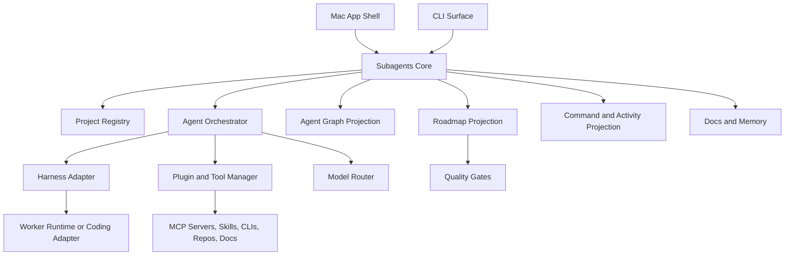

# Architecture

## Scope

This document describes the architecture for the Mac app we are building.

The app should not try to rebuild every low-level coding-agent capability in v1. It should build a first-party Subagents Core that owns the manager layer: project onboarding, agent team design, command routing, permissions, tool bundling, live agent graph, roadmap, reviews, docs, quality gates, and project memory.

External coding agents and frameworks are references and possible execution adapters. They should not define the product identity or user-facing state model.

## High-Level System

## Harness Strategy

The harness strategy is first-party orchestration with staged runtime depth.

In v1, Subagents IDE should own:

- Project state.
- Agent company graph.
- Command layer.
- Boss/orchestrator behavior.
- Permission gates.
- Project memory.
- Tool bundle model.
- Model router.
- Quality evidence.
- A narrow harness adapter.

The product may call a coding worker or external agent through an adapter, but chat, graph, roadmap, and approvals should remain views of Subagents IDE's own event model.

The detailed ecosystem survey is in [HARNESS_RESEARCH.md](HARNESS_RESEARCH.md). The recommended implementation approach is in [HARNESS_APPROACH.md](HARNESS_APPROACH.md).

## Product Surfaces

Subagents Core should be surface-agnostic. The Mac app and CLI should both talk to the same engine, event store, permission model, command router, and project memory.

The Mac app is the flagship surface. It owns the polished project launcher, visual company graph, right-side chat/activity panel, roadmap, approvals, reviews, and tool-bundle management.

The CLI is a second surface over the same project state. It should not be a separate harness. It should let users run direct commands, automate workflows, inspect agent state, trigger reviews, approve pending actions, and use Subagents IDE from terminal-first environments.

Example CLI responsibilities:

- List and select projects.
- Send messages to the boss/orchestrator.
- Target a department, agent, task, review, or blocker.
- Launch or refresh the agent company.
- Show graph status in text form.
- Show pending approvals.
- Approve or deny gated actions.
- Run review, test, roadmap, and tool commands.
- Export or inspect project memory.

This means the core product is not "a Mac app that later gets a CLI." It is an agentic development engine with a Mac app as the main interface and a CLI as a natural power-user interface.

## App Shell

The native Mac shell owns:

- Project launcher.
- New project flow.
- Existing project import.
- Windowing.
- Local settings.
- Account settings.
- Global plugin settings.
- Local filesystem permissions.
- Secret handling policy.

The shell should stay calm. It gets the user to the right project.

## Project Registry

The project registry tracks every project known to the app.

Each project should store:

- Project id.
- Name.
- Local path.
- Project type.
- Current phase.
- Last activity.
- Active agent count.
- Completion summary.
- Setup completion state.
- Linked harness session ids.
- Linked plugin bundle ids.

## Project Workspace

The workspace is the main product surface.

It owns:

- Agent graph.
- Command chat.
- Roadmap.
- Agent roster.
- Task queue.
- Review and approval queue.
- Tool bundle panel.
- Docs panel.
- Deployment panel.
- Activity timeline.

The workspace should make the user feel like they are managing an AI engineering team.

The v1 workspace should use a graph-led layout. The graph owns the left or main area. A compact right-side panel provides the familiar agent-manager flow.

The right panel should combine command chat with live activity. User messages, agent updates, handoffs, blockers, approvals, and review summaries can appear in one stream, with filtering or grouping as the project grows.

Chat should support target context. The default target is the whole project, but a selected graph node can become the active target for the next message.

When no graph node is selected, chat routes through the main boss/orchestrator agent. This agent handles project-level routing, delegation, summaries, and user-facing coordination.

Agent messages should include speaker metadata:

- Agent id.
- Agent display name.
- Role.
- Department.
- Character asset id.
- Related graph node ids.
- Related task, review, blocker, or handoff ids.

When a chat command changes work state, the graph should update as part of the same event. Chat and graph are two views of the same underlying project state, not separate systems.

The chosen interaction model is combined chat plus graph action. A user command is visible in the message stream, and any resulting state change updates the graph through the same event pipeline.

The roadmap and tasks should connect back into the graph instead of feeling like separate products placed beside it.

## Agent Orchestrator

The orchestrator is the coordination layer.

It owns:

- Converting project intent into a plan.
- Recommending the agent team.
- Assigning scopes and permissions.
- Routing tasks.
- Tracking dependencies and blockers.
- Managing handoffs.
- Requiring reviews.
- Deciding when user approval is needed.
- Updating docs.
- Updating roadmap status.

The orchestrator is not the only coding agent. It is the manager.

## Agent Model

Agent roles are part of the product design, not individual files in this repo yet.

The product should use pre-built agent roles in v1. Each role can have a strong built-in system prompt behind the scenes, but those runtime prompts do not need to exist as separate files in this repo yet.

For a normal new app project, the v1 recommendation should begin with at least 7-8 pre-built sub-agents. The team is still adaptive, but the baseline should be large enough to make the product's sub-agent identity obvious.

The agent model should be hierarchical, like a company. It should support senior agents coordinating teams, specialists reviewing work, scoped builders implementing tasks, and temporary child agents spawned for specific subtasks.

The long-term system should be able to represent very large agent organizations, potentially hundreds of sub-agents, without forcing the UI to render them as a flat list or flat graph.

The product may recommend roles such as:

- Orchestrator.
- Planner.
- Implementation lead.
- Scoped implementer.
- Testing specialist.
- Security reviewer.
- Tool curator.
- Deployment guide.
- Maintenance or marketing agent.
- Domain specialist.

Each agent should have:

- Role.
- Purpose.
- Scope.
- Permissions.
- Tool access.
- Current status.
- Current task.
- Parent agent if spawned by another agent.
- Child agents if it delegates work.

Custom agent creation should be treated as a later advanced feature. V1 should focus on pre-built agents plus configurable permission presets.

## Recursive Sub-Agents

The product should support a heavy sub-agent approach.

Some agents may spawn child agents, but this must be controlled:

- Every child agent must be visible.
- Every child agent must have a reason.
- Child agents should inherit or narrow permissions.
- The graph should show parent-child relationships.
- The orchestrator should prevent agent sprawl.

Recursive spawning should roll up into higher-level structures:

- Company.
- Department.
- Team.
- Squad.
- Senior agent.
- Child agent.
- Temporary task agent.

This lets the app show the full system when needed while keeping the default view readable.

Departments should be fixed in v1: Product, Engineering, QA, Security, Tools, and Deployment. Project-specific specialist agents should attach to the closest fixed department instead of creating arbitrary top-level departments.

## Permissions

Agent permissions should be explicit.

Permission presets can include:

- Ask for approval.
- Auto-review.
- Full access.
- Read-only.
- Scoped write.
- Deploy-gated.

Onboarding should set a project-wide autonomy mode first:

- Conservative.
- Balanced.
- Autonomous.

The project-wide mode maps to default permissions for each pre-built agent. Advanced users can override individual agents after that.

The default project-wide mode should be Conservative. Mode changes should live in onboarding and project settings, not inside normal coding-task output.

Sensitive actions should require approval:

- Installing dependencies.
- Editing secrets.
- Changing production infrastructure.
- Running destructive commands.
- Deploying.
- Merging release work.

## Harness Adapter

The app should use a harness adapter so it can sit above different coding runtimes.

The adapter should expose:

- Create session.
- Start task.
- Spawn sub-agent.
- Pause task.
- Cancel task.
- Read status.
- Read logs.
- Read changed files.
- Read diff.
- Run command.
- Run tests.
- Return artifacts.
- Report completion.

This lets the app start with one worker/runtime adapter while avoiding lock-in to a single coding-agent implementation.

## Command Layer

The command layer is the user-facing control language for the engine.

It should support familiar coding-agent slash commands, product-specific commands for the sub-agent company model, and CLI command equivalents.

The Mac app should treat `/` as a command launcher. A slash entry can execute a command, open a panel, target a graph node, change graph focus, inspect tools, or manage approvals. This means slash commands are both a text convention and a UI navigation/control mechanism.

The command layer should route commands to:

- Main boss/orchestrator agent.
- Selected agent.
- Selected department.
- Selected task, blocker, review, or graph node.
- Underlying coding harness when execution is required.

Example command flow:

1. User enters `/review` or clicks a review action.
2. Command parser identifies the command and target.
3. Orchestrator chooses the right agent or department.
4. Harness adapter executes coding-agent work if needed.
5. Result emits events.
6. Chat/activity panel and graph update together.

The product can support commands from open-source agents where appropriate, but should normalize them through the app's command layer so the UI, graph, and project memory remain consistent.

The v1 command set should combine familiar coding-agent commands with app-native company commands. Familiar commands handle normal coding workflows, while app-native commands control graph, departments, handoffs, blockers, roadmap, tools, and permissions.

The same command should have one internal meaning even if it comes from a chat message, a graph click, a toolbar action, or the CLI. For example, `/review` in chat and `subagents review` in the terminal should create the same command event and update the same graph, roadmap, and memory projections.

Slash launcher events should still become normal command events when they affect state. Opening a panel can be a UI-only action, but reviewing code, changing permissions, spawning an agent, approving a task, or modifying tool bundles must flow through the command router and permission engine.

## Engine Strategy

The app should build its own first-party agent system rather than becoming a generic "bring your own agent" shell. The engine should start as a first-party orchestration core with a narrow worker runtime and adapter boundary, then deepen its coding abilities over time.

This means:

- Subagents IDE owns the product state and user experience.
- A minimal first-party worker handles scoped code tasks in v1.
- ACP-compatible or CLI-based coding agents can be used behind a harness adapter when useful.
- MCP is the primary tool/plugin boundary.
- External agents should not own the graph, roadmap, permissions, memory, or quality status.

The engine should maintain our own core abstractions:

- Project.
- Department.
- Agent.
- Task.
- Command.
- Tool call.
- Handoff.
- Review.
- Diff.
- Test run.
- Permission gate.
- Graph event.
- Project memory.
- Quality gate.
- Runtime session.

The best near-term build order is:

1. Event-sourced project state.
2. Graph nodes and edges for departments, agents, tasks, reviews, blockers, handoffs, and tools.
3. Command router with graph target resolution.
4. Conservative permission gate.
5. Minimal worker runtime for scoped code tasks.
6. Diff, test, review, and quality evidence model.
7. Project memory writer.
8. ACP adapter proof of concept.

Open-source code should only be copied after file-level license audit. MIT and Apache-2.0 projects are usually practical candidates with attribution and notice obligations. Mixed, source-available, archived, maintenance-mode, or non-code licenses need separate review and may need isolation or avoidance.

Research details and current license notes are in [HARNESS_RESEARCH.md](HARNESS_RESEARCH.md). The concrete phased architecture is in [HARNESS_APPROACH.md](HARNESS_APPROACH.md).

## Ecosystem Patterns To Borrow

- Slash command conventions from coding agents.
- Command metadata and dynamic available commands from OpenCode-like and ACP-like systems.
- Primary-agent/subagent separation from OpenCode, Qwen Code, and similar tools.
- Git/diff/review discipline from Aider and Plandex.
- Simple worker loops and linear trajectories from mini-swe-agent and Pi.
- Isolated workspaces, agent servers, and backend switching from OpenHands.
- Human-in-the-loop approval from Cline/Roo/OpenHands patterns.
- Durable workflows, handoffs, checkpoints, and interrupts from LangGraph and Microsoft Agent Framework.
- Role/team abstractions from CrewAI, adapted to Subagents IDE departments.
- Tracing, RBAC, scheduling, and control-plane ideas from Agno and Mastra.
- Memory and document retrieval ideas from LlamaIndex and Hermes Agent.
- ACP-style protocol boundaries for client-to-agent communication.
- MCP-style tool boundaries for external tools and data.

## Copying Rules

Do not copy code, prompts, configs, command templates, docs, UI assets, icons, or character assets until the exact source license has been checked.

Before copying from any project:

1. Check the repo license at the exact commit.
2. Check whether the specific file has extra headers or different licensing.
3. Check dependencies and generated code.
4. Preserve required notices and attribution.
5. Avoid trademarks and brand assets.
6. Avoid source-available or enterprise-only directories unless explicitly permitted.
7. Treat GPL, AGPL, and other copyleft code as requiring separate legal review.

MIT and Apache-2.0 are usually practical for direct reuse if notices are preserved. Apache-2.0 also includes patent-license terms and NOTICE obligations where applicable. Source-available and copyleft projects can still be studied conceptually, but direct copying may be inappropriate for this product.

## Plugin and Tool Manager

The plugin manager turns raw tools into useful bundles.

Inputs:

- MCP servers.
- Skills.
- CLIs.
- GitHub repos.
- Vendor tools.
- Documentation.
- Templates.

Outputs:

- Minimal bundle.
- Recommended bundle.
- Expanded bundle.
- Category-based tool groups.
- Setup status.
- Required credentials.
- Risk warnings.

The user should not need to manage a long list of raw skills unless they open an advanced view.

## Model Router

The model router chooses which model or coding client each agent uses.

It should support:

- Official coding-client integrations where available.
- Bring-your-own API keys for direct model calls.
- Per-agent model defaults.
- Project-level model mode.
- Cost and quality tradeoffs.
- Escalation from cheaper models to stronger models.

The default model mode should be Balanced. The boss/orchestrator, architect, security reviewer, and final reviewer should use the strongest appropriate model. Routine scanning, summarization, docs, and simple subtasks can use cheaper or faster models.

Managed credits can come later. V1 should focus on letting users use the model access and coding subscriptions they already have, without misusing credentials or hiding cost.

## Agent Graph Data Model

The graph should represent real work.

The default graph should be hybrid: agents are primary nodes, while tasks, reviews, tools, blockers, documents, and milestones attach to agents or connect between them.

Agent nodes should support character-like visuals. The user plans to provide pixel character designs later, so the graph renderer should not assume agents are only abstract circles.

Each pre-built agent role should map to a fixed default character identity. Character customization can be considered later, but v1 should use stable role-character mappings.

The graph model should support grouping and collapsing. This is necessary because the heavy sub-agent approach may create very large agent trees. The user should be able to see a simple top-level company view, then drill into teams, senior agents, and spawned child agents.

The default large-project graph view should be a company overview. Additional graph modes should include active-work-only and current-milestone focus.

Departments should be fixed in v1:

- Product.
- Engineering.
- QA.
- Security.
- Tools.
- Deployment.

Project-specific specialist agents should attach to the closest department rather than creating arbitrary top-level departments.

Department display names should use serious labels in v1.

Department nodes should support both inspection and expansion:

- Inspecting a department opens details in the right-side panel.
- Expanding a department reveals child agents, teams, and spawned workers in the graph.
- Collapsing a department returns to the company overview.

Department detail data should include both operational state and membership. Operational state should appear first.

Node types:

- Agent.
- Team.
- Department.
- Task.
- Tool.
- Milestone.
- Review.
- Blocker.
- Document.

Edge types:

- Assignment.
- Dependency.
- Handoff.
- Review.
- Tool use.
- Blocker.
- Spawned child agent.
- Membership.
- Rollup summary.

Edges should carry visual semantics so users can tell stable structure from live work. For example, membership/reporting edges differ from handoff, blocker, review, and tool-use edges.

Graph animation should be event-driven rather than constant. Active agents, handoffs, blockers, and completions can animate briefly, but the graph should remain readable.

Clicking a node or edge should reveal state, history, and available actions.

## Roadmap and Quality Gates

The roadmap should be connected to real gates.

Example milestones:

1. Scope locked.
2. Project docs generated.
3. Agent team configured.
4. Tool bundle configured.
5. Architecture approved.
6. Foundation built.
7. Core feature built.
8. Tests added.
9. Security review passed where needed.
10. Deployment configured.
11. Shipped.
12. Maintenance active.

Completion should depend on:

- Milestone status.
- Required review gates.
- Build and test results.
- Open blockers.
- Deployment readiness.

## Project Memory

The app should generate Markdown docs inside user projects once the product exists.

Examples:

- Product brief.
- Architecture notes.
- Agent plan.
- Tool bundle choices.
- Roadmap.
- Risks.
- Open questions.
- Review decisions.

Those generated docs are part of the product's future output. They should not be confused with the docs in this repo, which describe the product itself.

## Quality Proof

The app must prove that the sub-agent approach improves output.

Quality signals:

- Build passes.
- Tests pass.
- Tests added or updated.
- Security review results.
- Code review summaries.
- Files changed.
- Risky changes.
- Deployment readiness.
- Docs updated.

The product claim should be supported by visible evidence, not just marketing copy.

## V1 Build Target

The first version should prove the manager layer.

The strongest v1 path should be new-project creation. Existing-project import can be supported, but the first-run experience should be designed around turning a new app idea into project docs, recommended agents, tool bundles, roadmap, and an initial build.

New-project intake should be hybrid:

1. Quick project-type selection.
2. Natural voice or chat idea capture.
3. Structured confirmation of scope, agents, tools, roadmap, and permissions.

The project-type picker should expose specific categories, such as iOS, macOS, web, backend, AI/ML, infrastructure, game, plugin, existing project, and other. These choices inform default agents and tool bundles.

After idea capture, the app should generate one structured confirmation flow:

1. Product brief.
2. Roadmap.
3. Agent team.
4. Tool bundles.
5. Permissions.

The confirmation flow should end with:

- Launch Agent Team.
- Save setup.
- Edit more.

When the user chooses Launch Agent Team, the first run should be a split pass. Planning, docs, roadmap, and tool setup can run in parallel with safe foundation work. Review gates still apply before risky or final changes are marked complete.

Minimum useful scope:

1. Project launcher.
2. New/existing project setup.
3. Scope and development-style selection.
4. Agent team recommendation.
5. Plugin/tool bundle recommendation.
6. Agent graph model.
7. Harness adapter for one coding runtime.
8. Roadmap with basic quality gates.
9. Markdown project memory generation.
10. Project workspace with chat plus visible agent operations.
11. Graph-led workspace layout where the main surface is the connected agent map and the right panel keeps chat, approvals, reviews, and status updates available.

## Architecture Risks

- Building a custom harness too early could distract from the product layer.
- Fake graph state would make the product feel decorative.
- Too many raw tools would recreate MCP clutter.
- Too much playful agent personality could weaken technical credibility.
- Weak quality evidence would make the "better code" claim unconvincing.
