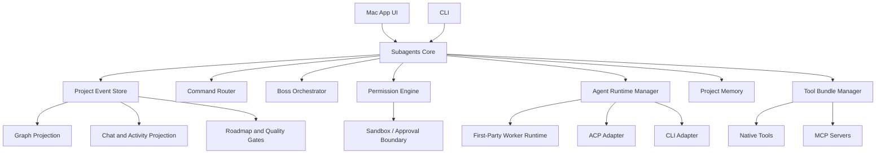

# Harness Approach

This document defines the recommended harness and core-engine strategy for Subagents IDE.

The short version: build a first-party orchestration engine, not a generic wrapper. Use existing coding agents and protocols as references and optional adapters, but make Subagents IDE own the product model: company graph, departments, named agents, commands, permissions, memory, reviews, and quality evidence.

## Core Decision

Subagents IDE should build `Subagents Core`: a local-first engine that owns the user-visible system of work.

In v1, do not rebuild every low-level coding-agent feature from scratch. Instead:

1. Build our own command, graph, permission, memory, and orchestration core.
2. Build one simple first-party worker runtime for scoped code tasks.
3. Add an adapter boundary so ACP-compatible or CLI-based coding agents can be used behind the scenes when they are the right execution tool.
4. Expose the core through the Mac app first, then a CLI over the same engine.
5. Keep the user experience first-party and graph-led.

This resolves the apparent tension between "do not reinvent the full harness in v1" and "do not become a bring-your-own-agent wrapper." We should own the manager layer immediately and grow the coding runtime in phases.

## Product Boundaries

The Mac app owns:

- Project launcher.
- Project setup.
- Graph-led workspace.
- Chat/activity panel.
- Graph selection and command targeting.
- Approval UI.
- Review UI.
- Tool bundle UI.
- Project memory and docs UI.

The CLI owns:

- Terminal project selection.
- Direct command execution.
- Scriptable agent workflows.
- Text-based graph and roadmap status.
- Approval listing and approval decisions.
- Headless or remote use cases where the Mac graph is not visible.

Subagents Core owns:

- Project state.
- Agent company model.
- Command routing.
- Orchestration.
- Runtime sessions.
- Graph events.
- Permission checks.
- Tool calls.
- Memory writes.
- Quality gates.
- Harness adapters.

External coding agents may own:

- Low-level code editing for a scoped task.
- Terminal-style exploration.
- Test execution, if routed through the adapter.
- Specialized model/provider behavior.

External agents should not own:

- The product graph.
- Department membership.
- Agent identity.
- User-facing command semantics.
- Permission policy.
- Project roadmap truth.
- Final quality state.

## Architecture Shape

The event store is the source of truth. The graph, chat/activity stream, roadmap, and approval queue are different views over the same project events.

## Command Layer

Commands are product objects, not just text strings.

Each command should define:

- Name, such as `/review`.
- Category: coding, graph, department, roadmap, permission, tool, deployment, or memory.
- Presentation type: execute immediately, open panel, show picker, focus graph, request approval, or start a longer run.
- Allowed targets: whole project, selected agent, selected department, selected task, selected blocker, selected review, or selected tool.
- Permission impact.
- Expected graph mutation.
- Expected artifacts.
- Whether it can run immediately or needs approval.
- Whether it calls a worker runtime, MCP tool, native tool, or only updates product state.

Baseline familiar commands:

- `/plan`
- `/review`
- `/test`
- `/fix`
- `/explain`
- `/diff`
- `/commit`
- `/help`

Product-native commands:

- `/launch-team`
- `/agent`
- `/department`
- `/graph`
- `/handoff`
- `/blockers`
- `/roadmap`
- `/tools`
- `/permissions`
- `/spawn`
- `/approve`

CLI equivalents should map to the same internal command objects:

- `subagents ask "..."` maps to a normal boss/orchestrator message.
- `subagents review` maps to `/review`.
- `subagents test` maps to `/test`.
- `subagents launch-team` maps to `/launch-team`.
- `subagents agent qa ask "..."` maps to a targeted graph command.
- `subagents approvals` reads pending approval events.
- `subagents approve <id>` creates an approval decision event.

The Mac app's `/` launcher should use the same command registry. Some entries execute work, while others open the right panel, focus graph areas, show target pickers, or reveal pending approvals. This keeps the command system from splitting into separate chat commands, UI shortcuts, and CLI commands.

Command routing:

1. Parse the command and free-text message.
2. Resolve target from graph selection. If nothing is selected, target the boss/orchestrator.
3. Classify permission impact.
4. Create a command event.
5. Let the orchestrator decide whether this is a product-state update, a coding task, a review task, a tool action, or an approval request.
6. Emit graph, activity, and roadmap events from the same run.

ACP's slash-command model is a useful protocol reference, but Subagents IDE needs richer target and graph semantics.

## Surface Strategy

The Mac app and CLI should be two surfaces over one engine.

The Mac app is the flagship because it can show the live company: departments, agents, child agents, tasks, handoffs, blockers, reviews, tools, approvals, and roadmap progress.

The CLI is the power-user and automation surface. It should not invent a separate product model. It should call the same command router and event store as the Mac app.

This gives the product a clean split:

- Mac app: best for seeing, steering, reviewing, and understanding the agent company.
- CLI: best for quick commands, scripts, CI-adjacent workflows, remote environments, and terminal-first users.
- Subagents Core: the shared source of truth.

The CLI should be a byproduct of good architecture. If the engine is cleanly separated from the UI, the CLI becomes natural. If the Mac UI directly owns orchestration logic, the CLI becomes expensive and inconsistent.

## Orchestrator

The boss/orchestrator is the manager, not the only coding agent.

Responsibilities:

- Convert user intent into scoped work.
- Maintain the project plan.
- Recommend the default agent company.
- Assign work to departments and agents.
- Spawn child agents only when the task needs it.
- Enforce permissions.
- Request user approval for risky actions.
- Require specialist review when needed.
- Merge worker results into project memory and graph state.
- Summarize progress in plain language.

The orchestrator should prefer small scoped tasks over broad autonomous runs. A user may ask for a big outcome, but the orchestrator should break it into graph-visible units.

## Agent Runtime Model

Agents are first-party product entities. Runtime sessions are execution details.

Agent types:

- Boss/orchestrator agent.
- Department lead agents.
- Specialist agents.
- Scoped builder agents.
- Reviewer agents.
- Temporary child agents.

Runtime states:

- Proposed.
- Ready.
- Active.
- Waiting for approval.
- Blocked.
- Reviewing.
- Verifying.
- Complete.
- Archived.

Every spawned child agent needs:

- Parent agent.
- Reason for existence.
- Scope.
- Allowed tools.
- Permission preset.
- Expected output.
- Expiration condition.

This keeps the company model understandable and prevents invisible agent sprawl.

## Worker Runtime

Build a minimal first-party worker runtime first.

The first worker does not need every feature in the ecosystem. It needs to be reliable, observable, and safe enough for scoped coding tasks.

Minimum loop:

1. Receive a scoped task and allowed files/tools.
2. Gather code context.
3. Produce a brief plan.
4. Execute edits through controlled file tools.
5. Run allowed checks.
6. Return diff, tests, logs, and summary.
7. Stop for review.

Borrow conceptually from:

- mini-swe-agent for simple linear trajectories.
- Pi for modular session, compaction, hooks, and RPC structure.
- Aider for repo maps and Git discipline.
- Plandex for review-before-apply.
- OpenCode for commands, permissions, and subagent routing.

The worker should not have unrestricted host access by default.

## Harness Adapter

The adapter exists so the product can use strong coding agents without becoming them.

Adapter interface:

- Create session.
- Start task.
- Stream events.
- Pause task.
- Resume task.
- Cancel task.
- Read status.
- Read logs.
- Read changed files.
- Read diff.
- Run tests.
- Request approval.
- Return artifacts.
- Report completion.

Adapter types:

- First-party worker adapter.
- ACP adapter for agents that speak ACP.
- CLI adapter for agents that only expose terminal interfaces.
- Future remote adapter for cloud or VM workers.

Use ACP where possible because it is designed for code editor to coding agent communication. Use CLI adapters only for controlled prototypes or tools without ACP support.

## Graph Event Model

The graph must be operational, not decorative.

Recommended event categories:

- `project.created`
- `project.opened`
- `team.recommended`
- `team.launched`
- `department.added`
- `agent.added`
- `agent.spawned`
- `agent.status_changed`
- `task.created`
- `task.assigned`
- `task.started`
- `task.blocked`
- `task.completed`
- `handoff.created`
- `review.requested`
- `review.completed`
- `approval.requested`
- `approval.granted`
- `approval.denied`
- `tool.connected`
- `tool.called`
- `permission.changed`
- `memory.updated`
- `diff.created`
- `test.started`
- `test.completed`
- `quality_gate.passed`
- `quality_gate.failed`
- `deployment.prepared`
- `deployment.blocked`
- `deployment.completed`

Events should carry:

- Event id.
- Project id.
- Run id.
- Actor agent id.
- Target ids.
- Command id, if triggered by a command.
- Permission decision.
- Human-readable summary.
- Artifact references.
- Timestamp.

The graph projection should show departments, agents, tasks, handoffs, blockers, reviews, tools, and quality gates from these events.

## Permissions and Sandboxing

Default project mode should remain Conservative.

Permission presets:

- Read-only.
- Ask for approval.
- Scoped write.
- Auto-review.
- Deploy-gated.
- Full access.

Action classes:

- Read project files.
- Write allowed files.
- Run safe read-only shell command.
- Run build/test command.
- Install dependency.
- Change lockfile.
- Read secret.
- Write secret.
- Access network.
- Start server.
- Use browser automation.
- Modify infrastructure.
- Deploy.
- Commit.
- Push.
- Merge.
- Delete files.
- Run destructive command.

Default behavior:

- Read-only actions can usually proceed inside scope.
- Writes need scoped-write permission or approval.
- Dependency installation, secrets, network expansion, destructive commands, deployment, push, merge, and production infrastructure changes need explicit approval.
- A spawned child agent can inherit only equal or narrower permissions than its parent.

Sandboxing:

- Do not treat prompt rules or project trust as security boundaries.
- Prefer per-task Git worktrees for isolation from the main working tree.
- Use OS/container/VM/micro-VM boundaries for untrusted or high-autonomy runs.
- Mount only needed files.
- Pass only needed credentials.
- Restrict network access when not required.
- Keep command logs and file diffs as evidence.

For the Mac app, the first implementation can support local trusted-project execution with Conservative approvals, then add stronger sandbox profiles before unattended autonomy.

## Tool and Plugin System

MCP should be the main tool protocol.

Subagents IDE should still wrap MCP in product-level bundles:

- Project type bundles.
- Department bundles.
- Vendor bundles.
- Safety bundles.
- Deployment bundles.
- Testing bundles.
- Security bundles.

Tool access should be assigned by department and agent role.

Examples:

- QA gets test runners, browser checks, coverage tools, and artifact readers.
- Security gets static scanning, dependency audit, secret scanning, and threat-model docs.
- Deployment gets hosting CLIs, release checklists, and environment health checks.
- Tools department gets MCP setup, docs indexing, package managers, and provider configuration.

Advanced users may inspect raw MCP servers, but the normal UI should show curated bundles.

## Project Memory

Project memory should be structured and generated by product state.

Memory types:

- Product brief.
- Architecture notes.
- Roadmap.
- Agent team plan.
- Tool bundle decisions.
- Permissions record.
- Open questions.
- Risks.
- Review decisions.
- Test history.
- Deployment notes.

Memory should be written as user-project artifacts when the product exists. These are not the same as the product docs in this repository.

Memory rules:

- User-facing memory should be readable Markdown.
- Runtime summaries should be compact and machine-readable.
- Retrieval indexes should be rebuildable from source artifacts.
- Secrets should never be written to memory.
- Agent prompts should remain separate from project memory.

## Quality Gates

The product promise is better code, so quality evidence must be first-class.

Better code should come from the system around the models, not only from better prompts.

The engine should improve output through:

- Clear scope before coding starts.
- Small, bounded tasks instead of broad uncontrolled edits.
- Role-specific system prompts for pre-built agents.
- Model routing that uses stronger models for judgment and cheaper models for routine work.
- Separate builder, reviewer, QA, security, and deployment responsibilities.
- Worktrees or equivalent isolation so risky work can be reviewed or discarded.
- Explicit test, lint, build, review, and security evidence.
- Failed gates that route work back to the responsible department.
- Project memory that prevents agents from forgetting decisions.
- Approval gates for secrets, destructive commands, deployment, and production infrastructure.

Every meaningful coding task should produce:

- Files changed.
- Diff summary.
- Test/lint/build commands attempted.
- Result status.
- Reviewer agent, if required.
- Remaining risks.
- Follow-up tasks.

Gate examples:

- Scope approved.
- Plan accepted.
- Implementation complete.
- Tests pass.
- Review pass.
- Security check pass where relevant.
- Docs updated.
- Deployment ready.

The roadmap percentage should derive from these gates, not from simulated progress.

## Phased Build Plan

### Phase 1: Product State Core

Build:

- Project event store.
- Agent/dept/task graph data model.
- Command parser and router.
- Conservative permission model.
- Static pre-built company roster.
- Chat/activity projection.
- Graph projection.
- CLI skeleton that can list projects, send a boss/orchestrator message, and read event status.

No heavy autonomous coding is required yet. The goal is to prove that chat commands and graph actions are one system.

### Phase 2: Minimal Worker Runtime

Build:

- One scoped first-party worker loop.
- Per-task worktree support.
- File read/write tools.
- Shell command tool with approval.
- Diff artifact generation.
- Test command reporting.
- Basic review agent flow.

This phase proves useful coding output while keeping autonomy contained.

### Phase 3: MCP Tool Bundles

Build:

- MCP server registry inside the app.
- Tool bundle recommendations.
- Department-level tool access.
- Tool-call event logging.
- Approval gates for risky tools.

This phase prevents raw MCP clutter and makes tools feel product-native.

### Phase 4: ACP Adapter

Build:

- ACP client adapter.
- One OpenCode or Qwen Code adapter proof of concept.
- Session event normalization into Subagents graph events.
- Command mapping for `/plan`, `/review`, `/test`, and `/diff`.

This phase validates that external agents can help without becoming the product.

### Phase 5: Stronger Sandboxing and Autonomy

Build:

- Docker/Colima or VM execution profile.
- Network policy.
- Secret mount policy.
- Long-running job resume.
- Scheduled maintenance runs.
- Deployment-gated release agent.

This phase unlocks safer Balanced and Autonomous modes.

## What To Build First

Build these first:

1. Event-sourced project state.
2. Graph nodes and edges for departments, agents, tasks, reviews, blockers, handoffs, and tools.
3. Command router with graph target resolution.
4. Conservative permission gate.
5. Minimal worker runtime for scoped code tasks.
6. Diff/test/review evidence model.
7. Project memory writer.

The first coding flow should be:

1. User runs `/launch-team`.
2. The boss creates the fixed department graph.
3. User asks for a scoped coding task.
4. Boss creates task and assigns Engineering.
5. Worker executes in a controlled worktree.
6. QA runs tests or records why tests cannot run.
7. Review passes or creates follow-up tasks.
8. Graph, chat/activity, roadmap, and memory update from the same events.

## What To Borrow Conceptually

- OpenCode: command metadata, permissions, ACP, subagent routing.
- Pi: modular runtime, sessions, hooks, compaction, RPC, explicit sandbox warning.
- Aider: repo map, Git flow, diffs, lint/test/commit discipline.
- Plandex: plan/review/apply separation and cumulative diffs.
- mini-swe-agent: simple linear worker loop and trajectory inspection.
- OpenHands: agent server/backends and durable remote execution.
- Cline: approval UX and mode ergonomics.
- Qwen Code: agent teams, auto-memory/skills, daemon/SDK/ACP ideas.
- Hermes: durable memory, scheduling, skill evolution, remote execution.
- LangGraph and Microsoft Agent Framework: durable workflows, handoffs, checkpoints, human-in-the-loop, observability.
- Agno and Mastra: control plane, RBAC, storage-backed state, scheduling, TypeScript workflow ideas.
- LlamaIndex: project memory ingestion and retrieval.
- ACP: client-to-agent protocol boundary.
- MCP: tool and data access boundary.

## What To Avoid

- Do not build a generic "choose your agent engine" product in v1.
- Do not fork OpenHands or Cline as the product base.
- Do not use Crush code directly without legal review because of FSL terms.
- Do not depend on Roo Code or Continue for current core behavior because they are archived/read-only.
- Do not start new work on AutoGen as a base because it is in maintenance mode and its repo license is not a normal permissive code license.
- Do not let subagents spawn without graph visibility, scope, and permission inheritance.
- Do not make permission mode changes part of normal task output.
- Do not show hundreds of agents as a flat graph.
- Do not copy runtime prompts or command templates without source-level license review.

## Remaining Decisions

- Engine service language: TypeScript is attractive because many agent/MCP/ACP projects are TypeScript; Rust is attractive for a stable local daemon; Swift is attractive for Mac-native integration; Python is attractive for agent-framework reuse. Decide after a small prototype.
- First external adapter: OpenCode and Qwen Code are the best initial ACP candidates. Pi is the best minimal-runtime reference. Aider is the best Git-quality reference.
- CLI packaging: decide whether the CLI ships inside the Mac app bundle, as a separate Homebrew-style install, or both.
- Sandbox path: compare local worktrees, macOS sandboxing, Docker/Colima, and remote VM execution.
- Event schema: formalize before building UI so graph and chat never drift.
- File-level license audit: required before copying any code from research targets.
