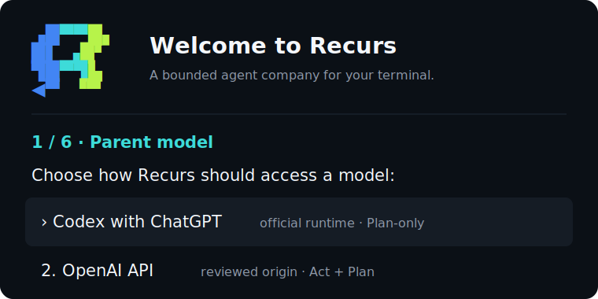

<div align="center">


# Recurs

**A coding-agent company that stays inside the lines.**

Give Recurs a goal. It forms a project-specific team, keeps implementation in
isolated worktrees, and returns reviewed work for your approval.

[](https://github.com/tacotuesday8888/recurs/actions/workflows/ci.yml)
[](#project-status)
[](LICENSE)

</div>

<p align="center">
  
</p>

## 🚀 Start locally

> [!IMPORTANT]
> Recurs is a source-installable alpha. npm, Homebrew, curl, signed binary, and
> desktop releases are not published yet.

You need Node.js 22.22+, Git 2.45+, and ripgrep.

```bash
git clone https://github.com/tacotuesday8888/recurs.git
cd recurs
npm ci
npm run build
npm link
recurs
```

On first launch, Recurs guides you through model access, safety boundaries,
operating mode, specialist routing, company review, and project context.
Credentials remain with the vendor runtime, native authority, or named process
environment.

> On Linux, subprocess containment also requires `/usr/bin/bwrap` with
> unprivileged user namespaces. Windows subprocess containment is not yet
> implemented and subprocess tools fail closed.

## ✨ Why Recurs

- 🏢 **Company-shaped work.** Review the proposed roles, reporting lines,
  tools, gates, and first goal before activation.
- 🛡️ **Limits before execution.** Permission, concurrency, request, cost,
  review, retry, and cancellation boundaries are frozen before work begins.
- 🔎 **Evidence before apply.** Mutating work stays in isolated Git worktrees
  through implementation, independent review, and bounded repair.
- 🔌 **Explicit model access.** Use reviewed OpenAI, Anthropic, Gemini,
  OpenAI-compatible, Ollama, LM Studio, or local user-present Codex
  subscriptions with exact model/effort routing through Recurs tools. Recurs
  does not claim automatic model ranking or silent provider routing.
- 💾 **Designed to resume.** Goals, sessions, checkpoints, company knowledge,
  and approved organization revisions survive restarts.

## 🔁 From goal to apply

```text
approved goal
    │
    ▼
explore and plan
    │
    ▼
specialist implementation ──► independent review ──► bounded repair
    │
    ▼
candidate change ──► your approval ──► apply
```

Recurs depicts only agents that actually run. It does not claim arbitrary
recursive hierarchies, autonomous deployment, unattended daemon workers, or
automatic installation or trust of Skills and MCP servers.

## ✅ Built today

- **Company design:** resumable onboarding, versioned rosters, proposal
  revision, explicit activation, and multi-stage role DAGs.
- **Agent execution:** streaming tools, parallel Explore and Review work,
  isolated Implement teams, repair, apply, cancellation, compaction, steering,
  forks, undo, and restart recovery.
- **Extensions:** bounded Agent Skills, digest-bound stdio MCP, text and image
  input, headless JSON/JSONL, and a Recurs ACP endpoint.
- **Host controls:** permission profiles, credential-path denial, clean child
  environments, sanitized failures, and supported macOS/Linux containment.
- **Operations:** company status, activity, knowledge, readiness, amendments,
  exact-run inspection, deterministic formation, provider dogfooding, and
  durable-goal scoring.

The [feature status](docs/FEATURE_STATUS.md) is the code-backed inventory of
implemented, bounded, prepared-only, and absent capabilities.

## ⌨️ Everyday commands

```bash
recurs                                      # set up or resume
recurs run "inspect the project" --plan    # one bounded headless run
recurs review                               # review staged/unstaged Git work
recurs doctor                               # redacted host-readiness report
recurs eval company --json                  # deterministic offline evaluation
recurs eval company --list --json           # discover evaluation scenarios
```

Use `-C /path/to/project` with interactive, run, or review commands. The
[CLI guide](docs/CLI.md) covers every command, provider, permission, image,
session, and JSON/JSONL option.

## Project status

- The source CLI is usable on the supported Node.js toolchain.
- Package metadata is `0.1.0-alpha.1`; the release gate is prepared, but no
  package-manager distribution is published.
- The macOS native authority is implemented and tested, but unsigned and
  undistributed.
- Windows subprocess containment and a desktop app are not implemented.

## 📚 Documentation

- [CLI guide](docs/CLI.md) — setup, commands, outputs, storage, and limits
- [Feature status](docs/FEATURE_STATUS.md) — exact capability inventory
- [Architecture](ARCHITECTURE.md) — engine boundaries and lifecycle
- [Agent company onboarding](docs/AGENT_COMPANY_ONBOARDING.md) — product and
  authority model
- [Security policy](SECURITY.md) — support and disclosure boundary
- [Product direction](PRODUCT.md) — current shape and roadmap
- [Release runbook](docs/RELEASING.md) — artifact and publication gates

## 🧪 Develop and verify

```bash
npm run check
npm run check:native            # full Swift/native suite on macOS
npm run package:smoke-install
```

## License

Recurs is licensed under the [Apache License 2.0](LICENSE). Direct runtime
dependencies retain their own licenses in [THIRD_PARTY_NOTICES.md](THIRD_PARTY_NOTICES.md).
