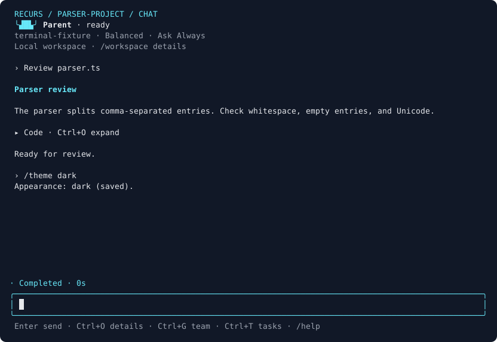
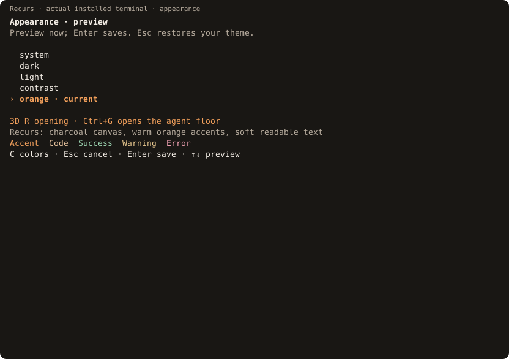

<p align="center">
  
</p>

<p align="center"><strong>Coding agents. A team you can see and control.</strong></p>

<p align="center">
  <a href="https://github.com/tacotuesday8888/recurs/actions/workflows/ci.yml"></a>
  <a href="https://www.npmjs.com/package/recurs"></a>
  <a href="LICENSE"></a>
</p>

Recurs is an open-source coding CLI for working with a model or a bounded team
of agents. Choose who does the work, which models they use, how far they can
delegate, and what they may change. Inspect the agents that actually ran,
their conversations, evidence, and results.



*Captured from the installed CLI through a real terminal. The local fixture
provider tests the interface; it is not a model-quality benchmark.*

## Start coding

**macOS or Linux · Node.js 22.22+ · Git · ripgrep**

```bash
npm install --global recurs@alpha
cd your-project
recurs
```

Connect a model, choose a permission level, and select **Start coding**.
Bring an API key, a supported local model, or an existing supported vendor
runtime. [Provider compatibility and setup →](docs/PROVIDER_CAPABILITY_MATRIX.md)

Other install paths:

| Installer | Command |
| --- | --- |
| Homebrew | `brew install tacotuesday8888/recurs/recurs` |
| Bun | `bun install --global recurs@alpha` |
| curl | `curl -fsSL https://github.com/tacotuesday8888/recurs/releases/download/v0.1.0-alpha.11/install.sh \| sh` |

Bun can install Recurs; Node.js runs it. Linux command isolation requires
Bubblewrap. See [installation and troubleshooting](docs/CLI.md#install).
Use `@alpha`: unqualified npm `latest` still selects alpha.2.

## Make delegation visible

A configured role is a plan. An execution is an agent that actually ran.
Recurs shows both, separately.

- **Choose the team.** Set role models, delegation depth, active-agent and
  concurrency limits. Start with defaults or complete Quick, Guided, or Deep
  project onboarding with `recurs setup`.
- **Follow the work.** Open the execution list with `Ctrl+T`. Inspect a specific
  child's model, permission boundary, durable conversation and changed files.
  Stop an owned execution and its descendants from its inspector.
- **Keep changes reviewable.** Isolated implementation, independent review,
  bounded repair and explicit application keep the parent in control.
- **Resume with context.** Reopen a saved conversation and reconstruct its
  execution history. Incomplete work and unavailable runtime details stay
  visible; unknown usage and cost stay unknown.

```text
/agents controls       inspect effective team limits
/agents routes         preview specialist models and inheritance
/agents executions     list actual executions
/agents inspect <id>   read one execution's conversation and evidence
/agents stop <id>      cancel an owned execution and its descendants
/goal <objective>      create a durable project goal
/goal launch           run the approved team workflow
```

A larger team is not automatically better. Explicit configuration and reliable
visibility are the product; automatic model-team selection remains gated on
recorded evaluation evidence. [Team evaluation →](docs/AUTO_MODEL_TEAMS.md) ·
[Current TypeScript CLI comparison →](docs/research/product-comparison-2026-09.md)

## Make it yours

Choose a saved model with `/model`. Press **F2** or enter `/theme` to preview
orange (the default), system, dark, light, or high-contrast colors. Press **C**
in the picker to edit individual colors. Escape restores your previous
appearance and preserves your draft; Enter saves it across restarts.

```text
/theme dark
/theme light
/theme color accent #67e8f9
```

The 3D R opening and V19 agent floor form one interface. **Ctrl+G** switches
between conversation and the team hierarchy; **Ctrl+T** opens executions and
**F3** changes permissions. From a checkout, `npm run ui:preview` starts real
first-run onboarding; `npm run ui:demo` runs the scripted tool walkthrough.

Eight semantic colors cover text, backgrounds, code, and status. `NO_COLOR`
and terminal-default colors remain supported. [Appearance guide →](docs/APPEARANCE.md)



## Extend your workflow

Manage local stdio and remote HTTP MCP servers, including OAuth, tools,
resources and prompts. Install skills from local bundles or explicitly
selected public sources. Project definitions require trust and cannot widen
an agent's permissions.

```bash
recurs mcp list
recurs skills list
recurs doctor
```

[Configure MCP](docs/MCP.md) · [Install and use skills](docs/SKILLS.md) ·
[Permissions](docs/CLI.md#permissions-and-modes)

## Use it in a terminal or a script

```bash
recurs run "fix the failing parser tests"
recurs run "explain the architecture" --plan --format json
recurs review
```

The terminal supports streamed Markdown, code blocks, file completion,
bracketed paste, history scrolling, queued approvals and drafts. Headless text,
JSON, JSONL and ACP share the same execution core.

## Status and contributing

Source version: `0.1.0-alpha.11`. Published packages and checksummed install assets
are listed in [GitHub Releases](https://github.com/tacotuesday8888/recurs/releases).
Source changes can precede publication; the npm badge shows the published alpha.
The [release work record](docs/RELEASE_READINESS.md) and
[product polish record](docs/PRODUCT_POLISH.md) track exact source, artifact,
test and publication status.

Recurs supports macOS and Linux. There is no persistent background daemon or
Windows process containment. Child inspectors are read-only apart from
cancellation; send further instructions through the parent. Vendor runtimes
may expose only prompts and final responses. Compatibility is documented per
integration, not claimed for every server, skill or model.

[CLI guide](docs/CLI.md) · [Feature status](docs/FEATURE_STATUS.md) ·
[Architecture](ARCHITECTURE.md) · [Contributing](CONTRIBUTING.md) ·
[Security](SECURITY.md) · [Privacy](PRIVACY.md)

Apache-2.0 © Recurs contributors
