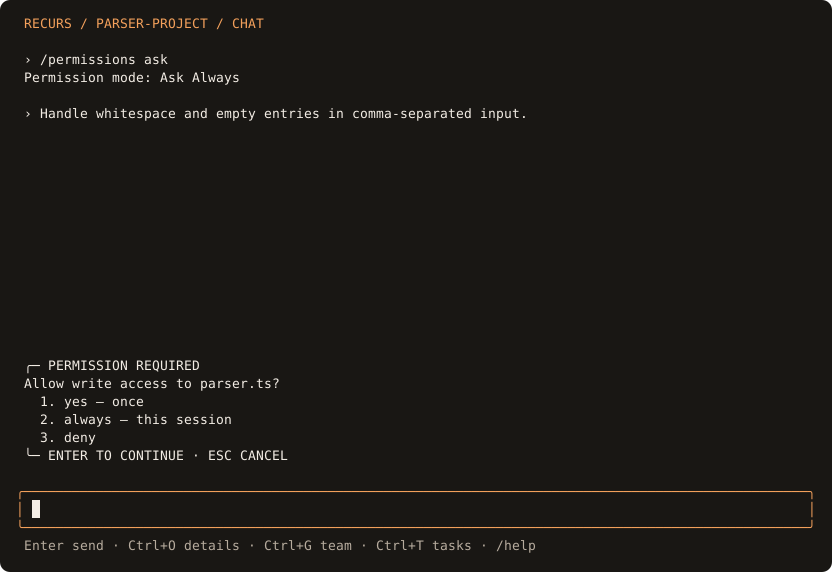

<p align="center">
  
</p>

<p align="center"><strong>One task. A team you control.</strong><br>
An open-source coding agent CLI with visible, configurable delegation.</p>

<p align="center">
  <a href="https://github.com/tacotuesday8888/recurs/actions/workflows/ci.yml"></a>
  <a href="https://www.npmjs.com/package/recurs"></a>
  <a href="LICENSE"></a>
</p>

<p align="center">
  <a href="#get-started">Get started</a> ·
  <a href="#work-with-a-team">Agent teams</a> ·
  <a href="docs/CLI.md">Documentation</a> ·
  <a href="CONTRIBUTING.md">Contributing</a>
</p>


Give Recurs a task, choose a model, and start coding. When the work needs a
team, control each role's model, delegation depth, concurrency, and permissions.
Follow the agents that actually run and inspect their work from the same terminal.

## Get started

**macOS or Linux · Node.js 22.22+ · Git · ripgrep**

```bash
npm install --global recurs@alpha
cd your-project
recurs
```

Connect a model, choose permissions, and select **Start coding**. Team setup is
optional. Use an API key, a supported local model, or a supported vendor runtime.
[See connection options and compatibility →](docs/PROVIDER_CAPABILITY_MATRIX.md)

<details>
<summary>Homebrew, Bun, and shell installer</summary>

| Installer | Command |
| --- | --- |
| Homebrew | `brew install tacotuesday8888/recurs/recurs` |
| Bun | `bun install --global recurs@alpha` |
| curl | `curl -fsSL https://github.com/tacotuesday8888/recurs/releases/download/v0.1.0-alpha.11/install.sh \| sh` |

Bun can install Recurs; Node.js runs it. Linux command isolation requires
Bubblewrap. [Installation and troubleshooting](docs/CLI.md#install)

</details>

Use `@alpha`: unqualified npm `latest` still selects alpha.2. Screens below
show the current source; source changes can precede the published package.

## Work with a team

Start with one agent or configure a bounded team. Recurs keeps the planned
roles and the executions that actually ran distinct.

| You control | You can inspect |
| --- | --- |
| Models for implementation, review, and repair | Each child's model and actual execution status |
| Delegation depth and concurrent agents | Parent–child hierarchy and current activity |
| Permissions and approval boundaries | Tool requests, conversations, and changed files |
| Whether reviewed changes are applied | Results and evidence from isolated work |


**Ctrl+G** switches between the conversation and the agent floor. **Ctrl+T**
opens executions; select an agent and press **Enter** to inspect it. **Escape**
returns to the previous view. Stop an owned execution and its descendants from
its inspector.

```text
/agents controls       inspect effective team limits
/agents routes         see specialist models and inheritance
/agents executions     list actual executions
/goal <objective>      create a durable project goal
/goal launch           run the approved team workflow
```

Use `recurs setup` for Quick, Guided, or Deep project onboarding. Saved chats
retain their conversations and execution history when reopened.
[Team configuration and evaluation →](docs/AUTO_MODEL_TEAMS.md)

## Stay in the flow

Streamed Markdown, highlighted code, file completion, bracketed paste,
scrollable history, and preserved drafts keep everyday work in the terminal.
Approvals show up where the work happens. Live status separates waiting,
thinking (when reported), tool execution, and response writing, with elapsed
time and confirmed patch counts.

Use `/diff` to review numbered changes in unified or split view, or switch to
original and updated excerpts. `/source <path>` reads the current source.


Organize saved chats from the home screen with **M**, or use `/rename`, `/pin`,
`/archive`, and `/copy`. Archived conversations remain available through
`/chats archived`. Copy forks a completed native conversation; vendor runtime
continuations cannot currently be copied.

The chat header shows the local branch and changed-file count. `/workspace`
opens branch status, source files, and local worktrees, plus agent-assisted
commit, push, and pull-request workflows. `/usage` shows recorded token usage
and context information; unavailable account limits stay explicitly unknown.

<details>
<summary>See a file change awaiting approval</summary>



</details>

| Shortcut | Action |
| --- | --- |
| **Enter** | Send a message or confirm a selection |
| **Ctrl+G** | Switch conversation / agent floor |
| **Ctrl+T** | Open executions |
| **F2** | Preview and save appearance |
| **F3** | Choose session permissions |
| **PgUp / PgDn** | Scroll conversation history |
| **Ctrl+C** | Cancel active work |
| **Ctrl+Q** | Quit |

Orange is the default. Choose system, dark, light, or high contrast with
`/theme`, or edit individual colors in the **F2** picker. Escape cancels the
preview and restores your theme. `NO_COLOR` and reduced motion are supported.
[Appearance guide →](docs/APPEARANCE.md)

## Use your tools

Add local stdio or remote HTTP MCP servers, including supported OAuth flows,
tools, resources, and prompts. Install skills from local bundles or explicitly
selected public sources. Project extensions require trust and stay within the
agent's permissions.

```bash
recurs mcp list
recurs skills list
recurs doctor
```

[Configure MCP](docs/MCP.md) · [Use skills](docs/SKILLS.md) ·
[Permissions](docs/CLI.md#permissions-and-modes)

For scripts and automation:

```bash
recurs run "fix the failing parser tests"
recurs run "explain the architecture" --plan --format json
recurs review
```

Text, JSON, JSONL, and ACP use the same execution core as the terminal.

## Development and status

Recurs is an early alpha. Source version: `0.1.0-alpha.11`.
[Releases](https://github.com/tacotuesday8888/recurs/releases) list published
packages and install assets; the npm badge reports the published alpha.

From a checkout, `npm run ui:preview` starts fresh onboarding with real provider
sign-in. `npm run ui:demo` runs an isolated walkthrough with a scripted local
provider and real tools. The screenshots on this page are terminal captures
from that deterministic acceptance flow, not model-quality benchmarks.

There is no persistent background daemon or Windows process containment.
Child inspectors support reading and cancellation; send further instructions
through the parent. Vendor runtimes may expose only prompts and final responses.
Automatic model-team selection remains gated on evaluation evidence.

[Feature status](docs/FEATURE_STATUS.md) · [Architecture](ARCHITECTURE.md) ·
[Contributing](CONTRIBUTING.md) · [Security](SECURITY.md) · [Privacy](PRIVACY.md)

Apache-2.0 © Recurs contributors
