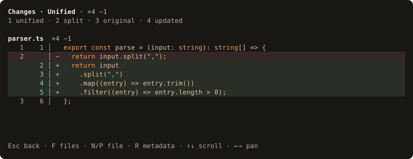
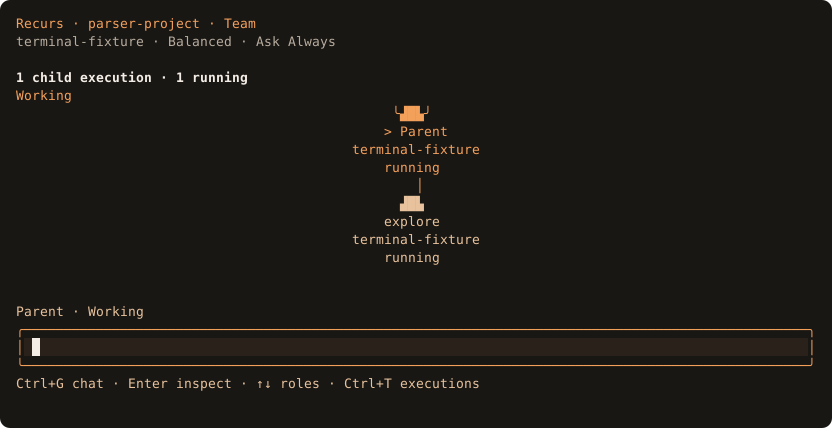

<p align="center">
  
</p>

<p align="center">A terminal coding agent with configurable agent teams.</p>

<p align="center">
  <a href="https://github.com/tacotuesday8888/recurs/actions/workflows/ci.yml"></a>
  <a href="https://www.npmjs.com/package/recurs"></a>
  <a href="LICENSE"></a>
</p>


## Install

macOS or Linux · Node.js 22.22+ · Git 2.45+ · ripgrep

```bash
npm install --global recurs@alpha
cd your-project
recurs
```

Connect a model, choose permissions, and start coding. Use your Codex login,
a supported API provider, or a local model. [Connections](docs/PROVIDER_CAPABILITY_MATRIX.md)

<details>
<summary>Other installers</summary>

```bash
brew install tacotuesday8888/recurs/recurs
bun install --global recurs@alpha
curl -fsSL https://github.com/tacotuesday8888/recurs/releases/download/v0.1.0-alpha.11/install.sh | sh
```

Bun can install Recurs; Node.js runs it. Linux command isolation requires Bubblewrap.
[Install help](docs/CLI.md#install)

</details>

## Code, review, continue

- Stream responses, inspect tool activity, and approve changes.
- Browse files and review numbered diffs in unified or split view.
- Rename, pin, archive, copy, and reopen chats.
- Connect MCP servers and add skills.



## Work with a team

Choose models for implementation, review, and repair. Set delegation depth,
concurrency, and permissions. Follow each running agent and inspect its work.



**Ctrl+G** opens the team. **Ctrl+T** opens executions. **Enter** inspects an agent.
[Team setup](docs/AUTO_MODEL_TEAMS.md)

## Reference

[CLI](docs/CLI.md) · [MCP](docs/MCP.md) · [Skills](docs/SKILLS.md) ·
[Appearance](docs/APPEARANCE.md) · [Contributing](CONTRIBUTING.md)

Recurs is an alpha (`0.1.0-alpha.11`). Use `@alpha` for the current published
package. This README follows the source; captures come from the terminal test
walkthrough. [Release notes](CHANGELOG.md) · [Feature status](docs/FEATURE_STATUS.md) ·
[Verification](docs/UI_VERIFICATION.md) · [Security](SECURITY.md) · [Privacy](PRIVACY.md)
