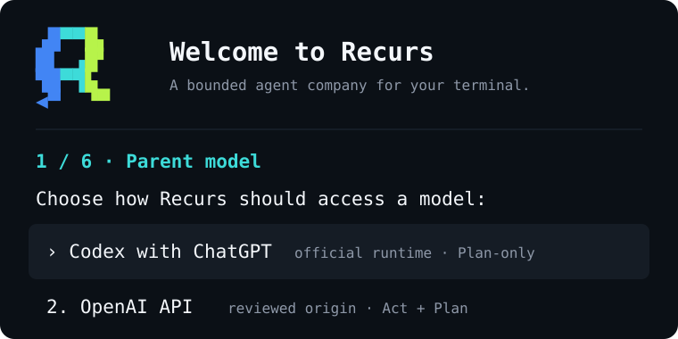

<div align="center">


# Recurs

**A coding-agent harness that can form a company—and stays inside the lines.**

Recurs can form and run a project-specific company, keep implementation in
isolated worktrees, and return reviewed work for your approval. Company
formation is optional; you can also use Recurs as a bounded parent coding agent.

[](https://github.com/tacotuesday8888/recurs/actions/workflows/ci.yml)
[](#project-status)
[](LICENSE)

</div>

<p align="center">
  
</p>

## 🚀 Start locally

> [!IMPORTANT]
> Recurs is a source-only public alpha candidate. The npm registry package,
> GitHub release and curl installer, Homebrew formula, signed binary, and
> desktop app are not published. Bun can install the prepared npm tarball in a
> pinned compatibility smoke, but Recurs remains a Node.js CLI; Bun is not a
> supported runtime.

You need Node.js 22.22+, Git 2.45+, and ripgrep.

```bash
git clone https://github.com/tacotuesday8888/recurs.git
cd recurs
npm ci
npm run build
npm link
recurs
```

On first launch, Recurs guides you through model access, safety boundaries,
operating mode, specialist routing, optional company review, and project
context. Credentials remain with the vendor runtime or a named process
environment. Recurs never persists BYOK values.

The exact local alpha archive measured 414 KiB compressed and 1.79 MiB
unpacked; a clean Apple-silicon production install measured about 38.7 MiB on
2026-07-26 and did not install Codex. Subscription users share a separately
installed exact official Codex CLI. The full development checkout remains
larger—about 402 MiB in this measurement, including about 307 MiB of pinned
Codex test fixtures. Exact size varies by platform and npm version.

> On Linux, subprocess containment also requires `/usr/bin/bwrap` with
> unprivileged user namespaces. Windows subprocess containment is not yet
> implemented and subprocess tools fail closed.

## ✨ Why Recurs

- 🏢 **Company-shaped work.** Review the proposed roles, reporting lines,
  tools, gates, and first goal before activation.
- 🛡️ **Limits before execution.** Permission, concurrency, request, cost,
  review, retry, and cancellation boundaries are frozen before work begins.
- 🔎 **Evidence before apply.** Mutating work stays in isolated Git worktrees
  through implementation, independent review, and bounded repair.
- 🔌 **Explicit model access.** Use reviewed OpenAI, Anthropic, Gemini,
  OpenAI-compatible, Ollama, LM Studio, or local user-present Codex
  subscriptions with exact model/effort routing through Recurs tools. Recurs
  never silently routes providers; optional Models Auto activates only from
  eligible, inspectable completed-goal evidence.
- 💾 **Designed to resume.** Goals, sessions, checkpoints, company knowledge,
  and approved organization revisions survive restarts.

## 🔁 From goal to apply

```text
approved goal
    │
    ▼
explore and plan
    │
    ▼
specialist implementation ──► independent review ──► bounded repair
    │
    ▼
candidate change ──► your approval ──► apply
```

Recurs depicts only agents that actually run. It does not claim arbitrary
recursive hierarchies, autonomous deployment, unattended daemon workers, or
automatic installation or trust of Skills and MCP servers.

## ✅ Built today

- **Company design:** resumable onboarding, versioned rosters, proposal
  revision, explicit activation, and multi-stage role DAGs.
- **Agent execution:** streaming tools, parallel Explore and Review work,
  isolated Implement teams, repair, apply, cancellation, compaction, steering,
  forks, undo, and restart recovery.
- **Extensions:** bounded Agent Skills, digest-bound stdio MCP, text and image
  input, headless JSON/JSONL, and a Recurs ACP endpoint.
- **Host controls:** permission profiles, credential-path denial, clean child
  environments, sanitized failures, and supported macOS/Linux containment.
- **Operations:** company status, activity, knowledge, readiness, amendments,
  exact-run inspection, deterministic formation, provider dogfooding, and
  durable-goal scoring.
- **Evidence-backed model teams:** `/model auto` records exact configured goal
  results, shows the selected Parent/Implement/Review/Repair models and
  rationale, and applies the most-supported eligible recorded configured lineup
  to future work.

The [feature status](docs/FEATURE_STATUS.md) is the code-backed inventory of
implemented, bounded, prepared-only, and absent capabilities.

## 📊 Alpha evidence

A real Codex subscription dogfood on 2026-07-23 completed Quick company
formation and a reviewed Balanced coding goal:

- Sol (`gpt-5.6-sol`, high) led and synthesized the run;
- Terra (`gpt-5.6-terra`, medium) produced the two-file candidate;
- Luna (`gpt-5.6-luna`, medium) independently approved it;
- all four fixture tests passed; and
- provider-reported usage totaled 216,879 input tokens, including 161,024
  cached input tokens, and 3,274 output tokens. Dollar cost was unavailable.

The first candidate passed review, so the configured Repair fallback did not
activate. Deterministic integration tests cover request-changes, bounded
repair, and re-review. This is proof that the full path can run.

On 2026-07-29, one fresh comparison pair ran on each of three immutable coding
fixtures. The Sol/Terra/Luna company passed all three hidden verifiers; the Sol
single-agent baseline passed two. On the two shared successes the company used
more input tokens, was slower once, and slightly faster once. This supports
selective team activation for quality insurance—not a claim that more agents
are always cheaper, faster, or better. The
[evaluation record](docs/COMPANY_EVALUATION.md) gives the exact results and
remaining evidence bar.

## ⌨️ Everyday commands

```bash
recurs                                      # set up or resume
recurs run "inspect the project" --plan    # one bounded headless run
recurs review                               # review staged/unstaged Git work
recurs doctor                               # redacted host-readiness report
recurs eval company --json                  # deterministic offline evaluation
recurs eval company --list --json           # discover evaluation scenarios
recurs benchmark company --list --json      # discover immutable proof fixtures
```

Use `-C /path/to/project` with interactive, run, or review commands. The
[CLI guide](docs/CLI.md) covers every command, provider, permission, image,
session, and JSON/JSONL option.

## Project status

- **Usable now:** source checkout on Node.js 22.22+ with npm, Git, and ripgrep;
  macOS and Linux are the supported subprocess platforms.
- **Proven live:** company formation, isolated implementation, independent
  review, synthesis, explicit apply, evidence-backed Auto activation, and one
  single-versus-company pair on every built-in proof fixture through a real
  Codex subscription.
- **Not distributed:** package metadata is `0.1.0-alpha.1`, but there is no
  public npm package, GitHub release, curl installer, or Homebrew tap. The
  prepared Bun global-install path cannot work until the npm package exists and
  still launches Recurs with Node.js.
- **Prepared to repeat:** three immutable hidden-verifier fixtures, repeatable
  selected-parent-only versus currently configured saved role-route campaigns,
  an explicit all-strong comparison option, and distinct Quick/Guided/Deep
  formation evaluations are implemented. At least three pairs per fixture,
  alternative teams, and provider-reported cost still need authorized model
  runs.
- **Not implemented:** Windows subprocess containment and a desktop app.

## 📚 Documentation

- [Public alpha status](docs/PUBLIC_ALPHA.md) — installation, evidence, limits,
  and release criteria in one page
- [CLI guide](docs/CLI.md) — setup, commands, outputs, storage, and limits
- [Feature status](docs/FEATURE_STATUS.md) — exact capability inventory
- [Architecture](ARCHITECTURE.md) — engine boundaries and lifecycle
- [Agent company onboarding](docs/AGENT_COMPANY_ONBOARDING.md) — product and
  authority model
- [Security policy](SECURITY.md) — support and disclosure boundary
- [Product direction](PRODUCT.md) — current shape and roadmap
- [Release runbook](docs/RELEASING.md) — artifact and publication gates

## 🧪 Develop and verify

```bash
npm run check
npm run package:smoke-install
```

See [CONTRIBUTING.md](CONTRIBUTING.md) before opening a pull request. Use
[SUPPORT.md](SUPPORT.md) for help and [SECURITY.md](SECURITY.md) for private
security-reporting guidance.

## License

Recurs is licensed under the [Apache License 2.0](LICENSE). Direct runtime
dependencies retain their own licenses in [THIRD_PARTY_NOTICES.md](THIRD_PARTY_NOTICES.md).
