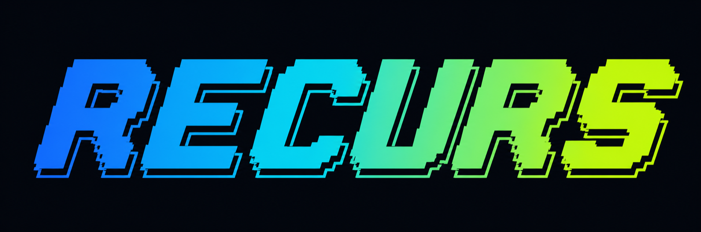

<p align="center">
  
</p>

<p align="center">
  <strong>The best coding model is a team. You control the team.</strong>
</p>

<p align="center">
  Open-source coding-agent teams with visible roles, routes, limits, review, and results.
</p>

<p align="center">
  <a href="https://github.com/tacotuesday8888/recurs/actions/workflows/ci.yml"></a>
  <a href="https://www.npmjs.com/package/recurs"></a>
  <a href="https://github.com/tacotuesday8888/recurs/releases/tag/v0.1.0-alpha.7"></a>
  <a href="LICENSE"></a>
</p>

## Install

macOS and Linux · Node.js 22.22+

| Method | Command |
| --- | --- |
| npm | `npm install --global recurs@alpha` |
| Homebrew | `brew install tacotuesday8888/recurs/recurs` |
| curl | `curl -fsSL https://github.com/tacotuesday8888/recurs/releases/download/v0.1.0-alpha.7/install.sh \| sh` |
| Bun | `bun install --global recurs@alpha` |

Then launch Recurs inside a project:

```bash
cd your-project
recurs
```

Every path installs the same reviewed package. Bun can install Recurs; Node.js
runs it. See [installation, upgrades, and source setup](docs/CLI.md#install).
Use the explicit `@alpha` tag: npm's unqualified `latest` tag still points to
`0.1.0-alpha.2`, while `alpha` points to `0.1.0-alpha.7`.

## One goal. A controlled company.

```text
goal → plan → workers → review → repair → synthesis → approval
```

Recurs turns a coding goal into bounded, inspectable work. You choose the team
size, delegation depth, model route, authority, and budget. Recurs records the
agents that actually ran, their handoffs, evidence, usage, and final result.

- **Bring your models.** Use API keys, coding plans, local models, or a
  user-present vendor runtime such as Codex with ChatGPT.
- **Control the team.** Route roles independently and cap depth, concurrency,
  retries, requests, and spend.
- **Keep authority narrow.** Children cannot exceed parent permissions;
  repository changes stay isolated until the active policy allows application.
- **Require evidence.** Independent review, bounded repair, durable recovery,
  and truthful failure reporting are part of the runtime.

## Quick start

The first run discovers available model connections, asks for an authority
level, and offers to form a project-specific company. Start with the recommended
defaults or inspect every route and limit before approval.

```bash
recurs                                  # interactive session
recurs run "fix the failing tests"      # bounded headless run
recurs review                           # review local changes
recurs doctor                           # check host readiness
```

Useful commands inside Recurs:

```text
/goal <objective>    create a durable goal
/goal launch         launch the approved company goal
/agents controls     inspect team limits
/company status      inspect the active company
/model auto          select an evidence-gated model team
/permissions         change the authority profile
/status              show the session and usage
```

## Current status

Recurs is public alpha software for macOS and Linux. The base agent loop,
provider routes, permissions, worktree isolation, durable company execution,
review, repair, recovery, and explicit apply path are implemented and tested.
Team configurations remain evidence-gated: Recurs does not claim that a larger
team always beats a strong single agent.

The published alpha.7 archive is immutable. Current `main` contains post-tag
hardening and provider work that will ship only in a later deliberately tagged
preview; the repository does not retroactively describe those bytes as the
public alpha.7 artifact. Current model-team evidence remains insufficient for
an Auto promotion, includes a false approval, has limited Repair evidence, and
has no provider-reported dollar cost.

- [Five-minute CLI guide](docs/CLI.md)
- [Feature status](docs/FEATURE_STATUS.md)
- [Company onboarding](docs/AGENT_COMPANY_ONBOARDING.md)
- [Architecture](ARCHITECTURE.md)
- [Security](SECURITY.md) and [privacy](PRIVACY.md)
- [Public alpha boundaries](docs/PUBLIC_ALPHA.md)
- [Active-use release-candidate evidence](docs/ACTIVE_USE_RELEASE_CANDIDATE.md)
- [Contributing](CONTRIBUTING.md)

Apache-2.0 © Recurs contributors
