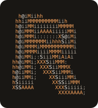
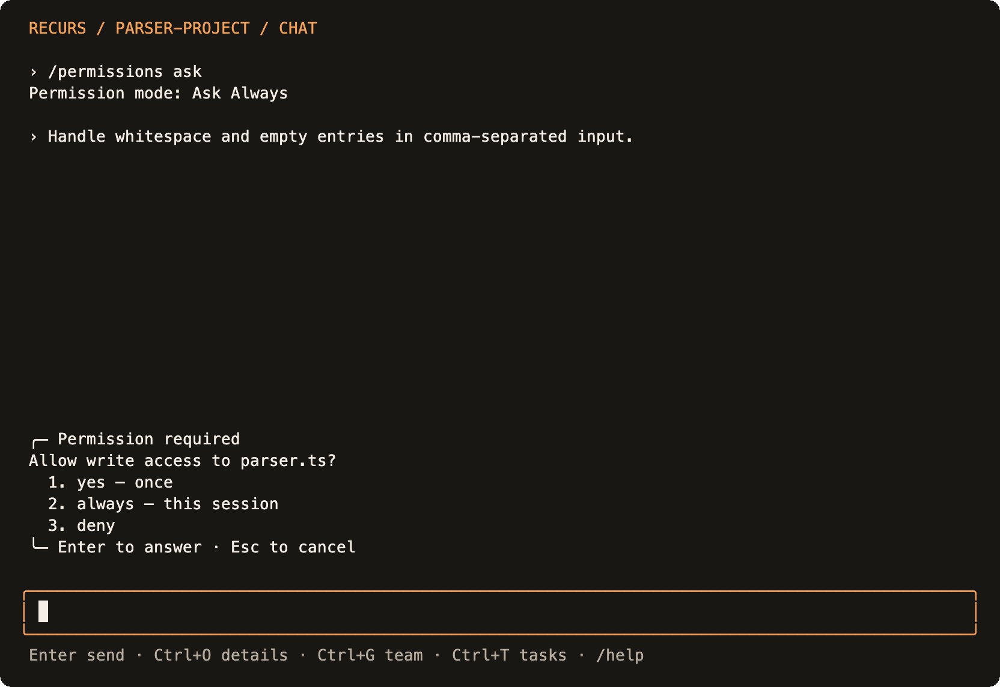
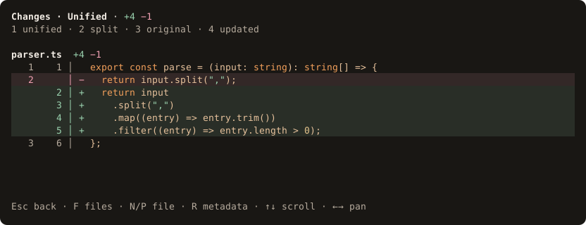
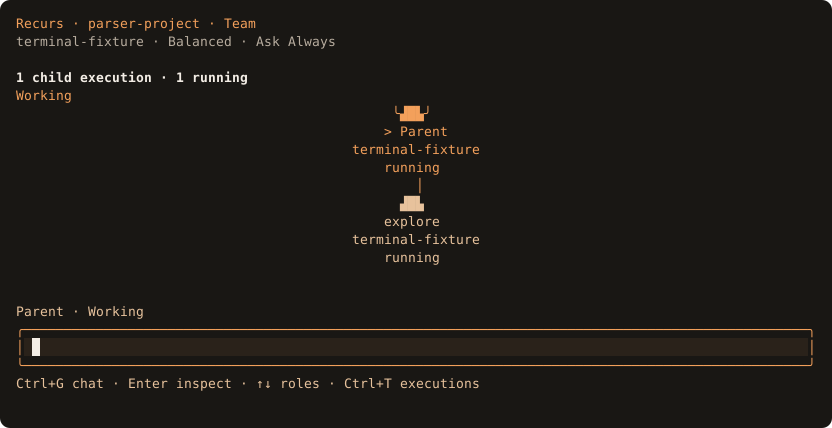

<p align="center">
  
</p>

<h1 align="center">Coding agents. Your terminal.</h1>

<p align="center">Choose the models. Bound the team. Review every change.</p>

<p align="center">
  <a href="https://github.com/tacotuesday8888/recurs/actions/workflows/ci.yml"></a>
  <a href="https://www.npmjs.com/package/recurs"></a>
  <a href="LICENSE"></a>
</p>

## Install

macOS or Linux · Node.js 22.22+ · Git 2.45+ · ripgrep

```bash
npm install --global recurs@alpha
cd your-project
recurs
```

Connect a model, choose permissions, and start coding: your Codex login, a
supported API provider, or a local model. [Connections](docs/PROVIDER_CAPABILITY_MATRIX.md)

<details>
<summary>Bun, Homebrew, or the release installer</summary>

```bash
bun install --global recurs@alpha
brew install tacotuesday8888/recurs/recurs
curl -fsSL https://github.com/tacotuesday8888/recurs/releases/download/v0.1.0-alpha.11/install.sh | sh
```

Bun can install Recurs; Node.js runs it. Linux command isolation requires Bubblewrap.
[Install help](docs/CLI.md#install)

</details>

## Every step stays in view

Recurs shows what each agent reads, edits and runs. Open a step, review the
diff, and your draft is still there when you return.



- **Choose the models.** Use one model for everything, or assign separate ones
  to implement, review and repair. `recurs setup`
- **Bound the team.** Set delegation depth, concurrency, request budgets and
  permissions before work starts. `/agents`
- **Review before it lands.** Workers build in isolated Git worktrees; an
  independent reviewer checks their work before your session applies it. <kbd>Ctrl+T</kbd>

<details>
<summary>Code review and the agent team</summary>





</details>

## Built to stay responsive

| Recurs, same workload before → after | Result |
| --- | --- |
| Streaming turn, median over 120 turns | 501–521 ms → **124 ms** |
| Loading a chat's agent history beside 30 other chats | 1.1 s → **8 ms** |
| Peak physical memory over 120 turns | ~400 MiB → **~270 MiB** |

Against one local model server with identical replies, Recurs finished a long
streamed answer in **369 ms**, against 432 ms for Codex CLI and 495 ms for
Claude Code (median of five runs; one of three measured workloads).
[CLI comparison](benchmarks/cli-resources/README.md) ·
[Memory method](docs/ACTIVE_SESSION_MEMORY.md)

## Reference

[CLI](docs/CLI.md) · [MCP](docs/MCP.md) · [Skills](docs/SKILLS.md) ·
[Appearance](docs/APPEARANCE.md) · [Benchmarks](benchmarks/product-comparison/README.md) ·
[Contributing](CONTRIBUTING.md)

Recurs is an alpha (`0.1.0-alpha.11`); install with the `@alpha` tag. Captures
come from the installed-package terminal walkthrough.
[Release notes](CHANGELOG.md) · [Feature status](docs/FEATURE_STATUS.md) ·
[Verification](docs/UI_VERIFICATION.md) · [Security](SECURITY.md) · [Privacy](PRIVACY.md)
