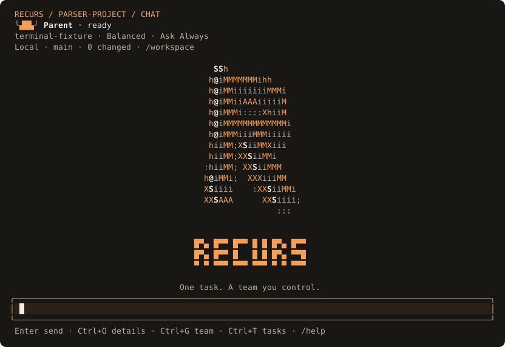
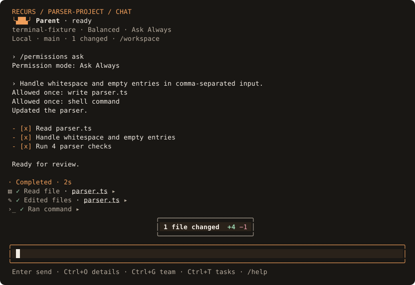

# Terminal appearance

Press **F2** while the parent is idle, or enter `/theme`, to open the appearance
picker. Arrow keys preview colors immediately. **Enter** saves; **Escape**
restores the appearance you opened with. Your unfinished message stays intact.
**C** edits individual colors: **Tab** selects a role, six hex digits and **Enter** preview the color, then **Enter** saves the theme. **Ctrl+C** cancels the entire preview.

The **3D R opening and V19 agent floor are one interface**. The R rotates 2.5 times faster than the original. **Ctrl+G** switches between conversation and the agent floor, even before the first child starts. **Ctrl+T** opens executions; **Enter** inspects one; **Escape** returns. **F3** opens permissions, **F2** colors, and **Ctrl+Q** exits. Pending approvals stay visible until answered or cancelled with Escape. Legacy `/theme design r|v19` commands still open the corresponding view; they no longer select separate interfaces.

The current preset is marked, and selection remains visible in short terminals.

| Preset | Appearance |
| --- | --- |
| `orange` | Default: charcoal background, warm orange accents, soft text |
| `system` | Your terminal's background and standard ANSI colors |
| `dark` | Slate background, pale text, cyan accents |
| `light` | White background, dark text, blue accents |
| `contrast` | Black background, bright text, no dimmed semantic labels |

```text
/theme dark
/theme light
/theme system
/theme color accent #67e8f9
```

`/theme <preset>` selects a clean preset and resets custom colors. Reconfirming
the current preset in the picker preserves its custom colors. A color command
changes only that semantic role. Supported roles are `background`, `foreground`,
`accent`, `muted`, `success`, `warning`, `failure`, and `code`. Values must be
six-digit hex colors such as `#67e8f9`; executable theme files, escape sequences,
color references, and unknown keys are rejected.

Colors apply to the shared terminal canvas, conversation, editor, model picker,
team tree, and execution inspector. Setup loads the saved appearance on startup.
The supplied light and dark palettes keep muted and status text readable;
custom foreground/background combinations are your choice and can reduce
contrast. Status remains labeled in words as well as color.


## Persistence and environment

The full-screen CLI saves preferences in `config/appearance.json` beneath the
Recurs data directory (`recurs data path`). That file is private user
configuration, independent of project sessions. On Unix its permissions are
`0600` inside an owned `0700` directory. Symlink and hard-link destinations are
rejected. A safely owned malformed file can be replaced by an explicit theme
selection. A load failure falls back to the orange preset with a notice.

`RECURS_THEME=dark recurs` selects a preset for startup instead of reading the
saved setting; valid values are the five names above. Invalid environment names
fall back to `system`. An explicit `/theme` change still saves a future
preference. The environment override takes precedence again on the next launch.

`NO_COLOR`, `CLICOLOR=0`, a dumb terminal, or non-terminal output disables
styling. The preference can still be saved while color is disabled. The picker
and `/theme` commands are full-screen UI features; readline and headless output
keep their existing text behavior, and do not read saved appearance settings.

The screenshots come from the installed executable and a real terminal emulator
using a deterministic local provider. They demonstrate rendering and interaction,
not the quality of a model's code review.

The opening uses a spinning, extruded R with inset detail, rendered in native terminal geometry, with no image protocol or downloaded assets. Set `RECURS_REDUCED_MOTION=1` to freeze animation. The team floor displays configured roles and their recorded status; crowded or small terminals use the navigable tree. Live activity shows tool outcomes and completed `apply_patch` additions/deletions. Counts describe observed patch lines in the current turn, not a repository-wide diff; oversized patches show file-change information instead.





## Run the complete first-run experience

```sh
cd /path/to/recurs
npm run ui:preview
```

This builds and runs the real onboarding with an empty private home and workspace.
No model connection or conversation is preloaded. Sign in with a provider and
continue through permissions and team setup. Connected requests use your actual
provider account. The printed temporary directory retains the preview's private
state for inspection; normal Recurs settings are untouched. For environment-key
providers, pass `-- --use-env` to explicitly expose your existing `*_API_KEY` and
`*_AUTH_TOKEN` environment variables to this isolated process.

For the deterministic, no-account tool walkthrough, use `npm run ui:demo`.
Try “Apply terminal fixture patch”, “Inspect with terminal child”, or “show long
output”. Responses are scripted; tools, approvals, file edits, and child execution
are real. Add `-- --setup` to exercise onboarding with the fixture connection.

For everyday use in your own project, run `recurs` (or the current local build).
