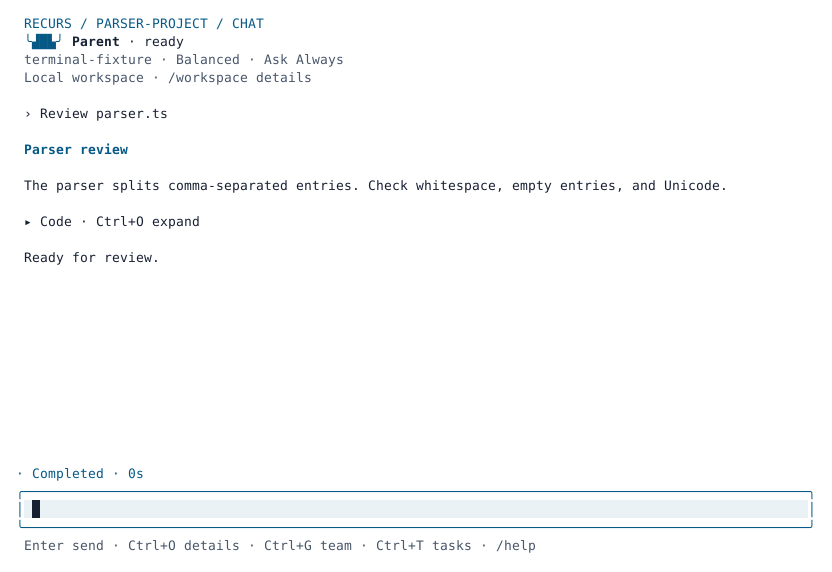

# Terminal appearance

Press **F2** while the parent is idle, or enter `/theme`, to open the appearance
picker. Arrow keys preview colors immediately. **Enter** saves; **Escape**
restores the appearance you opened with. Your unfinished message stays intact.
The current preset is marked, and selection remains visible in short terminals.

| Preset | Appearance |
| --- | --- |
| `system` | Your terminal's background and standard ANSI colors |
| `dark` | Slate background, pale text, cyan accents |
| `light` | White background, dark text, blue accents |
| `contrast` | Black background, bright text, no dimmed semantic labels |

```text
/theme dark
/theme light
/theme system
/theme color accent #67e8f9
```

`/theme <preset>` selects a clean preset and resets custom colors. Reconfirming
the current preset in the picker preserves its custom colors. A color command
changes only that semantic role. Supported roles are `background`, `foreground`,
`accent`, `muted`, `success`, `warning`, `failure`, and `code`. Values must be
six-digit hex colors such as `#67e8f9`; executable theme files, escape sequences,
color references, and unknown keys are rejected.

Colors apply to the shared terminal canvas, conversation, editor, model picker,
team tree, and execution inspector. Setup loads the saved appearance on startup.
The supplied light and dark palettes keep muted and status text readable;
custom foreground/background combinations are your choice and can reduce
contrast. Status remains labeled in words as well as color.



## Persistence and environment

The full-screen CLI saves preferences in `config/appearance.json` beneath the
Recurs data directory (`recurs data path`). That file is private user
configuration, independent of project sessions. On Unix its permissions are
`0600` inside an owned `0700` directory. Symlink and hard-link destinations are
rejected. A safely owned malformed file can be replaced by an explicit theme
selection. A load failure falls back to terminal defaults with a notice.

`RECURS_THEME=dark recurs` selects a preset for startup instead of reading the
saved setting; valid values are the four names above. Invalid environment names
fall back to `system`. An explicit `/theme` change still saves a future
preference. The environment override takes precedence again on the next launch.

`NO_COLOR`, `CLICOLOR=0`, a dumb terminal, or non-terminal output disables
styling. The preference can still be saved while color is disabled. The picker
and `/theme` commands are full-screen UI features; readline and headless output
keep their existing text behavior, and do not read saved appearance settings.

The screenshots come from the installed executable and a real terminal emulator
using a deterministic local provider. They demonstrate rendering and interaction,
not the quality of a model's code review.
