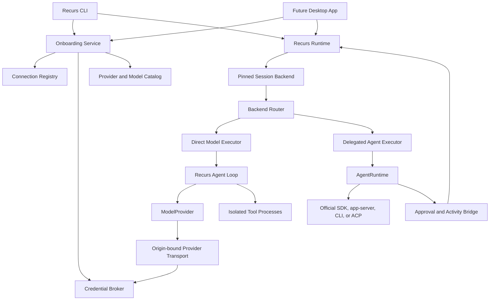
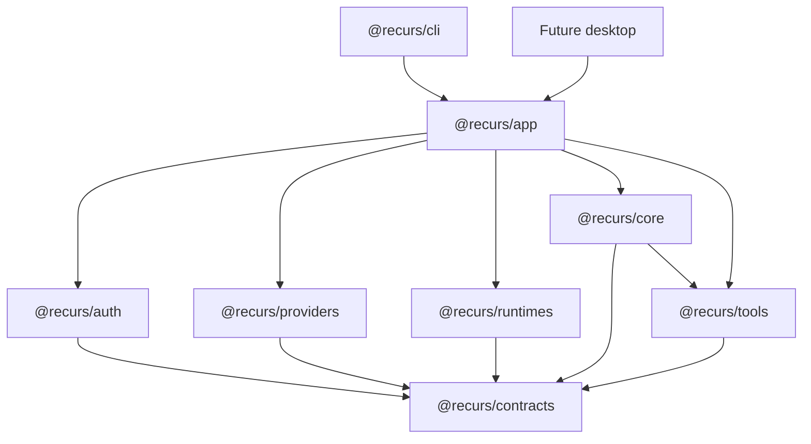

# Recurs Provider, Authentication, and Onboarding Design

**Date:** 2026-07-10
**Status:** Reviewed umbrella design — Slice 0, the TypeScript safety precursor and macOS native-authority foundation of Slice 1, the 25-path/non-secret connection lifecycle of Slice 2, and the Codex foundation of Slice 4 implemented; direct credential-bearing Slice 3 and later runtime/policy work pending
**Scope:** CLI-first provider connectivity shared with the future desktop app

This specification describes the provider/authentication program. The repository now implements dependency-leaf contracts, immutable backend pins, trusted host context, version-2 sessions and leases, direct/delegated coordination, durable delegated results and recovery, a sessionless workspace shell, unified built-in credential exclusions, checkpoint format gating, clean child state, tool security profiles, sanitized failures, a strict 25-path manifest catalog, a non-secret connection registry and exact-ID lifecycle service, literal-loopback OpenAI-compatible setup, the first official Codex-with-ChatGPT ACP path, and the macOS native-authority component foundation. That native foundation includes tested Data Protection Keychain and credential-state/journal libraries, exact-peer code-identity checks, handshake/health launcher-broker executables, bounded no-secret framing, a credential-free injected-descriptor TypeScript client, and redacted diagnostics. It is not an end-to-end signed authority: the launcher-to-Node bridge, live broker credential operations, and signed/notarized artifact remain absent. Recurs imports or stores no vendor credential; Codex authentication remains owned by the pinned official runtime. Direct API, coding-plan, OAuth, and cloud-identity activation remains blocked until that native wiring, provider codecs/profiles, hidden-input lifecycle, transport/policy binding, and signed installed-artifact evidence land. See [the architecture](../../../ARCHITECTURE.md) and the newer [Provider Activation v1 design](2026-07-13-provider-activation-v1-design.md) for exact implemented behavior and the narrower native-authority decision that supersedes this umbrella design's blanket sandbox prerequisite for broker-owned direct credentials.

## 1. Decision

Recurs will support multiple model accounts and access methods without pretending
they are interchangeable.

The system has two execution lanes:

1. **Direct model connections** implement `ModelProvider`. Recurs owns the agent
   loop, tools, permissions, goals, checkpoints, retries, and context.
2. **Delegated agent connections** implement `AgentRuntime`. An official vendor
   SDK, app-server, CLI protocol, or ACP runtime owns its internal agent loop.
   Recurs owns the outer task, normalized activity, policy enforcement,
   approvals when the runtime exposes them, cancellation, and orchestration.

Provider setup is a core part of first-run onboarding. A user chooses an
existing subscription, an API or coding-plan key, or a local model; verifies the
connection; selects a coding-capable model; sees who will bill the work; and
then enters Recurs.

Recurs will use only official, documented integration methods. It will never
copy browser cookies, import another product's private auth files, scrape a
Keychain entry, or relabel a consumer subscription as generic API access.

## 2. Goals

The provider layer must let users:

- Connect normal API keys from major Western and Chinese providers.
- Connect supported coding-plan keys while enforcing each plan's restrictions.
- Use supported consumer or developer subscriptions through official SDKs,
  app-servers, CLIs, or ACP runtimes.
- Run local and self-hosted models through loopback or explicitly approved
  endpoints.
- Configure one primary connection during onboarding and add more later.
- Know which account, model, billing method, and usage policy powers every run.
- Resume sessions without silently changing provider, account, or billing.
- Use the same connection service from the CLI and future desktop app.
- Prepare for future orchestrator/worker routing without building that router
  in this phase.

Security requirements are product behavior, not optional hardening. A model,
tool, model-controlled subprocess, project file, or Full Access mode must never
be able to obtain a provider credential.

## 3. Non-goals

This design does not include:

- Recurs-hosted model credits or a Recurs billing gateway.
- Automatic cheapest-model or strongest-model routing.
- Multi-agent orchestrator/worker assignment.
- Account sharing, pooled consumer subscriptions, or credential brokering
  between users.
- A provider marketplace or third-party adapter loading system.
- Windows secure-storage and sandbox implementation. The contracts must remain
  portable, but Windows support follows the initial macOS/Linux work.
- Supporting every nominally OpenAI-compatible endpoint without a tested
  provider profile.
- Workarounds for subscriptions that do not officially allow third-party use.

## 4. Current State and Required Corrections

Recurs Core v0 has a provider-neutral agent loop, tools, permission modes, Plan
mode, goals, durable sessions, checkpoints, and CLI. Standalone assembly now
loads a strict non-secret connection registry and resolves either a local direct
model or the first production delegated runtime. The injected `ModelProvider`
remains available as a test/embedding seam.

The current live provider foundation is deliberately narrow:

- A validated manifest registry describes 25 distinct provider/authentication
  paths. Only literal-loopback Ollama, literal-loopback LM Studio, and Codex
  with ChatGPT through the official ACP adapter are runnable.
- Version-2 sessions pin the exact connection, adapter, model, account
  fingerprint, policy, and acknowledged billing source set. Local pins also
  bind the normalized loopback origin. Each operation resolves that exact pin
  from the current registry, so changing primary cannot redirect history and a
  changed or disconnected record fails preflight. Exact-ID account commands
  list, verify, select, and disconnect redacted registry/application data.
- `BackendRunCoordinator` has separate direct and delegated executors. Delegated
  results, failures, usage, file/evidence data, and continuation transitions are
  durable; uncertain continuations are reconciled before new work rather than
  replayed.
- Codex is restricted to local, manual, user-present CLI use and an enforced
  `read-only`/Plan profile. Setup checks structured ChatGPT authentication;
  each run binds that account on the exact ACP child before session work and
  again immediately before prompting. Core rejects non-read opaque runtime
  approvals in Plan. Included usage may fall through to automatic prepaid-
  credit use only after explicit revision-bound acceptance.
- Delegated `/compact` is explicitly unavailable because the vendor runtime
  owns its transcript.

The TypeScript safety precursor adds these implemented defenses:

- Direct and aggregate built-in tools share one case-insensitive credential-path
  policy; classified intents are permanently denied in every preset.
- New checkpoint stores exclude classified paths before file reads or blob
  writes and carry a version-2 format marker; ambiguous legacy stores fail
  closed and require an explicit manual reset.
- Fixed and arbitrary children receive a synthetic private home and an
  allowlisted environment, and process groups are bounded and cleaned up.
- Provider, tool, process, and unexpected CLI failures cross durable or
  user-visible boundaries through safe messages rather than raw stderr, causes,
  or provider text.
- Runtime composition exposes the default `local_guarded` profile and a
  fail-closed `tools_disabled` profile that advertises no model tools.

Those defenses remain insufficient for real credentials:

- The path-based Node implementation cannot remove check-then-open symlink races
  or provide descriptor-relative no-follow access.
- `local_guarded` arbitrary commands retain the Recurs user's filesystem,
  network, IPC, and process-inspection authority; clean environment variables do
  not prevent indirect access to Recurs data or vendor auth state.
- `tools_disabled` is not a useful coding profile and does not create a broker
  or isolate the main process.
- Session/checkpoint roots and their full parent chains are not validated as a
  hardened secret store for ownership, mode, ACL, filesystem semantics, and
  concurrent no-follow access.
- Native non-exporting broker components now exist, but their credential-state
  libraries are not connected to the handshake/health service and the launcher
  does not yet bridge an anonymous socket to Node. No origin-bound provider
  transport, signed installed artifact, or general OS sandbox exists.

No live cloud credential may ship until the credential and execution isolation
gates in this specification are proven.

**Supersession note:** Sections 6, 7, 12, and 20 below preserve the broader
umbrella target. The approved 2026-07-13 Provider Activation v1 design is
authoritative for the macOS direct-provider path: it permits a narrower signed
broker/launcher authority instead of requiring a general tool OS sandbox, but
only after installed-artifact tests prove that tools cannot inherit, discover,
or reuse credentials or native request authority. If that proof fails, direct
providers remain disabled and the general sandbox requirement returns.

## 5. Evaluated Approaches

### 5.1 Gateway-first

Send every model request through one compatibility gateway.

This would minimize adapter count, but it would add another billing and trust
layer, hide plan-specific rules, fail to represent official agent runtimes, and
make Recurs dependent on a third party for its core execution path.

**Decision:** Rejected as the primary architecture. A gateway may be added later
as an ordinary optional provider connection.

### 5.2 Treat every integration as a raw model

Adapt Codex, Copilot, Claude Agent SDK, and ACP agents to `ModelProvider`.

This creates two nested agent loops and loses truthful permission, transcript,
tool, sandbox, and resume semantics.

**Decision:** Rejected.

### 5.3 Hybrid direct-model and delegated-agent architecture

Use normalized raw-model adapters for APIs and local servers, and a separate
runtime contract for official coding agents.

This retains Recurs's first-party harness while respecting vendor-owned agent
runtimes and subscription boundaries.

**Decision:** Selected.

### 5.4 Reference-agent lessons

Recurs builds its own contracts and implementations, but the design uses
specific lessons from open-source agents:

- **Pi** demonstrates a small normalized stream plus explicit provider
  compatibility flags.
- **OpenCode** demonstrates catalog-driven provider setup and the need to remove
  consumer-auth plugins when provider policy forbids them.
- **Goose** demonstrates keeping direct model providers and ACP-delegated agents
  as separate execution paths.
- **Hermes Agent** demonstrates declarative provider profiles and account
  registries, while also showing why Recurs must not import another client's
  auth files.
- **Codex CLI/app-server, Copilot SDK, Mistral Vibe, and Grok Build** demonstrate
  structured official agent-runtime protocols rather than token reuse.

These projects are references, not embedded harness dependencies. Recurs owns
its session, permission, event, connection, and policy models.

## 6. High-level Architecture



### 6.1 Authority planes

The implementation must maintain three authority planes:

1. **User-only account control plane**
   - Onboarding, connect, reconnect, disconnect, endpoint approval, and key
     entry.
   - Never exposed as model-callable tools.
2. **Credential and provider transport plane**
   - Resolves opaque credential references, binds them to an exact provider
     origin, injects authorization, performs network requests, and sanitizes
     failures.
   - Direct model adapters do not receive exportable secret values.
3. **Untrusted execution plane**
   - Model-selected tools and repository scripts run with a clean environment,
     synthetic home, no Recurs data access, no vendor auth directories, and a
     tested OS/process isolation boundary.

A delegated vendor runtime controller is a narrowly trusted, credential-bearing
adjunct to the account plane, not part of the untrusted execution plane. Its
agent/tool children must be placed across a tested OS authority boundary. A
runtime that cannot separate controller authentication from child execution is
not supported.

Package boundaries organize code; they are not the security boundary. The
persistent secure store, credential broker, and authorized network transport
run in a separate broker process or equivalently isolated OS service. Tool
processes do not inherit its file descriptors, environment, socket capability,
or process-inspection rights. The main agent process receives sanitized
transport events, not long-lived refresh tokens. An in-process fake broker is
permitted only in tests that use canary credentials.

### 6.2 Implementation note: native authority is required

Review of the TypeScript safety precursor established that Node pathname
validation plus an opaque or branded TypeScript object cannot satisfy hardened
storage semantics. A check-then-open pathname remains subject to symlink races,
and a compile-time brand carries no operating-system authority. Environment
cleanup also cannot prevent a child with the same user identity from opening
other paths, contacting local services, or inspecting accessible processes.

Before Recurs owns a direct API, coding-plan, OAuth, or cloud-identity
credential, it must complete and test the narrow native broker/storage boundary
defined by Provider Activation v1. The repository now contains its Keychain,
credential-state/journal, exact-peer, framing/client, and handshake/health
components, but not the launcher-to-Node bridge, live broker credential
operations, origin-bound transport, or installed signed-artifact proof. The
newer design requires tool-child authority denial and installed canary testing;
it does not claim that the current `local_guarded` profile is a general OS
sandbox. A small platform-native component is appropriate for this authority
boundary. The TypeScript agent loop, coordinator, session engine, and CLI do
not need a wholesale rewrite.

`@recurs/auth` is now a deliberately small credential-free client for an
injected inherited native descriptor. It is not a pathname wrapper, secure
store, connection registry, provider transport, or secret API. Literal-loopback
local onboarding remains the only Recurs-owned direct transport and collects no
key. The descriptor marker is transport plumbing, not identity proof: until an
OS-authenticated launcher bridge exists, the production inherited-descriptor
factory downgrades a peer's self-asserted ready result to
`peer_identity_unverified` without a caller-controlled bypass.

## 7. Package Boundaries

The implementation should preserve the current small monorepo structure.

The dependency graph is acyclic:



### `@recurs/contracts` (implemented dependency leaf)

- `JsonValue`, messages, tools, normalized events, failures, connection
  variants, billing/policy types, model catalogs, backend pins, continuation
  handles, `ModelProvider`, `AgentRuntime`, and injected port interfaces.
- No Node APIs, storage, network, UI, provider implementations, or internal
  package dependencies.
- `ProviderTransport`, `BackendResolver`, and native authority-handle ports are
  consumer-owned contracts, preventing providers and auth from importing each
  other. A TypeScript-only branded path is not an authority handle.

### `@recurs/providers`

- Provider manifests and protocol profiles.
- OpenAI Responses, OpenAI Chat Completions, Anthropic Messages, Gemini,
  Bedrock, and compatible endpoint adapters.
- Depends only on contracts. Provider transport and continuation storage are
  injected ports; providers never import `@recurs/auth`.
- No Keychain implementation and no CLI prompts.

### `@recurs/auth` (implemented bounded native client)

- Consumes and removes one injected inherited-descriptor marker.
- Performs bounded binary framing, exact protocol/component-version and nonce
  handshake, request correlation, timeout, cancellation, and fixed safe-failure
  mapping.
- Treats the injected marker and peer-supplied attestation as untrusted
  provenance and cannot expose a self-asserted ready result from that path.
- Exposes only redacted native attestation/health and has no `getSecret`,
  endpoint, header, credential-reference, Keychain, storage, registry, OAuth,
  or provider-transport surface.
- Includes a fake status port for deterministic tests.

The production launcher-to-Node descriptor producer remains pending. Secure
storage and provider transport live in the native authority rather than this
TypeScript package.

### `@recurs/runtimes` (implemented ACP/Codex foundation)

- Managed subprocess/IPC launcher for authenticated official runtimes.
- Codex app-server/SDK, Copilot SDK, Mistral Vibe ACP, Grok Build ACP, and
  conditional Claude Agent SDK adapters.
- Protocol negotiation, event limits, approval bridging, and cancellation.

### `@recurs/core`

- Backend-neutral `RecursRuntime`, `RunCoordinator`, and session mutation
  leases.
- Direct-model executor wrapping the existing `AgentLoop`.
- Delegated-agent executor normalizing runtime activity into Recurs events.
- Pinned session backend and vendor continuation state.
- No provider-specific auth logic and no dependency on auth implementations.
- Credential-bearing session/continuation stores eventually accept a
  native-backed opened-directory authority, never an arbitrary path string.
  The current session/checkpoint implementations still use path strings and are
  not auth-secret stores.

### `@recurs/tools`

- Clean child-process state now; OS-isolated tool execution before credentials.
- Permanent hard denial for credential/internal-secret access.
- Existing workspace policies, checkpointing, and stale-write protection.
- Checkpoints use an exclusion format gate but remain pathname-based and
  unsuitable for auth secrets.
- No ability to query the connection registry or broker.

### `@recurs/cli`

- First-run onboarding and command rendering.
- Noninteractive configuration errors.
- Argument parsing, REPL handling, and the CLI composition entrypoint.
- No direct secure-store or vendor-token parsing.

### `@recurs/app` (implemented non-secret foundation; broader layer planned)

- Owns `OnboardingService`, connection/account commands, model selection,
  `BackendResolver`, provider/runtime factories, and application assembly.
- Combines auth, providers, runtimes, core, and tools through their contracts.
- Is the shared API used by CLI and the future desktop app.

The future desktop app will render the same `OnboardingService` state machine
and call the same connection APIs.

## 8. Core Domain Contracts

The following TypeScript-shaped contracts define the required semantics. Exact
file splitting may change during implementation, but the boundaries must not.

### 8.1 Connection identity

```ts
type AdapterKind = "model_provider" | "agent_runtime";
type AccessKind = "api" | "coding_plan" | "subscription" | "cloud_identity" | "local";
type BillingSource =
  | "metered_api"
  | "included_subscription"
  | "prepaid_credits"
  | "cloud_account"
  | "local_compute";
type AuthKind =
  | "api_key"
  | "coding_plan_key"
  | "oauth_pkce"
  | "device_code"
  | "cloud_identity"
  | "official_runtime"
  | "local_endpoint";

type ConnectionState =
  | { status: "ready" }
  | { status: "needs_verification"; reason: string }
  | { status: "needs_reauthentication"; reason: string }
  | {
      status: "disabled";
      reason: "no_compatible_model" | "policy" | "adapter" | "user";
    }
  | { status: "unavailable"; reason: string };

interface BillingPolicy {
  revision: string;
  disclosureRevision: string;
  primarySource: BillingSource;
  possibleAdditionalSources: readonly BillingSource[];
  providerFallback: "none" | "user_configured" | "automatic" | "unknown";
  availableSelections: readonly BillingSelectionMode[];
}

type BillingSelectionMode =
  | "provider_default"
  | "strict_primary_only"
  | "allow_declared_additional";

interface BillingSelection {
  mode: BillingSelectionMode;
  policyRevision: string;
  disclosureRevision: string;
  allowedSources: readonly BillingSource[];
  acknowledgedAt: string;
}

interface VerifiedAccountIdentity {
  subjectFingerprint: string;
  displayLabel: string;
  organizationLabel?: string;
  stability: "provider_verified" | "credential_bound";
}

interface ConnectionBase {
  schemaVersion: 1;
  id: string;
  providerId: string;
  adapterId: string;
  label: string;
  region: string;
  accessKind: AccessKind;
  authKind: AuthKind;
  accountIdentity: VerifiedAccountIdentity;
  billingPolicy: BillingPolicy;
  billingSelection: BillingSelection;
  settings: Readonly<Record<string, JsonValue>>;
  policyRevision: string;
  state: ConnectionState;
  verifiedAt: string | null;
  createdAt: string;
  updatedAt: string;
}

interface DirectConnection extends ConnectionBase {
  kind: "direct";
  adapterKind: "model_provider";
  credentialOwner: "recurs_broker";
  endpointBindingId: string;
}

interface DelegatedConnection extends ConnectionBase {
  kind: "delegated";
  adapterKind: "agent_runtime";
  auth: { owner: "vendor_runtime"; runtimeProfileId: string };
  runtimeProfileId: string;
}

interface LocalConnection extends ConnectionBase {
  kind: "local";
  adapterKind: "model_provider";
  credentialOwner: "none";
  endpointBindingId: string;
}

interface ConnectionTombstone {
  schemaVersion: 1;
  kind: "tombstone";
  id: string;
  providerId: string;
  adapterId: string;
  originalKind: "direct" | "delegated" | "local";
  label: string;
  region: string;
  accessKind: AccessKind;
  authKind: AuthKind;
  accountIdentity: VerifiedAccountIdentity;
  billingPolicy: BillingPolicy;
  billingSelection: BillingSelection;
  disconnectedAt: string;
  credentialOwner: "recurs_broker" | "vendor_runtime" | "none";
}

type ProviderConnection =
  | DirectConnection
  | DelegatedConnection
  | LocalConnection
  | ConnectionTombstone;

interface EndpointBinding {
  id: string;
  providerId: string;
  network: "public" | "loopback" | "private";
  source: "built_in" | "user_approved";
  origin: string;
  pinnedCertificateSha256?: string;
}

interface ConnectionRegistry {
  schemaVersion: 1;
  revision: number;
  primaryConnectionId: string | null;
  connections: readonly ProviderConnection[];
  endpointBindings: readonly EndpointBinding[];
}

interface ConnectionSummary {
  id: string;
  providerId: string;
  adapterId: string;
  label: string;
  accessKind: AccessKind;
  accountIdentity: VerifiedAccountIdentity;
  billingPolicy: BillingPolicy;
  billingSelection: BillingSelection;
  region: string;
  originDisplay: string;
  state: ConnectionState;
  verifiedAt: string | null;
}

interface EntitlementClaim {
  id: string;
  value: string | number | boolean;
  source:
    | "provider_identity"
    | "provider_plan_status"
    | "official_runtime_status"
    | "signed_policy_catalog";
}

interface EntitlementSnapshot {
  connectionId: string;
  accountSubjectFingerprint: string;
  policyRevision: string;
  status: "available" | "limited" | "exhausted" | "unknown";
  usedPercent: number | null;
  resetsAt: string | null;
  activeBillingSource: BillingSource | null;
  claims: readonly EntitlementClaim[];
  fetchedAt: string;
  expiresAt: string;
}
```

`settings` is adapter-schema-validated and explicitly non-secret. Repository
files cannot select a connection or model. User-approved project defaults live
in Recurs's user-owned data root, keyed by the canonical workspace identity.
They may contain only a connection ID and model ID. Neither a project nor its
files may define a credential reference, OAuth client, proxy credential,
provider origin, custom certificate authority, or secure-store identifier.

Disconnecting creates a tombstone and does not erase metadata needed to explain
historical sessions. For Recurs-owned credentials, disconnect deletes the
broker secret after the tombstone commits. For vendor-owned credentials,
disconnect only unlinks Recurs. A separate, explicit vendor logout may affect
other clients and therefore requires its own confirmation.

The registry lives in the user-level Recurs data root, not inside a project.
Project defaults contain only a connection ID and model ID. Endpoint bindings
are immutable once a credential is attached; changing an origin creates a new
binding and requires a new credential.

A delegated connection never references a Recurs-broker credential. Its
version-pinned runtime controller may be credential-bearing only through the
official runtime's dedicated synthetic auth home or documented login flow. The
controller is a separate trusted authority from agent/tool children. If Recurs
cannot prove with OS containment that those children cannot read the runtime
credential, environment, memory, descriptors, or auth home, the adapter is
unavailable. Recurs never copies that credential into its broker or passes a
broker-held key to the runtime.

The first project-to-connection binding requires trusted-user confirmation that
shows account identity, exact origin, billing policy, region, and usage policy.
Noninteractive use requires an explicit `--connection` or an already approved
user-owned project binding. Repository configuration and model output cannot
create or modify that binding.

Provider, access kind, endpoint, billing policy, and verified account identity
are immutable for a connection ID. Reconnect may rotate a credential only when
the provider verifies the same stable subject. A different subject—or a
provider that cannot verify stable identity—creates a new connection ID.

`BillingPolicy` records provider facts; `BillingSelection` records the user's
explicit spend choice. A selection is valid only for the policy revision and
sources it names. Changing it is a user-only registry mutation and never
changes an existing session pin. A newer strict selection applies immediately;
a newer permissive selection does not widen an existing session.
Schema validation requires every `allowedSources` entry to be a known source
declared by the policy and requires the primary source to be present. A policy
with `providerFallback: "unknown"` has no available selection and the connection
cannot become ready for model work.

`primaryConnectionId` is either null or references one non-tombstoned, ready
persistent connection. Ephemeral and disabled connections cannot be primary.

One usability function evaluates the full connection variant, current
entitlement, model, policy, trusted run context, and time:

```ts
type UsabilityResult =
  | { usable: true; effectiveBilling: BillingPolicy }
  | {
      usable: false;
      code:
        | "connection_state"
        | "identity"
        | "entitlement"
        | "model"
        | "policy"
        | "billing"
        | "stale_policy";
      message: string;
    };

interface UsabilityEvaluator {
  evaluate(input: {
    connection: ProviderConnection;
    model: ModelDescriptor;
    entitlement: EntitlementSnapshot | null;
    billingSelection: BillingSelection;
    context: TrustedRunContext;
    policy: ProviderUsagePolicy;
    now: string;
  }): UsabilityResult;
}
```

### 8.2 Session backend pin

```ts
interface SessionBackendPin {
  kind: AdapterKind;
  providerId: string;
  adapterId: string;
  connectionId: string;
  modelId: string;
  modelIdentityKind: "versioned" | "mutable_alias" | "router";
  providerResolvedModelRevisionAtCreation: string | null;
  catalogRevision: string | null;
  policyRevisionAtCreation: string;
  billingPolicyRevisionAtCreation: string;
  primaryBillingSourceAtCreation: BillingSource;
  billingSelectionAtCreation: BillingSelection;
  accountSubjectFingerprint: string;
}
```

The connection, adapter, model, and selected billing path are immutable for a session.
Changing `/model` or `/connect` starts a new session, optionally carrying a
user-approved generic redacted export. It never mutates the backend beneath an
existing provider-native transcript.

`backendFingerprint` elsewhere in this specification means a domain-separated
SHA-256 digest of the canonical, schema-versioned serialization of the complete
`SessionBackendPin`. Implementations compare the underlying fields as well as
the digest; the digest is an index/binding aid, not an authorization decision.

The recorded policy revision is for audit. Current provider restrictions are
re-evaluated before every run, and a newer, stricter policy overrides the
historical revision.

### 8.3 Model capabilities

```ts
interface ModelCapabilities {
  streaming: boolean;
  toolCalling: "none" | "single" | "parallel";
  multiTurnToolResults: boolean;
  reasoning: "none" | "final" | "streaming" | "opaque_replay";
  inputModalities: readonly ("text" | "image")[];
  contextWindowTokens?: number;
  maxOutputTokens?: number;
}

interface ModelDescriptor {
  id: string;
  providerId: string;
  adapterId: string;
  providerModelId: string;
  displayName: string;
  identityKind: "versioned" | "mutable_alias" | "router";
  providerResolvedRevision?: string;
  availability: "available" | "unavailable" | "unknown";
  executionLocation: "local" | "self_hosted" | "provider_cloud";
  billingSource: BillingSource;
  capabilities: ModelCapabilities;
}

interface ModelCatalogSnapshot {
  connectionId: string;
  revision: string;
  fetchedAt: string;
  source: "remote" | "static" | "hybrid";
  models: readonly ModelDescriptor[];
}
```

A primary coding model must support streaming, tool calls, and multi-turn tool
results through the selected adapter. Incompatible models are hidden by
default; an advanced `--all` listing explains why each is unavailable.

Capabilities belong to the model and adapter combination, not to the provider
as a whole.

Mutable aliases and router models are disclosed at selection and resume. Their
session pin preserves the requested alias and the provider-resolved revision
when one is reported; it does not falsely claim the underlying model can never
change. A changed or unresolvable revision produces an audit event before the
next request.

### 8.4 Provider manifest and support policy

```ts
type SupportStatus =
  | "supported"
  | "conditional"
  | "blocked_pending_written_approval"
  | "blocked";
type PolicyDecision = "allowed" | "conditional" | "denied" | "unknown";

interface TrustedRunContext {
  invocation: "repl" | "one_shot" | "goal";
  presence: "present" | "unattended";
  location: "local" | "remote";
  automation: "manual" | "scripted";
  embedding: "cli" | "desktop" | "sdk" | "ci";
}

type PolicyCondition =
  | {
      type: "entitlement_claim";
      claimId: string;
      allowedValues: readonly (string | number | boolean)[];
    }
  | {
      type: "billing_selection";
      allowedModes: readonly BillingSelectionMode[];
    }
  | { type: "all"; conditions: readonly PolicyCondition[] };

interface UsagePolicyRule {
  when: Partial<TrustedRunContext>;
  decision: PolicyDecision;
  condition?: PolicyCondition;
  reason: string;
}

interface ProviderUsagePolicy {
  revision: string;
  reviewedAt: string;
  expiresAt: string;
  defaultDecision: PolicyDecision;
  rules: readonly UsagePolicyRule[];
  officialRuntimeRequired: boolean;
  accountSharingForbidden: boolean;
  sourceUrls: readonly string[];
  evidenceSummary: string;
}

interface AdapterDescriptor {
  id: string;
  providerId: string;
  displayName: string;
  kind: AdapterKind;
  accessKinds: readonly AccessKind[];
  authKinds: readonly AuthKind[];
  credentialOwners: readonly ("recurs_broker" | "vendor_runtime" | "none")[];
  regions: readonly string[];
  supportStatus: SupportStatus;
  usagePolicy: ProviderUsagePolicy;
  protocol:
    | "openai_responses"
    | "openai_chat"
    | "anthropic_messages"
    | "gemini_generate_content"
    | "bedrock_converse"
    | "json_rpc"
    | "acp"
    | "sdk";
}
```

Manifest validation permits `recurs_broker` only for direct model adapters and
`vendor_runtime` only for delegated runtimes. A delegated manifest that asks
Recurs to export or inject a broker credential is invalid.

The effective policy is the most restrictive intersection of adapter,
credential class, provider-reported entitlement, billing profile, and every
dimension of the trusted run context:

- `denied` is blocked.
- `conditional` requires a nonempty typed condition. Every referenced
  entitlement claim must be present in an unexpired snapshot bound to the same
  account, connection, and policy revision; prose or user confirmation alone
  cannot satisfy it.
- `unknown` is blocked whenever the run is unattended, remote, scripted,
  embedded, or in CI.
- A user confirmation cannot override provider terms.
- Quota exhaustion never silently falls back from a subscription to a metered
  API account.

Recurs never changes to a different metered connection automatically. Some
providers support account-level paid overage or prepaid Credits on the same
subscription credential. The onboarding and status views show that additional
spend as none, paid overage, prepaid Credits, or unknown. When unknown, Recurs
warns that the provider's own account setting controls additional charges and
keeps model work disabled. Unknown fallback is never selectable because Recurs
cannot enumerate what the user would be accepting. Automatic but fully
documented fallback is denied until a user-only flow persists an explicit
`BillingSelection` for the current disclosure/policy revision.
`strict_primary_only` is offered only when the provider or adapter can prove it;
`allow_declared_additional` enumerates every permitted source; and
`provider_default` records explicit acceptance that the provider may apply its
documented, fully enumerated account-level fallback. A warning without that
record is not consent.

Bundled manifests provide the baseline. Conditional subscriptions and coding
plans additionally require a signed, expiring, monotonic policy catalog with
anti-rollback revision tracking. Project-controlled data can never weaken a
policy. A conditional catalog that is stale, unavailable, unsigned, or older
than the last accepted revision fails closed.

Trusted context is derived by the host, not the model or repository. User flags
may make a context more restrictive but never widen it. A `recurs run` launched
in CI is simultaneously one-shot, unattended, remote, scripted, and embedded
in CI; all matching rules apply. Moving a foreground goal into detached
execution changes its context before the next request.

Policy is enforced during preflight, again inside the broker before every
direct-model request, and before every delegated-runtime spawn or resume. A
policy change between two model calls in one turn therefore stops the later
call before data is sent.

Manifests with `decision: "conditional"` and no machine-evaluable condition are
invalid and fail closed. Entitlement snapshots are evidence, not authority:
the signed current policy decides which claim IDs and values are sufficient.

## 9. Direct Model Contract

`ModelProvider` remains the interface for raw inference, with adapter and
connection identity separated from model identity.

```ts
interface ModelProvider {
  readonly adapterId: string;
  readonly connectionId: string;
  stream(request: ProviderRequest): AsyncIterable<ProviderEvent>;
  compact(request: ProviderCompactionRequest): AsyncIterable<ProviderCompactionEvent>;
}

interface ProviderRequest {
  requestId: string;
  recursSessionId: string;
  turnId: string;
  expectedSessionRecordSequence: number;
  backendFingerprint: string;
  model: string;
  messages: readonly ProviderBackedMessage[];
  tools: readonly ToolDefinition[];
  authorization: RunAuthorization;
  continuationReader: ContinuationReadCapability | null;
  continuationWriter: ContinuationWriteCapability;
  signal: AbortSignal;
}

interface ProviderCompactionRequest {
  requestId: string;
  recursSessionId: string;
  operationId: string;
  expectedSessionRecordSequence: number;
  backendFingerprint: string;
  model: string;
  messages: readonly ModelMessage[];
  authorization: RunAuthorization & { operation: "compact"; turnId: null };
  signal: AbortSignal;
}

interface ProviderUsage {
  inputTokens: number;
  outputTokens: number;
  cachedInputTokens?: number;
  cacheWriteInputTokens?: number;
  reasoningTokens?: number;
  costUsd?: number;
}

type ProviderEvent =
  | { type: "text_delta"; text: string }
  | { type: "reasoning_delta"; text: string }
  | { type: "tool_call"; call: ToolCall }
  | { type: "usage"; usage: ProviderUsage }
  | {
      type: "done";
      stopReason: StopReason;
      stateHandle?: DirectContinuationHandle;
    }
  | { type: "failed"; failure: IntegrationFailure };

type ProviderCompactionEvent =
  | { type: "text_delta"; text: string }
  | { type: "usage"; usage: ProviderUsage }
  | { type: "done"; stopReason: StopReason }
  | { type: "failed"; failure: IntegrationFailure };
```

Adapters assemble fragmented vendor tool arguments internally and emit only a
complete validated `ToolCall`. The validation boundary enforces:

- Maximum SSE/frame, JSON, text, reasoning, and tool-argument sizes.
- Maximum tool-call count and bounded unique call IDs.
- Valid non-negative usage.
- Exactly one terminal `done` or `failed` event.
- Time-to-first-byte, idle, and total deadlines.
- Bounded decompression.
- No post-terminal data.

`authorization`, `continuationReader`, and `continuationWriter` are internal
capabilities consumed by the reviewed adapter helper and broker ports. They are
never serialized into a provider request body/header, model message, event,
diagnostic, or session.
`compact()` is a distinct non-turn operation: it exposes no tools or
continuation writer, and its event type cannot return tool calls, reasoning
state, or a continuation handle. Its generic `ModelMessage` input contains no
provider-state handles.

### 9.1 Provider-native message state

Some providers require replay of signed thinking blocks, opaque response items,
or protocol-specific continuation IDs. Those values may be bearer-like, so
they are not stored directly in session JSONL. A Recurs-generated handle is
non-authorizing by itself; the broker binds the actual state to the complete
backend and session identity:

```ts
interface ContinuationHandleBase {
  id: string;
  storageClass: "persistent_broker" | "process_scoped";
  ownerInstanceId?: string;
  expiresAt?: string;
  recursSessionId: string;
  connectionId: string;
  adapterId: string;
  modelId: string;
  backendFingerprint: string;
  stateVersion: number;
  originTurnId: string;
  continuationSequence: number;
  status: "committed" | "uncertain";
}

interface DirectContinuationHandle extends ContinuationHandleBase {
  kind: "direct";
}

interface RuntimeContinuationHandle extends ContinuationHandleBase {
  kind: "runtime";
  vendorTurnSequence: number;
}

type ContinuationHandle =
  | DirectContinuationHandle
  | RuntimeContinuationHandle;

interface ContinuationWriteCapability {
  id: string;
  expiresAt: string;
}

interface ContinuationReadCapability {
  id: string;
  expiresAt: string;
}

interface ContinuationCapabilityIssuer {
  mintWriter(input: {
    authorization: RunAuthorization;
    expectedSessionRecordSequence: number;
    kind: "direct" | "runtime";
  }): Promise<ContinuationWriteCapability>;
  mintReader(input: {
    authorization: RunAuthorization;
    expectedSessionRecordSequence: number;
    purpose: "run" | "reconcile";
    activeHandles: readonly ContinuationHandle[];
  }): Promise<ContinuationReadCapability>;
}

interface ContinuationStorePort {
  putDirect(input: {
    writer: ContinuationWriteCapability;
    stateVersion: number;
    payload: Uint8Array;
  }): Promise<DirectContinuationHandle>;
  putRuntime(input: {
    writer: ContinuationWriteCapability;
    stateVersion: number;
    vendorTurnSequence: number;
    payload: Uint8Array;
  }): Promise<RuntimeContinuationHandle>;
  load(input: {
    reader: ContinuationReadCapability;
    handle: ContinuationHandle;
  }): Promise<Uint8Array>;
  commit<T extends ContinuationHandle>(input: {
    authorization: RunAuthorization;
    handle: T;
  }): Promise<T>;
  markUncertain<T extends ContinuationHandle>(input: {
    authorization: RunAuthorization;
    handle: T;
  }): Promise<T>;
  discardOrphan(input: {
    authorization: RunAuthorization;
    handle: ContinuationHandle;
  }): Promise<void>;
}

interface ProviderBackedMessage extends ModelMessage {
  providerStateHandle?: DirectContinuationHandle;
}
```

The trusted executor asks the broker to mint a
`ContinuationWriteCapability` for each direct provider request or delegated
runtime run. The broker binds it to session, origin turn, backend fingerprint,
connection, adapter, model, expected session-record sequence, next
continuation sequence, expiry, and run authorization. The adapter cannot choose
those fields. It
submits schema-validated, size-bounded opaque state through its private
`ContinuationStorePort` and receives the broker-created handle. The terminal
event's handle and assistant message are committed under the same session
lease. An unreferenced stored state is garbage-collected as an orphan. Core
never sees the underlying value.

The continuation port is available only to reviewed adapter/runtime helpers;
it is not part of the core, tool, plugin, or model-callable surface. Under the
session lease, the trusted executor reduces the exact durable snapshot at
`expectedSessionRecordSequence`, selects the direct handles in the replayable
transcript or the single runtime continuation tip, and asks the broker for a
short-lived `ContinuationReadCapability`. The broker verifies that every
allowlisted handle belongs to the current authorization's session and backend
before minting it. `load()` accepts only an ID on that immutable allowlist; an
older same-session handle that is no longer in the selected durable snapshot is
not readable. A `purpose: "run"` reader accepts only committed active handles.
A `purpose: "reconcile"` reader accepts the one uncertain active runtime handle
and requires a `runtime_reconcile` authorization; the resulting status change
is persisted under the same session lease before a normal run reader can be
minted.

Persistent sessions use `persistent_broker`. A **Use once** session uses only
`process_scoped` continuation state in the broker's volatile namespace, bound
to the initiating instance lease and a short TTL. Normal cancellation/exit
synchronously discards it; after a client crash the broker removes it when the
owner lease or TTL expires; a broker restart loses it. It is never written to
the secure store, promoted by ordinary orphan collection, or copied into a
persistent fork. Generic export strips every handle.

`originTurnId` identifies the turn that produced the state and is expected to
differ from the current consuming turn on normal resume. An adapter replays
state only when the read capability, session, connection, adapter, model,
backend fingerprint, state version, origin record, and continuation sequence
match. The session JSONL `sequence` and broker `continuationSequence` are
deliberately separate.
Unsupported state versions make same-session resume unavailable; the user may
create a generic fork. Cross-provider handoff strips handles and uses explicitly
approved generic text only.

The first release prohibits every retry after semantic text, reasoning, or tool
output. It does not claim an adapter-specific post-output resume mechanism that
the contract cannot express.

### 9.2 Compatibility profiles

“OpenAI-compatible” and “Anthropic-compatible” are protocol families, not a
promise of identical behavior. A provider profile explicitly records and tests
model-list behavior, endpoint paths, token-limit fields, tool-choice values,
parallel calls, reasoning fields, signed thinking replay, usage semantics,
finish reasons, and quota errors. Unknown quirks fail closed instead of being
guessed from a base URL.

## 10. Delegated Agent Runtime Contract

Official agent systems are not forced through `ModelProvider`.

```ts
interface AgentRunRequest {
  sessionId: string;
  turnId: string;
  prompt: string;
  cwd: string;
  modelId: string;
  executionMode: "act" | "plan";
  permissionMode: "ask_always" | "approved_for_me" | "full_access";
  authorization: RunAuthorization;
  continuationReader: ContinuationReadCapability | null;
  continuationWriter: ContinuationWriteCapability;
  continuation: RuntimeContinuationHandle | null;
  signal: AbortSignal;
}

type RuntimeActionKind =
  | "read"
  | "write"
  | "shell"
  | "network"
  | "external_path"
  | "sensitive"
  | "credential"
  | "deploy"
  | "unknown";

interface RuntimeApprovalRequest {
  requestId: string;
  action: RuntimeActionKind;
  resource: string;
  risk: "normal" | "elevated" | "destructive";
  summary: string;
  details?: Readonly<Record<string, JsonValue>>;
}

type RuntimeApprovalDecision =
  | "allow_once"
  | "allow_session"
  | "deny"
  | "cancel";

interface AgentRuntimeHost {
  requestApproval(request: RuntimeApprovalRequest): Promise<RuntimeApprovalDecision>;
  executeTool(call: ToolCall, signal: AbortSignal): Promise<ToolResult>;
}

interface RuntimeActivity {
  id: string;
  kind: "tool" | "command" | "file_change" | "subagent" | "other";
  name: string;
  status: "started" | "running" | "completed" | "failed" | "declined";
  summary?: string;
}

type AgentRuntimeEvent =
  | { type: "continuation_updated"; continuation: RuntimeContinuationHandle }
  | { type: "text_delta"; text: string }
  | { type: "reasoning_delta"; text: string }
  | { type: "activity"; activity: RuntimeActivity }
  | { type: "files_changed"; paths: readonly string[] }
  | { type: "evidence"; items: readonly string[] }
  | { type: "usage"; usage: ProviderUsage }
  | {
      type: "done";
      finalText: string;
      stopReason: "complete" | "length";
      continuation?: RuntimeContinuationHandle;
    }
  | {
      type: "cancelled";
      reason: string;
      continuation?: RuntimeContinuationHandle;
    }
  | {
      type: "failed";
      failure: IntegrationFailure;
      continuation?: RuntimeContinuationHandle;
    };

interface AgentRuntime {
  readonly adapterId: string;
  readonly connectionId: string;
  readonly capabilities: RuntimeCapabilities;
  readonly capabilityProfileRevision: string;
  run(
    request: AgentRunRequest,
    host: AgentRuntimeHost,
  ): AsyncIterable<AgentRuntimeEvent>;
  reconcile(input: {
    continuation: RuntimeContinuationHandle;
    reader: ContinuationReadCapability;
    authorization: RunAuthorization & { operation: "runtime_reconcile" };
    expectedSessionRecordSequence: number;
    signal: AbortSignal;
  }): Promise<"committed" | "uncertain" | "gone">;
}
```

Normalized runtime events include:

- Text and optional reasoning deltas.
- Immediate continuation updates.
- Tool, command, file-change, subagent, and other activity.
- Changed files and verification evidence.
- Usage when the vendor exposes it.
- Exactly one terminal `done`, `cancelled`, or `failed` outcome.

`AgentRunRequest.authorization`, `continuationReader`, and
`continuationWriter` are consumed by the trusted managed-runtime helper. They
are never serialized into the vendor protocol, environment, argv, prompt,
repository, or tool-child namespace.

The runtime helper stores vendor IDs and state in the broker continuation store,
then emits only a Recurs handle. Updates are persisted immediately as
`uncertain`; successful terminal completion atomically commits the latest
sequence and returns its committed handle on `done`. The executor appends one
`runtime_completed` record containing the complete provenance-bearing
`RunResult`, stop reason, and that exact committed handle before
`turn_completed`; it never splits those values across records. A
`cancelled` or `failed` terminal instead appends its continuation, when any,
inside the corresponding `turn_cancelled` or `turn_failed` record. A crash or
lost IPC before a terminal append leaves the latest prior handle uncertain.
Resume calls `reconcile` and never repeats the remote action automatically.

`executeTool` accepts only a call to a tool definition Recurs exposed for that
run and routes it through the ordinary registry, permission engine, checkpoint,
and cancellation path. Account, credential, broker, and connection-management
operations are never included in that tool set.

### 10.1 Runtime capability gate

Every delegated adapter declares:

```ts
interface RuntimeCapabilities {
  resume: boolean;
  cancellation: "protocol" | "os_containment" | "unsupported";
  fileEvents: boolean;
  usageEvents: boolean;
  supportedPermissionModes: readonly PermissionMode[];
  approvalControl: "host" | "recurs_policy_bridge" | "none";
  planMode: "enforced" | "advisory" | "unsupported";
  toolExecution: "host_tools" | "recurs_os_containment" | "opaque";
  checkpointing: "host_tools" | "turn_snapshot" | "none";
  containmentProfileId?: string;
}

interface RuntimeContainmentProfile {
  id: string;
  revision: string;
  platform: string;
  runtimeExecutableSha256: string;
  runtimeVersion: string;
  protocolVersion: string;
  processContainment:
    | "linux_cgroup_namespace"
    | "macos_sandbox_service"
    | "equivalent_reviewed_boundary";
  detachedDescendantsPrevented: true;
  controllerCredentialHiddenFromChildren: true;
  filesystemPolicyRevision: string;
  networkPolicyRevision: string;
  processPolicyRevision: string;
  verificationSuiteRevision: string;
  evidenceSha256: string;
  catalogSignature: string;
  verifiedAt: string;
  expiresAt: string;
}

interface RuntimeCapabilityProfile {
  id: string;
  revision: string;
  adapterId: string;
  runtimeExecutableSha256: string;
  runtimeVersion: string;
  protocolVersion: string;
  capabilities: RuntimeCapabilities;
  capabilitiesSha256: string;
  containmentProfileRevision: string | null;
  verifiedAt: string;
  expiresAt: string;
  catalogSignature: string;
}
```

Rules:

- Recurs Plan mode is available only when the runtime can enforce read-only
  behavior. Merely denying visible approval requests is insufficient.
- Act mode is supported only when every OS action is host-mediated or enforced
  by a current version-pinned `RuntimeContainmentProfile`.
- Unknown runtime actions map to sensitive/elevated, never routine access.
- An opaque runtime with no approval control cannot advertise Recurs's three
  permission modes.
- Preflight rejects any requested permission mode not listed in
  `supportedPermissionModes`; the request type does not imply support.
- `cancellation: "unsupported"` is unusable. `"protocol"` requires a verified
  cancellation acknowledgement. `"os_containment"` requires an enforced
  platform containment profile that prevents or accounts for detached
  descendants; killing a Unix process group alone is insufficient.
- A runtime with `resume: false` is one-turn-only unless it accepts an explicit
  generic transcript. It cannot pretend a vendor thread exists.
- Act mode requires host tools, or `recurs_os_containment` plus turn-level
  checkpointing. A runtime with opaque tool execution or no checkpoint
  integration is not usable as a coding backend.
- `/compact` remains a Recurs operation for raw-model sessions. It is
  unavailable for delegated sessions in the first release; those runtimes own
  their transcript and context management.

`recurs_policy_bridge` means Recurs has a version-pinned, fail-closed pre-action
protocol that receives every filesystem, process, network, and subagent action
before execution; a post-hoc activity stream is not a policy bridge. A current
signed `RuntimeCapabilityProfile` binds the reviewed executable hash, runtime
and protocol versions, exact `RuntimeCapabilities`, supported permission modes,
and containment profile revision. At startup and preflight, Recurs hashes and
deep-compares the runtime's declaration to that signed profile and requires
`capabilityProfileRevision` to match. Any mismatch, unrecognized revision, bad
signature, rollback, or expiry is unavailable.

For `host_tools`, Recurs keeps its existing per-tool checkpoints and stale-write
guards. A runtime under `recurs_os_containment` that writes directly must hold an exclusive
workspace mutation lease for the turn, capture a bounded before/after
checkpoint, and reject restoration on conflicts. If the runtime cannot expose
changed files or verification evidence, Recurs derives a bounded workspace
diff after the turn; a goal cannot be marked complete without independent
evidence.

SDKs and in-process vendor libraries execute inside a Recurs-owned helper
subprocess, not the main process or credential broker. Permission decisions
flow only through the host callback; they are not duplicated as independent
runtime events.

## 11. Run Coordination and Backend Routing

The backend-neutral `RecursRuntime` moves from `@recurs/cli` into
`@recurs/core` and depends on a `RunCoordinator`, not directly on one captured
`AgentLoop`.

```ts
declare const hostInvocationBrand: unique symbol;

interface HostInvocation {
  readonly [hostInvocationBrand]: true;
  invocation: "repl" | "one_shot" | "goal";
  userPresent: boolean;
  remote: boolean;
  scripted: boolean;
  embedding: "cli" | "desktop" | "sdk" | "ci";
}

interface RunContextResolver {
  derive(invocation: HostInvocation): TrustedRunContext;
}

interface CoordinatedRunInput {
  sessionId: string;
  expectedSessionRecordSequence: number;
  prompt: string;
  invocation: HostInvocation;
  signal: AbortSignal;
}

interface RunAuthorization {
  kind: "run";
  id: string;
  operation: "run" | "compact" | "runtime_reconcile";
  sessionId: string;
  operationId: string;
  turnId: string | null;
  connectionId: string;
  modelId: string;
  backendFingerprint: string;
  connectionRevision: number;
  policyRevision: string;
  billingMode: BillingSelectionMode;
  billingSelectionDigest: string;
  contextDigest: string;
  maxRequests: number;
  expiresAt: string;
}

interface SetupAuthorization {
  kind: "setup";
  id: string;
  attemptId: string;
  providerId: string;
  adapterId: string;
  stagingCredentialGeneration: string | null;
  endpointBindingId: string;
  purposes: readonly (
    | "oauth_exchange"
    | "device_poll"
    | "identity"
    | "catalog"
    | "entitlement"
    | "smoke_test"
    | "revocation"
  )[];
  allowedRouteIds: readonly string[];
  fencingToken: number;
  maxRequests: number;
  expiresAt: string;
}

interface MaintenanceAuthorization {
  kind: "maintenance";
  id: string;
  operation: "identity" | "catalog" | "entitlement" | "refresh" | "revocation";
  connectionId: string;
  connectionRevision: number;
  credentialGeneration: string;
  endpointBindingId: string;
  allowedRouteIds: readonly string[];
  fencingToken: number;
  maxRequests: number;
  expiresAt: string;
}

type ProviderTransportAuthorization =
  | RunAuthorization
  | SetupAuthorization
  | MaintenanceAuthorization;

interface RunResult {
  finalText: string;
  usage: ProviderUsage | null;
  usageSource: "provider" | "runtime" | "unavailable";
  steps: number | null;
  changedFiles: readonly string[];
  changedFilesSource: "host_tools" | "runtime" | "workspace_diff";
  evidence: readonly string[];
  evidenceSource: "host_tools" | "runtime" | "independent_verification" | "none";
}

type RunOutcome =
  | { ok: true; result: RunResult }
  | { ok: false; failure: IntegrationFailure };

type CompactOutcome =
  | {
      ok: true;
      operationId: string;
      lastSessionRecordSequence: number;
      retainedTurnCount: number;
      usage: ProviderUsage | null;
      usageSource: "provider" | "unavailable";
    }
  | {
      ok: false;
      operationId: string;
      failure: IntegrationFailure;
      usage: ProviderUsage | null;
      usageSource: "provider" | "unavailable" | "unknown";
      lastSessionRecordSequence: number | null;
    };

interface RecursEventIdentity {
  version: 1;
  sessionId: string;
  at: string;
}

interface RecursTurnEventIdentity extends RecursEventIdentity {
  turnId: string;
}

type TransientRecursEvent<T> = RecursTurnEventIdentity &
  { durability: "transient" } & T;
type DurableRecursEvent<T> = RecursTurnEventIdentity &
  { durability: "durable"; recordSequence: number } & T;
type DurableSessionEvent<T> = RecursEventIdentity &
  { durability: "durable"; recordSequence: number } & T;

type RecursApprovalRequest =
  | { kind: "runtime"; request: RuntimeApprovalRequest }
  | { kind: "tool"; requestId: string; intent: PermissionIntent };

type RecursEvent =
  | DurableSessionEvent<{
      type: "session_created";
      cwd: string;
      backend: SessionBackendPin;
      forkedFrom?: { sessionId: string; sequence: number; mode: "generic_export" };
    }>
  | DurableRecursEvent<{ type: "turn_started"; prompt: string }>
  | TransientRecursEvent<{ type: "text_delta"; text: string }>
  | TransientRecursEvent<{ type: "reasoning_delta"; text: string }>
  | DurableRecursEvent<{
      type: "model_completed";
      message: ProviderBackedMessage;
      usage: ProviderUsage | null;
      stopReason: StopReason;
    }>
  | DurableRecursEvent<{
      type: "runtime_completed";
      result: RunResult;
      stopReason: "complete" | "length";
      continuation?: RuntimeContinuationHandle;
    }>
  | TransientRecursEvent<{ type: "tool_requested"; call: ToolCall }>
  | DurableRecursEvent<{ type: "tool_started"; call: ToolCall }>
  | DurableRecursEvent<{
      type: "tool_completed";
      callId: string;
      result: ToolResult;
    }>
  | DurableRecursEvent<{
      type: "tool_failed";
      callId: string;
      error: IntegrationFailure;
    }>
  | TransientRecursEvent<{
      type: "approval_requested";
      request: RecursApprovalRequest;
    }>
  | DurableRecursEvent<{
      type: "approval_resolved";
      request: RecursApprovalRequest;
      decision: RuntimeApprovalDecision | ApprovalResponse | "allowed_by_policy";
    }>
  | TransientRecursEvent<{ type: "activity"; activity: RuntimeActivity }>
  | DurableRecursEvent<{
      type: "continuation_updated";
      handle: ContinuationHandle;
    }>
  | DurableRecursEvent<{ type: "files_changed"; paths: readonly string[] }>
  | DurableRecursEvent<{
      type: "verification_recorded";
      evidence: readonly string[];
    }>
  | DurableSessionEvent<{
      type: "goal_updated";
      source: "command";
      goal: Goal | null;
    }>
  | DurableRecursEvent<{
      type: "goal_updated";
      source: "turn";
      goal: Goal | null;
    }>
  | DurableSessionEvent<{
      type: "mode_updated";
      source: "command";
      executionMode: ExecutionMode;
      permissionMode: PermissionMode;
    }>
  | DurableRecursEvent<{
      type: "mode_updated";
      source: "turn";
      executionMode: ExecutionMode;
      permissionMode: PermissionMode;
    }>
  | TransientRecursEvent<{ type: "warning"; code: string; message: string }>
  | TransientRecursEvent<{
      type: "retry_scheduled";
      attempt: number;
      delayMs: number;
    }>
  | TransientRecursEvent<{ type: "usage"; usage: ProviderUsage }>
  | DurableRecursEvent<{ type: "turn_completed"; result: RunResult }>
  | DurableRecursEvent<{
      type: "turn_failed";
      error: IntegrationFailure;
      continuation?: RuntimeContinuationHandle;
    }>
  | DurableRecursEvent<{
      type: "turn_cancelled";
      reason: string;
      continuation?: RuntimeContinuationHandle;
    }>
  | DurableRecursEvent<{
      type: "turn_interrupted";
      reason: string;
    }>
  | DurableSessionEvent<{
      type: "compaction_started";
      operationId: string;
      inputBaseSequence: number;
    }>
  | DurableSessionEvent<{
      type: "session_compacted";
      operationId: string;
      inputBaseSequence: number;
      baseSequence: number;
      summary: string;
      retainedTurnIds: readonly string[];
      usage: ProviderUsage | null;
      usageSource: "provider" | "unavailable";
    }>
  | DurableSessionEvent<{
      type: "compaction_failed";
      operationId: string;
      error: IntegrationFailure;
      usage: ProviderUsage | null;
      usageSource: "provider" | "unavailable" | "unknown";
    }>
  | DurableSessionEvent<{
      type: "compaction_interrupted";
      operationId: string;
      reason: string;
      usage: null;
      usageSource: "unknown";
    }>;

interface BoundModelProviderFactory {
  create(input: {
    pin: SessionBackendPin;
    authorization: RunAuthorization;
    signal: AbortSignal;
  }): Promise<ModelProvider>;
}

interface BoundAgentRuntimeFactory {
  create(input: {
    pin: SessionBackendPin;
    authorization: RunAuthorization;
    signal: AbortSignal;
  }): Promise<AgentRuntime>;
}

interface ResolvedBackendBase {
  pin: SessionBackendPin;
  authorization: RunAuthorization;
  continuations: ContinuationCapabilityIssuer;
  connectionRevision: number;
  policyRevision: string;
}

type ResolvedBackend =
  | (ResolvedBackendBase & {
      kind: "direct";
      factory: BoundModelProviderFactory;
    })
  | (ResolvedBackendBase & {
      kind: "delegated";
      factory: BoundAgentRuntimeFactory;
    });

interface BackendResolver {
  resolve(input: {
    operation: "run" | "compact" | "runtime_reconcile";
    operationId: string;
    sessionId: string;
    turnId: string | null;
    pin: SessionBackendPin;
    context: TrustedRunContext;
    signal: AbortSignal;
  }): Promise<ResolvedBackend>;
}

interface CoordinatedRun {
  events: AsyncIterable<RecursEvent>;
  outcome: Promise<RunOutcome>;
}

interface RunCoordinator {
  start(input: CoordinatedRunInput): Promise<CoordinatedRun>;
  compact(input: {
    sessionId: string;
    expectedSessionRecordSequence: number;
    invocation: HostInvocation;
    signal: AbortSignal;
  }): Promise<CompactOutcome>;
}
```

`HostInvocation` values are created only by trusted CLI, desktop, SDK, or CI
entrypoints through application assembly. Repository data, model output, and
ordinary configuration cannot construct them. Flags may only make the derived
context more restrictive.

For every run, the coordinator acquires the session mutation lease, checks the
expected revision, derives trusted context through `RunContextResolver`, and resolves connection, identity,
entitlement, billing, model, policy, adapter availability, and continuation
compatibility. This preflight completes before `turn_started`, prompt
persistence, or any provider request.

The broker mints a short-lived `RunAuthorization` after preflight. It is an
authorizing bearer capability available only to the trusted coordinator and
reviewed adapter/runtime helper, never to tools, model context, plugins,
repository processes, events, logs, or session storage. The broker stores the
authoritative binding and rechecks current connection state, policy,
entitlement freshness, billing selection, context, expiry, and request budget
before every direct transport call and every delegated spawn or resume. Fields
on the visible handle are diagnostic bindings, not broker-trusted input.

The resolver chooses the immutable session pin's lane:

- `model_provider` -> `DirectModelExecutor` -> existing `AgentLoop`.
- `agent_runtime` -> `DelegatedAgentExecutor` -> selected `AgentRuntime`.

Provider and runtime factories are connection-bound and instantiated per run;
neither the coordinator nor a resumed session retains a process-wide provider
instance. The direct executor passes the resolved provider into the agent loop
for that run. This fixes the current mismatch where `/resume` can change state
while retaining one captured provider.

Both executors produce the normalized result and `RecursEvent` stream. Direct
`ProviderEvent` values and delegated `AgentRuntimeEvent` values are mapped with
the current session and turn IDs. Text/reasoning deltas, pending approvals,
runtime activity, pending tool requests, and incremental usage are transient.
Tool starts/completions, model completions, approval decisions, continuation
updates, files, evidence, goal/mode changes, and terminal events append their
corresponding version 2 records before being labeled durable.
Runtime activity becomes durable only through one of those concrete records;
the activity event itself is never durable. Every durable event carries the
appended `recordSequence` and is losslessly derivable from that record; data
that is not in a record cannot be marked durable. Missing
vendor usage or evidence is represented explicitly, never invented as zero.
Goals cannot complete when `evidenceSource` is `none`.

Compaction derives trusted context from its `HostInvocation`, obtains its own
operation-scoped broker authorization, and is pin-resolved and revision-checked.
Compaction is rejected for in-flight turns, pending tools, legacy sessions, and
stale revisions. After preflight and before network I/O, the coordinator appends
`compaction_started` with a unique `operationId` and input base sequence. It
then retains whole completed turns and complete tool-call/result groups under a
token bound.

The executor aggregates every observed `ProviderCompactionEvent` usage value.
Success appends `session_compacted`; a typed provider failure appends
`compaction_failed`. Both the record and `CompactOutcome` carry the same usage
and source. When a failure occurred after possible delivery but the provider
did not report usage, the source is `unknown`, never zero. Recovery closes an
orphan `compaction_started` locally with `compaction_interrupted` and unknown
usage; it never retries automatically because the first request may have been
billed. A later explicit retry gets a new operation ID and warns about the
uncertain prior attempt.

Delegated sessions reject `/compact` and explain that the vendor owns context
management. Context overflow does not trigger automatic compaction in the first
release.

## 12. Credential Broker and Provider Transport

### 12.1 Non-exportable credentials

The TypeScript connection registry stores no credential reference. The native
broker privately binds the public connection ID and credential generation to
its Keychain item; Node retains only non-secret connection metadata and a
non-authorizing credential-bound account fingerprint.
Provider adapters submit an unsigned, bounded request descriptor to the
provider transport. The transport:

1. Loads either the ready connection or fenced onboarding attempt and its exact
   endpoint binding.
2. Resolves any required secret inside the broker authority plane.
3. Validates method, origin, redirect policy, and network class.
4. Injects the provider-specific authorization header.
5. Performs the request.
6. Strips credentials and unsafe vendor details from responses and errors.
7. Streams bounded sanitized data back to the adapter.

There is no general `getSecret()` API available to core, tools, plugins, or
model-callable code.

Adapters provide an endpoint-binding ID and a manifest-allowlisted relative
route, not an arbitrary URL. They cannot supply `Authorization`, `Cookie`,
proxy, forwarded-host, or provider-credential headers. Request headers, body,
and response stream all have explicit size limits before network I/O begins.

```ts
interface ProviderTransportRequestBase {
  endpointBindingId: string;
  routeId: string;
  method: "GET" | "POST";
  headers: Readonly<Record<string, string>>; // Non-credential allowlist only.
  body?: Uint8Array;
  signal: AbortSignal;
}

type ProviderTransportRequest = ProviderTransportRequestBase &
  (
    | {
        authorization: SetupAuthorization;
        attemptId: string;
        connectionId?: never;
      }
    | {
        authorization: RunAuthorization | MaintenanceAuthorization;
        connectionId: string;
        attemptId?: never;
      }
  );

type ProviderTransportEvent =
  | {
      type: "response_start";
      status: number;
      headers: Readonly<Record<string, string>>; // Safe allowlist only.
    }
  | { type: "data"; chunk: Uint8Array }
  | { type: "done" }
  | { type: "failed"; failure: IntegrationFailure };

interface ProviderTransport {
  stream(request: ProviderTransportRequest): AsyncIterable<ProviderTransportEvent>;
}
```

Transport, provider, and runtime iterators encode boundary failures in their
typed terminal event; callers do not depend on a cross-process thrown error.
Unexpected local programmer faults are caught once at the composition boundary
and converted to a sanitized `IntegrationFailure`.

The broker resolves `authorization.id` to its private authorization record and
compares every declared connection or onboarding attempt, credential
generation, endpoint, purpose, route, fence, request count, and time binding
before network I/O. It never trusts duplicated fields from the adapter.

`SetupAuthorization` exists before any session, connection ID, or model pin and
can call only the manifest routes needed for one onboarding attempt. It cannot
run an agent turn. Its `attemptId` resolves only through the live fenced attempt
journal to the staging credential generation and candidate endpoint; there is
no attempt-local entry in the normal connection registry.
`MaintenanceAuthorization` covers a ready connection's
identity, catalog, entitlement, refresh, or revocation route and cannot perform
generation. `RunAuthorization` is the only variant accepted for model work.
Revocation, a stale fence, a stricter policy, expired entitlement evidence, or
a disallowed billing selection invalidates the applicable capability before the
next request.

`routeId` resolves through the adapter manifest to a relative path and allowed
method. Neither the adapter nor model output can construct the destination
origin.

### 12.2 Secure storage

- macOS uses Keychain. Linux uses the Secret Service API
  (`org.freedesktop.secrets`); a headless environment without it must use
  workload identity, a protected credential descriptor, or a foreground
  in-memory connection.
- macOS items are non-synchronizing, device-only generic-password items with a
  signed-broker application requirement. Unsigned development builds cannot
  persist live provider credentials.
- Recurs TypeScript metadata stores only provider, label, auth kind, scopes,
  permitted origin/profile identity, expiry, status, and non-authorizing
  account fingerprint. Credential generation and Keychain mapping remain
  broker-private.
- Secure-store failure never falls back to plaintext, reversible obfuscation,
  or encryption with a colocated key.
- A foreground TTY may offer an in-memory **Use once** connection. It cannot be
  primary, shared with the desktop app, used by another process, or used for
  background/CI/SDK runs.
- Hidden key input bypasses chat, session events, slash-command arguments,
  shell history, and JSONL input.
- API keys and coding-plan keys are distinct credential classes.
- Cloud identity is resolved inside the broker/provider plane from an
  explicitly selected account or workload identity. Its environment and config
  files are never inherited by model-selected tools.

### 12.3 Endpoint binding

Built-in provider origins are immutable. Custom endpoints are user-level
connections created outside project configuration and receive a separate
credential binding.

Transport rules:

- Plain HTTP is permitted only to a literal loopback address. Private LAN
  endpoints require valid TLS or a user-approved pinned certificate; Recurs
  never sends a credential over private-network HTTP.
- URL usernames and passwords are rejected.
- Redirects and proxies are disabled by default. A required redirect must be a
  manifest-pinned exact target and passes the full validation again.
- Authorization is never forwarded across origins.
- Metadata, link-local, multicast, unspecified, reserved, and ambiguous numeric
  addresses are permanently rejected, including for private profiles.
- A private profile binds an exact canonical host or IP and port, not a network
  class. Every A/AAAA answer is validated; the transport connects only to a
  validated address and verifies the actual peer after connect. IPv4-mapped
  IPv6 and alternate numeric encodings are normalized before policy checks.
- Absolute-form URLs, userinfo, fragments, host overrides, CRLF, conflicting
  length/transfer headers, and other request-parser ambiguities are rejected.
- Project proxy, TLS, dotenv, and custom-CA settings are ignored.
- A repository or model response cannot select a connection, model, endpoint,
  or credential. Only an explicit user action, CLI flag, session pin, or
  user-owned project binding can do so.

## 13. OAuth, Device Login, and Refresh

Every OAuth adapter ships a reviewed manifest that pins its public client ID,
issuer, authorization/token/device/revocation endpoints, redirect form,
least-privilege scopes, resource/audience, and whether OIDC is used. Dynamic
discovery is permitted only from a pinned issuer and passes the same transport
and SSRF rules as model traffic.

Browser OAuth must:

- Bind the callback listener to literal loopback before opening a browser.
- Never bind `0.0.0.0`, a LAN address, mDNS name, or predictable shared port.
- Use PKCE S256, at least 128 bits of random state, an exact redirect URI,
  short expiry, and a one-use callback path.
- Bind state to provider, onboarding attempt, and initiating process.
- Prevent provider mix-up using a validated authorization-response issuer or a
  provider-distinct redirect. For OIDC, validate signature, issuer, audience,
  authorized party (`azp`), nonce, time claims, and transaction binding.
- Accept only the expected callback method, path, literal-loopback Host, and
  single-use authorization response.
- Return a minimal completion page with `Cache-Control: no-store` and a strict
  no-referrer policy.
- Close the listener after success, denial, timeout, or cancellation.
- Never log callback query strings, authorization codes, or tokens.
- Never embed a provider client secret in the distributed CLI.

Device flow uses the provider interval, honors `slow_down`, stops at expiry,
and cancels cleanly. The browser URL and user code may be displayed; device and
refresh tokens may not.

The desktop app and multiple CLI processes share one per-user broker service,
which is the sole refresh authority. It serializes refresh per connection and
uses credential generations, registry revisions, active-status checks, and
fencing tokens on every commit:

- Concurrent callers perform one logical refresh.
- Rotated refresh tokens cannot be overwritten by stale results.
- Cancellation of one waiter does not cancel refresh for other waiters.
- Disconnect commits a higher-revision tombstone that no late refresh can
  overwrite or resurrect.
- `invalid_grant` reloads the winning generation once; a persistent failure
  becomes `needs_reauthentication`, never an intentional disconnect tombstone.
- Authentication failures do not create retry storms.

Every refresh has a durable non-secret transaction record:

```ts
interface RefreshAttemptJournal {
  attemptId: string;
  connectionId: string;
  inputCredentialGeneration: string;
  outputCredentialGeneration?: string;
  baseRegistryRevision: number;
  fencingToken: number;
  phase:
    | "prepared"
    | "request_maybe_sent"
    | "response_staged"
    | "committed"
    | "refresh_in_doubt";
  updatedAt: string;
}
```

The broker writes and `fsync`s `prepared`, then writes and syncs
`request_maybe_sent` before network I/O. After a successful response it first
stores the returned credential as a new secure-store generation, syncs
`response_staged`, and only then performs the fenced registry CAS and marks the
journal `committed`. The journal contains no token bytes.

Recovery may retry a `prepared` attempt because the request was provably not
started. It may finish a `response_staged` CAS only when the connection,
registry revision, and fence still match. Every unfinished
`request_maybe_sent` record becomes `refresh_in_doubt`; Recurs never retries or
reinstates the older possibly rotated token. It uses a documented idempotency
or reconciliation mechanism when the provider has one, otherwise the
connection requires reauthentication. A disconnect fence always wins and
staged output can never resurrect the connection.

Official agent runtimes own and refresh their own OAuth credentials. Recurs
invokes documented status/login methods and stores only non-secret linkage
metadata. It never imports the runtime's token files.

## 14. First-run Onboarding

The onboarding service is shared below CLI and desktop UI.

Its UI-neutral contract contains no credential values in returned state:

```ts
type OnboardingStep =
  | { type: "select_source" }
  | { type: "select_provider"; source: AccessKind }
  | { type: "disclose"; adapter: AdapterDescriptor }
  | { type: "collect_secret"; fields: readonly CredentialField[] }
  | { type: "open_browser"; url: string }
  | { type: "device_code"; verificationUrl: string; userCode: string }
  | { type: "external_runtime_login"; adapterId: string; instructions: string }
  | { type: "verify" }
  | { type: "select_billing"; policy: BillingPolicy }
  | { type: "select_model"; catalog: ModelCatalogSnapshot }
  | { type: "confirm"; connection: ConnectionSummary; model: ModelDescriptor }
  | { type: "committing" }
  | { type: "complete"; connectionId: string; backend: SessionBackendPin }
  | { type: "failed"; error: IntegrationFailure }
  | { type: "deferred"; mode: "not_now" | "explore_without_connecting" }
  | { type: "cancelled" };

interface CredentialField {
  id: string;
  label: string;
  secret: true;
  optional: boolean;
  obtainUrl?: string;
}

interface SecretInputHandle {
  id: string; // Non-authorizing outside the initiating attempt.
  attemptId: string;
  expiresAt: string;
}

type OnboardingAction =
  | { type: "select_source"; source: AccessKind }
  | { type: "select_adapter"; adapterId: string }
  | {
      type: "submit_secret";
      input: SecretInputHandle;
    }
  | { type: "select_billing"; mode: BillingSelectionMode }
  | { type: "select_model"; modelId: string }
  | { type: "confirm" }
  | { type: "retry" }
  | { type: "defer"; mode: "not_now" | "explore_without_connecting" }
  | { type: "cancel" };

interface OnboardingAttempt {
  id: string;
  step: OnboardingStep;
}

interface OnboardingPreference {
  mode: "prompt" | "not_now" | "explore_without_connecting";
  updatedAt: string;
}

interface OnboardingPreferenceStore {
  read(): Promise<OnboardingPreference>;
  defer(mode: "not_now" | "explore_without_connecting"): Promise<void>;
  clearDeferral(): Promise<void>;
}

interface OnboardingService {
  begin(): Promise<OnboardingAttempt>;
  act(attemptId: string, action: OnboardingAction): Promise<OnboardingAttempt>;
  watch(attemptId: string, signal: AbortSignal): AsyncIterable<OnboardingAttempt>;
}
```

The service owns attempt lifecycle, staging credentials, verification, catalog
refresh, transactional connection commit, and cleanup. UI layers render steps
and submit actions only. A short-lived broker input process captures hidden
bytes and returns a one-attempt handle; secret bytes never traverse the ordinary
UI/application action object or appear in a later attempt state.

`defer` is valid before authentication begins. It performs no credential
cleanup, records the app-owned preference, and returns the distinct `deferred`
result. `cancel` aborts an active setup and follows the cleanup/exit semantics
below. Beginning explicit `recurs setup`, `/connect`, or a later model-requiring
prompt clears the remembered deferral before offering setup again.

Browser authorization URLs, PKCE state, device codes, and external-runtime
login instructions are ephemeral attempt data. They may be rendered to the
initiating user but are not written to ordinary logs, session JSONL, or
diagnostics.

### 14.1 Trigger

Before a backend exists, Recurs runs a sessionless `WorkspaceShell`. It holds
the canonical workspace identity and user-owned defaults but creates no durable
session and no `unconfigured` provider record. Available commands are:

```text
/help  /connect  /model  /status  /permissions
/resume  /init  /diff  /quit
```

`/resume` may list and inspect historical sessions, but a model turn still
requires successful backend preflight. `/goal`, `/plan <prompt>`, `/review`,
`/compact`, `/undo`, and ordinary prompts require a pinned session. A durable
version 2 session is created atomically only after a persistent connection and
model pass preflight.

In the shell, `/permissions` reads or changes the user-owned default for the
next session; `/status` clearly reports “No active session.”

A **Use once** connection creates an ephemeral session that is never written to
the ordinary session store and cannot be resumed after process exit. Before
exit, the user may explicitly fork its redacted generic transcript into a new
persistent session; Recurs never does this automatically.

Interactive `recurs` with no usable primary connection displays:

> Welcome to Recurs
> To work on your project, Recurs needs access to an AI model. You pay the
> model provider directly; Recurs does not include model usage.

Actions:

- **Set up a connection**
- **Not now**

Not now preserves local slash commands and is remembered. A later
model-requiring prompt offers setup and resumes the prompt only after setup
succeeds. The prompt is not persisted before a valid backend exists.

### 14.2 Source selection

The user chooses:

1. **Use an existing subscription**
   - Supported and currently eligible conditional delegated runtimes appear.
     Blocked and written-approval-pending paths remain hidden.
2. **Use an API or coding-plan key**
   - Provider search is grouped by normal API and restricted coding plan.
3. **Run a local model**
   - Recurs probes documented loopback ports only.
4. **Explore without connecting**
   - Local commands remain available; agent prompts do not.

### 14.3 State machine

```text
INTRO
  -> SELECT_SOURCE
  -> SELECT_PROVIDER_AND_ACCESS_PATH
  -> DISCLOSE_BILLING_AND_RESTRICTIONS
  -> AUTHENTICATE
       -> BROWSER_OAUTH
       -> DEVICE_FLOW
       -> HIDDEN_KEY_INPUT
       -> OFFICIAL_RUNTIME_STATUS
       -> LOCAL_LOOPBACK
  -> VERIFY_CONNECTION
  -> SELECT_BILLING
  -> SELECT_MODEL
  -> CONFIRM_ACTIVATION
  -> COMMITTING
  -> READY
  -> optional ADD_ANOTHER
```

Every state before `COMMITTING` supports Cancel. `COMMITTING` is a short,
uncancellable atomic section. If cancellation arrives after the registry commit
succeeds, Recurs reports success rather than pretending it rolled back.
Pre-commit cancellation:

- Closes callback listeners and polling.
- Best-effort zeroes owned mutable byte buffers. Secret entry uses a short-lived
  broker child so GC-managed UI strings are never treated as zeroizable.
- Requests revocation of newly issued OAuth credentials when supported. If
  remote revocation fails, it atomically moves only the minimum revocation
  credential into a quarantined broker-only `revocation_pending` generation,
  records a bounded retry/expiry deadline, and tells the user. That generation
  cannot authorize model traffic or become a connection.
- Removes all other staging secrets and metadata. The quarantined revocation
  generation is deleted only after successful revocation or its terminal
  deadline; terminal failure instructs the user to revoke access at the
  provider.
- Leaves the previous primary unchanged.
- Returns to the REPL, or exits an explicit setup process with code `130`.

### 14.4 Verification

Verification prefers a non-billable identity, model-list, plan-status,
client-status, or local-health endpoint. Recurs must not silently make a paid
generation request. If a provider requires generation for final verification,
the wizard explains that and asks before the bounded smoke test.

The wizard reports these states separately:

- Authentication verified.
- Model catalog available or unavailable.
- Subscription/coding-plan entitlement verified or not reported.
- At least one compatible coding model available or none.
- Trusted-run-context restrictions.

A valid credential with no compatible model may be saved only as a disabled
connection after explicit confirmation.

### 14.5 Billing disclosure

Before authentication and after verification, show plain language:

> **API key** — usage is billed by the provider to this API account. This is
> separate from a ChatGPT, Claude, or other consumer subscription.

> **Coding subscription** — uses that provider's included limits. Recurs cannot
> see remaining allowance unless the provider reports it.

If the provider can consume paid overage or prepaid Credits on the same
subscription credential, Recurs also shows the detected spend mode or states
that it is unavailable to inspect. Setup cannot continue until the user chooses
one offered `BillingSelection`. Any choice that permits additional or
provider-controlled spend shows the exact allowed sources, disclosure and
policy revisions, and records the acknowledgement timestamp. If strict mode is
not technically enforceable, Recurs says so and does not offer it.

> **Local model** — Recurs does not charge model usage. Your computer runs the
> model.

Show a compact Works for summary covering interactive, one-shot, background,
CI, and SDK use, plus the official restriction source and last-reviewed date.

### 14.6 Completion

The first successful persistent connection becomes global primary. A
session-only **Use once** connection powers only the current foreground session
and leaves global primary unset. A later added persistent connection stays
secondary unless the user explicitly changes primary.

> Ready — OpenAI API account · `gpt-…`
> This is now your primary connection.

The final actions are **Start using Recurs** and **Add another connection**.

## 15. Later Connection Management

The implemented non-secret management commands are:

- `recurs provider list [--all] [--json]`
- `recurs account list [--json]`
- `recurs account verify <id>`
- `recurs account set-primary <id>`
- `recurs account disconnect <id>`

Verification is read-only. Only the first connection in an empty registry
becomes primary; later records remain secondary. Disconnect removes current
non-secret Recurs metadata after local interactive confirmation and never logs
out of a vendor. Removing the primary leaves it unset. Existing sessions retain
their immutable pin and fail closed if its record is removed or changed.

The broader management surface below remains target design, not current CLI
behavior; the implemented commands above are omitted from this remaining list:

```text
recurs setup
recurs account list [--all|--json]
recurs account add [provider]
recurs account reconnect <id>
recurs account vendor-logout <id>
recurs model list [--connection <id>] [--for interactive|one-shot|background|ci|sdk] [--all]
recurs model set <model> [--connection <id>] [--scope project|global]
recurs run ... [--connection <id>] [--model <id>]
recurs run ... --session <id>
recurs run ... --fork-from <id> [--connection <id>] [--model <id>]
```

REPL commands:

```text
/connect
/connect add
/connect reconnect <id>
/connect disconnect <id>
/model
/model use <model>
/status
```

`/model use` or choosing a different connection offers to start a new session.
It does not rewrite the current session's backend pin.

`/status` displays connection label, provider, model, billing policy, selected
spend mode and active billing source, verification status, and allowed run
contexts without revealing credential references.

The current non-secret `disconnect` unlinks Recurs by deleting the metadata
record. Secret-bearing connections will require broker-side tombstones and
revocation state once native Slice 1 exists. For vendor-owned authentication,
disconnect does not log the user out of the official client. `vendor-logout`
remains a separately confirmed target operation because it may affect that
client outside Recurs.

## 16. Noninteractive Behavior

`recurs run` never opens a browser, starts a wizard, asks a question, or waits
for Keychain UI. By default it creates a new pinned session; it does not load
the newest session implicitly. `--session <id>` is the only resume form and
keeps the exact pin. Combining it with `--connection` or `--model` is a
configuration error. `--fork-from <id>` creates a new session and is the only
form that may choose a different connection or model.

Resolution for a new session is:

```text
explicit --connection / --model
-> project default
-> global primary
```

This is presence-based resolution, not failure fallback. If an explicitly
selected or project-default connection exists but is unusable, Recurs returns
the exact error; it does not skip to a different account that may change
billing or privacy.

If no usable backend exists, reauthentication needs a person, or policy blocks
the trusted run context, fail before writing `turn_started` or persisting the
prompt.

Exit codes:

- `2`: configuration, authentication, model compatibility, or policy problem.
- `1`: provider/runtime failure after a run begins.
- `130`: cancellation.

Text mode:

> No model connection is ready. Run `recurs setup` in an interactive terminal,
> then try again.

JSONL mode emits one structured `configuration_error` event and no human prose
on stdout.

Noninteractive credential setup must never accept a key through an argument.
A later implementation may support a protected file descriptor or provider
workload identity. Recurs never auto-imports provider environment variables;
an explicit broker-side import, if added later, must remove the value before
any tool or repository process is created.

## 17. Transactional Persistence and Multiple Processes

Each persistent onboarding attempt has a durable non-secret journal:

```ts
interface OnboardingAttemptJournal {
  attemptId: string;
  ownerInstanceId: string;
  ownerLeaseExpiresAt: string;
  fencingToken: number;
  baseRegistryRevision: number;
  state:
    | "authenticating"
    | "staged"
    | "verified"
    | "committing"
    | "committed"
    | "cancelled"
    | "revocation_pending"
    | "failed";
  credentialGeneration?: string;
  revocationCredentialGeneration?: string;
  revocationDeadline?: string;
  cleanupAfter?: string;
  requestedPrimary: boolean;
}
```

Connection creation and reconnect are transactions:

1. Write and `fsync` the attempt journal and its parent directory without
   holding a registry lock.
2. Authenticate and store a generation-specific staging credential.
3. Verify identity, connection, entitlement, billing, and catalog; update and
   sync the journal.
4. Re-read the registry revision.
5. Under a short OS lock, compare-and-swap a new metadata revision using a temp
   file, file and parent-directory `fsync`, and atomic rename. Connection
   insertion, endpoint binding, and primary selection are one registry
   snapshot.
6. Primary creation uses CAS on `primaryConnectionId === null`. If another
   attempt wins, this connection commits as secondary and reports the race; it
   never replaces the winner silently.
7. Delete the old credential only after commit.
8. Publish an in-process/cross-process notification only; publication is not a
   second registry write.
9. Clean an unreferenced staging generation only after its owner lease and
   cleanup deadline expire, its fencing token is stale, and no registry record
   references it.

Failure cannot replace a working credential or primary. CLI and desktop watch
registry revisions. Stale writers reload and retry or return a conflict; they
never overwrite another connection.

Disconnect publishes invalidation. Other processes stop using the connection
at the next safe boundary. The UI warns that a request already delivered to a
provider may still finish remotely.

## 18. Session Persistence and Migration

New logs are version 2 only. Every record has a strictly increasing sequence,
and every turn-scoped record carries its `turnId`:

```ts
interface SessionRecordBaseV2 {
  version: 2;
  sessionId: string;
  sequence: number;
  at: string;
}

type SessionRecordV2 =
  | (SessionRecordBaseV2 & {
      type: "session_created";
      cwd: string;
      backend: SessionBackendPin;
      forkedFrom?: { sessionId: string; sequence: number; mode: "generic_export" };
    })
  | (SessionRecordBaseV2 & { type: "turn_started"; turnId: string; prompt: string })
  | (SessionRecordBaseV2 & {
      type: "model_completed";
      turnId: string;
      message: ProviderBackedMessage;
      usage: ProviderUsage | null;
      stopReason: StopReason;
    })
  | (SessionRecordBaseV2 & {
      type: "runtime_completed";
      turnId: string;
      result: RunResult;
      stopReason: "complete" | "length";
      continuation?: RuntimeContinuationHandle;
    })
  | (SessionRecordBaseV2 & {
      type: "continuation_updated";
      turnId: string;
      handle: ContinuationHandle;
    })
  | (SessionRecordBaseV2 & { type: "tool_started"; turnId: string; call: ToolCall })
  | (SessionRecordBaseV2 & {
      type: "tool_completed";
      turnId: string;
      callId: string;
      result: ToolResult;
    })
  | (SessionRecordBaseV2 & {
      type: "tool_failed";
      turnId: string;
      callId: string;
      error: IntegrationFailure;
    })
  | (SessionRecordBaseV2 & {
      type: "approval_resolved";
      turnId: string;
      request: RecursApprovalRequest;
      decision: RuntimeApprovalDecision | ApprovalResponse | "allowed_by_policy";
    })
  | (SessionRecordBaseV2 & {
      type: "compaction_started";
      operationId: string;
      inputBaseSequence: number;
    })
  | (SessionRecordBaseV2 & {
      type: "session_compacted";
      operationId: string;
      inputBaseSequence: number;
      baseSequence: number;
      summary: string;
      retainedTurnIds: readonly string[];
      usage: ProviderUsage | null;
      usageSource: "provider" | "unavailable";
    })
  | (SessionRecordBaseV2 & {
      type: "compaction_failed";
      operationId: string;
      error: IntegrationFailure;
      usage: ProviderUsage | null;
      usageSource: "provider" | "unavailable" | "unknown";
    })
  | (SessionRecordBaseV2 & {
      type: "compaction_interrupted";
      operationId: string;
      reason: string;
      usage: null;
      usageSource: "unknown";
    })
  | (SessionRecordBaseV2 & {
      type: "goal_updated";
      source: "command";
      goal: Goal | null;
    })
  | (SessionRecordBaseV2 & {
      type: "goal_updated";
      source: "turn";
      turnId: string;
      goal: Goal | null;
    })
  | (SessionRecordBaseV2 & {
      type: "mode_updated";
      source: "command";
      executionMode: ExecutionMode;
      permissionMode: PermissionMode;
    })
  | (SessionRecordBaseV2 & {
      type: "mode_updated";
      source: "turn";
      turnId: string;
      executionMode: ExecutionMode;
      permissionMode: PermissionMode;
    })
  | (SessionRecordBaseV2 & { type: "files_changed"; turnId: string; paths: string[] })
  | (SessionRecordBaseV2 & {
      type: "verification_recorded";
      turnId: string;
      evidence: string[];
    })
  | (SessionRecordBaseV2 & {
      type: "turn_completed";
      turnId: string;
      result: RunResult;
    })
  | (SessionRecordBaseV2 & {
      type: "turn_failed";
      turnId: string;
      error: IntegrationFailure;
      continuation?: RuntimeContinuationHandle;
    })
  | (SessionRecordBaseV2 & {
      type: "turn_cancelled";
      turnId: string;
      reason: string;
      continuation?: RuntimeContinuationHandle;
    })
  | (SessionRecordBaseV2 & {
      type: "turn_interrupted";
      turnId: string;
      reason: string;
    });
```

The writer holds a per-session cross-process mutation lease for a run, slash
command mutation, compaction, recovery, or resume handoff. Append requires the
expected sequence and the lease fencing token. Stale writers fail instead of
interleaving. `compaction_started.inputBaseSequence` must equal the preceding
record sequence. Its terminal record must reference the same operation while
the lease/fence remains valid, so compaction cannot hide a newer turn.

The first record has sequence `0`; every append must be exactly previous + 1.
`continuation_updated.handle` preserves the full discriminated direct or
runtime member. A runtime record therefore retains `vendorTurnSequence` and can
be passed type-safely to `run()` or `reconcile()` after reload. Goal and mode
records distinguish command mutations from turn mutations; every turn-sourced
variant requires `turnId`.

An open turn is one with `turn_started` but no `turn_completed`, `turn_failed`,
`turn_cancelled`, or `turn_interrupted`. If it contains a complete
`runtime_completed` record, recovery copies that record's exact `RunResult`
into `turn_completed` using only local bookkeeping; it never contacts or
repeats the runtime. Otherwise recovery appends `turn_interrupted`. A direct
`model_completed` record—even one with a final stop reason—is not alone treated
as a terminal turn because a crash may have occurred before a pending tool or
provenance update. Recurs never replays a model call, tool, or delegated action
to guess. Goal completion still requires the persisted result's evidence.
Incomplete final-line quarantine remains allowed because it does not rewrite
valid records.

Version 1 logs remain readable and listable but are read-only. No version 2
record is appended to a version 1 log, and valid version 1 history is never
rewritten. The in-memory representation is explicit:

```ts
type SessionBackendState =
  | { type: "pinned"; pin: SessionBackendPin }
  | { type: "legacy"; model: string };
```

Continuing a legacy session creates a version 2 fork. The default handoff is a
local deterministic redacted transcript export; provider-generated summarizing
requires explicit consent because it sends old-session content to the newly
selected account and may incur cost. Fork provenance is persisted.

Connection tombstones preserve enough non-secret metadata to explain old
sessions. Session JSONL contains no provider credential, vendor bearer session
ID, or secure-store reference.

### 18.1 Resume decisions

| State | Same-session model work | Required behavior |
| --- | --- | --- |
| Ready connection, compatible continuation | Allowed | Re-run preflight and acquire session lease |
| Needs reauthentication | Paused | Reauthenticate and verify the same account subject |
| Different account subject after reconnect | Forbidden | Create a new connection and explicit fork |
| Disconnected/tombstoned connection | Read-only | Reconnect same identity or explicit fork |
| Missing adapter or removed model | Read-only | Install reviewed adapter/select model in a new fork |
| Stricter or stale current policy | Blocked | Wait for fresh policy or use an allowed explicit fork |
| Unsupported continuation version | Read-only | Adapter migration or generic fork |
| Runtime has `resume: false` | Forbidden | One-turn-only session or generic fork |
| Process-only **Use once** session | Not durable | Fork before process exit or lose continuation |
| Interrupted local turn | Paused | Inspect state; never replay tool calls automatically |
| Uncertain delegated continuation | Paused | Runtime reconciliation; never repeat remote work automatically |

Local/read-only commands remain available in every paused state.

## 19. Error Model and Retry Semantics

Provider, runtime, auth, and IPC boundaries return serializable failures rather
than relying on `instanceof` across processes.

```ts
type IntegrationErrorCode =
  | "adapter_unavailable"
  | "connection_not_found"
  | "connection_invalid"
  | "account_mismatch"
  | "authentication_required"
  | "authentication_failed"
  | "authorization_denied"
  | "credential_unavailable"
  | "credential_store_locked"
  | "secure_storage_unavailable"
  | "model_unavailable"
  | "model_incompatible"
  | "rate_limited"
  | "plan_limit_reached"
  | "quota_exhausted"
  | "context_overflow"
  | "protocol_mismatch"
  | "policy_blocked"
  | "policy_stale"
  | "billing_policy_blocked"
  | "session_conflict"
  | "continuation_incompatible"
  | "continuation_uncertain"
  | "runtime_capability_missing"
  | "transport"
  | "timeout"
  | "cancelled"
  | "invalid_response"
  | "tool_failed"
  | "runtime_failed";

interface IntegrationFailure {
  domain:
    | "connection"
    | "auth"
    | "catalog"
    | "policy"
    | "provider"
    | "runtime"
    | "storage"
    | "tool";
  phase: "preflight" | "started";
  code: IntegrationErrorCode;
  safeMessage: string;
  diagnosticId: string;
  retryable: boolean;
  retryAfterMs?: number;
  action?:
    | "reauthenticate"
    | "select_connection"
    | "select_model"
    | "confirm_billing"
    | "fork_session"
    | "unlock_store"
    | "wait";
}
```

The top-level machine output does not require a session to exist:

```ts
type CliJsonlEnvelope =
  | { version: 1; type: "configuration_error"; error: IntegrationFailure }
  | { version: 1; type: "session_event"; sessionId: string; event: RecursEvent };
```

Preflight failures are never written to a session and map to exit `2` for
configuration/auth/policy/model problems. A failure with `phase: "started"`
appends `turn_failed` and maps to exit `1`, except cancellation, which maps to
`130`. All provider/runtime/IPC failures cross boundaries as data and are
wrapped once; cancellation and retry logic never relies on cross-process
`instanceof` checks.

Raw SDK/process errors remain inside the adapter or broker diagnostic boundary.
They do not become user-facing `error.message`, session data, or model context.

Retry rules:

- Retry only before any semantic text, reasoning, tool, or activity event is
  emitted.
- After semantic output, do not retry in the first release.
- Authentication and policy failures are not retried automatically.
- Rate limits honor provider delay and a bounded attempt budget.
- A plan limit never triggers implicit account or billing fallback.

## 20. Security Invariants

These are release blockers for live cloud credentials.

For the macOS direct-provider path, apply these invariants through the newer
Provider Activation v1 authority model: the signed broker alone owns credential
and reusable request authority, the exact signed launcher is its only peer, and
model-selected children receive neither authority channel. The current tool
profile is not a general OS sandbox. Live providers stay disabled unless
installed-artifact tests prove the narrower boundary; failure restores the
broader sandbox prerequisite.

### 20.1 Credential isolation

- Direct-provider secrets are non-exportable broker capabilities. A delegated
  vendor controller may use only its own official runtime credential under the
  controller/child isolation rule; Recurs never exports a broker secret to it.
- Account control operations are not model tools.
- Full Access means broad workspace autonomy, not unrestricted machine access.
  It cannot override permanent denials for credentials, the Recurs data root,
  broker IPC, credential services, provider auth directories, process-debug
  interfaces, or unrelated user data.
- Model-selected processes cannot observe the credential through environment,
  argv, home config, process inspection, Keychain, Recurs IPC, or files.
- Broker IPC is OS-authenticated and capability-scoped. Unrelated descriptors
  are close-on-exec, and tool descendants cannot discover or connect to broker
  endpoints.
- The macOS launcher channel is anonymous, close-on-exec, and explicitly absent
  from every fixed and arbitrary tool child. The exact-peer XPC service is not
  discoverable authority for an unsigned or alternate same-user process.
- Installed-artifact tests cover descriptor inheritance, alternate launcher
  identity, process attachment, Keychain/`security`, broker IPC, Hardened
  Runtime, and credential canaries with every model-selected subprocess tool,
  not merely `run_command`.
- Linux and any platform without an equivalently enforceable, tested authority
  keep live Recurs-owned credentials unavailable. Recurs does not downgrade the
  guarantee.

### 20.2 No secret persistence or presentation

No raw credential may be persisted in or forwarded through:

- Session JSONL or quarantine records.
- Tool calls, tool output, or permission resources.
- Provider/runtime events.
- Compaction prompts or summaries.
- Text/JSONL output.
- Errors, diagnostics, telemetry, or crash reports.
- Checkpoint blobs or metadata.
- Provider/runtime stderr, response bodies, callback URLs, or headers crossing
  out of their helper/broker boundary; heap snapshots, core dumps, or crash
  attachments.

Exact-value redaction and provider-key pattern detection are defense in depth;
the primary defense is never placing secrets on those paths.

The continuation store treats every vendor session/response identifier as a
potential bearer capability. Session JSONL contains only Recurs-generated
non-authorizing handles. A provider or runtime may itself emit a credential in
raw bytes. Those bytes are size-bounded and secret-tainted on arrival, parsed
only in ephemeral helper/broker memory into allowlisted structured fields, then
sanitized or discarded. Raw stderr, bodies, and callback material never cross
into events, logs, diagnostics, telemetry, storage, or model context.
Live-credential mode disables core dumps and automatic heap/crash attachments.

### 20.3 Hardened storage

- Recurs data directories are current-user-owned `0700`.
- Sensitive metadata and logs are `0600`.
- macOS persistent credentials require a signed Recurs broker and Keychain
  access control restricted to that broker identity. Linux persistent
  credentials require Secret Service while tool sandboxes have no access to
  its session bus or socket.
- Symlinked, shared, world-writable, or workspace-contained Recurs roots are
  rejected.
- Sensitive opens use descriptor-relative no-follow operations and validate
  ownership, mode, ACLs, and the complete parent chain.
- Filesystems that cannot provide the required atomic rename, locking,
  ownership, ACL, and no-follow semantics are rejected for persistent auth.
- Checkpoints never archive `.env`, credential stores, provider config, or
  Recurs auth paths.
- If a sensitive mutation cannot be safely checkpointed, the mutation is
  denied instead of silently becoming non-recoverable.

### 20.4 Official runtime isolation

An official runtime adapter must:

- Resolve an absolute, pinned executable outside the workspace.
- Reject PATH/workspace shadow binaries and unsafe symlinks.
- Spawn directly, never through a shell.
- Use a minimal provider-specific environment and auth/config directory.
- Never receive another provider's credentials.
- Disable repository-provided hooks, plugins, MCP servers, skills, executable
  config, and runtime-specific auto-loading by default. Enabling one is a
  user-only trust operation recorded outside the repository and cannot weaken
  Recurs permissions.
- Treat repository instructions and steering files as untrusted prompt data,
  never as authority to change auth, endpoints, tools, or sandbox policy.
- Negotiate protocol version and enforce frame/output limits.
- Fail closed on unknown control events.
- Route every action through host tools/a Recurs pre-action policy bridge, or
  run inside a current version-pinned `RuntimeContainmentProfile`.
- Cancel through a verified protocol or an OS containment boundary that
  prevents or accounts for detached descendants. A process-group signal alone
  is never accepted as proof that agent work stopped.
- Disable vendor auto-update and pin a reviewed runtime version/protocol.
- Force the selected auth method, account, and model, then verify effective
  identity and billing after startup. Environment or user config cannot supply
  an alternate credential.
- Keep vendor-owned auth in a dedicated synthetic runtime home whose credential
  area is inaccessible to runtime tool children. If an official runtime falls
  back to plaintext tokens that its agent-executed commands can read, and the
  wrapper cannot separate those authorities, that adapter remains unavailable.

## 21. Support Matrix

Status meanings:

- **Supported:** documented access method can be implemented and advertised.
- **Conditional:** documented access exists, but billing, policy, protocol, or
  runtime capability must satisfy an additional listed gate.
- **Blocked pending written approval:** compatibility exists, but official
  terms are conflicting or Recurs is absent from an allowlist. This does not
  imply that an approval program exists.
- **Blocked:** official terms disallow the access path or no safe official
  integration exists.

This is a planned-support matrix, not a claim that current Core v0 already
contains these adapters. An entry becomes user-visible only after its adapter,
policy checks, onboarding path, and contract/security tests pass.

Every actual manifest is narrower than these product-family rows. It records
region, account type, credential owner, exact origins, billing order/fallback,
trusted-context rules, source URLs, evidence summary, review date, expiry, and
monotonic policy revision. International and mainland-China products use
separate manifests even when their brand and wire protocol match.

### 21.1 Major Western and global ecosystems

| Access path | Billing/auth | Execution lane | Policy | Recurs status |
| --- | --- | --- | --- | --- |
| OpenAI API | Platform API key; separate API billing | Direct, Responses API | Interactive and automation allowed | Supported |
| OpenAI Codex with ChatGPT plan | Official Codex ChatGPT sign-in and plan quota | Delegated, Codex SDK/app-server | Local user-owned workflows; unattended/CI remains blocked unless official entitlement says otherwise | Conditional |
| OpenAI Codex automation | API key or documented Enterprise access token | Delegated, Codex SDK/app-server | Official programmatic/CI use | Supported |
| Anthropic API | Platform API key or workload identity; API billing | Direct, Messages API | Interactive and automation allowed | Supported |
| Claude Pro/Max | Official Claude Agent SDK or documented Claude runtime | Delegated | Policy is actively changing; no token-file reuse; automation conservative | Conditional |
| GitHub Copilot SDK | Official GitHub OAuth/App/user token; Copilot quota/credits | Delegated | Apps, services, CI/CD, and server automation documented | Supported |
| Mistral API | Mistral API key and API billing | Direct, Chat API | Interactive and automation allowed | Supported |
| Mistral Vibe plan | Official Vibe runtime profile and Vibe budget; no broker-held key | Delegated, ACP | Other ACP clients and programmatic/CI mode documented; controller/child credential isolation gate applies | Conditional |
| xAI API | xAI API key and API billing | Direct | Interactive and automation allowed | Supported |
| Grok Build subscription | Official browser OIDC and subscription quota | Delegated, ACP/headless | Headless scripts, bots, automation, and ACP documented | Supported |
| Gemini Developer API | Google API authorization and API billing | Direct, Gemini API | Interactive and automation allowed | Supported |
| Vertex AI Gemini | ADC, service account, workload identity, or supported key | Direct | Production/automation allowed | Supported |
| Antigravity SDK with API key | Gemini API project billing | Delegated | SDK maturity review required | Conditional |
| Antigravity consumer/AI Pro/Ultra login | Google consumer session | None | Third-party use explicitly prohibited | Blocked |
| AWS Bedrock | IAM/SigV4, workload identity, or Bedrock key; AWS billing | Direct | Production/automation allowed | Supported |
| Azure OpenAI/Foundry | Entra ID/managed identity or API key; Azure billing | Direct | Production/automation allowed | Supported |
| Ollama local | No provider billing; verified local model execution | Direct | Local/headless use allowed | Supported |
| Ollama Cloud | Official Ollama API key and cloud-plan limits | Direct cloud API | Localhost can proxy cloud invisibly, so Recurs excludes that path and uses a separate cloud connection | Supported |
| LM Studio | Local endpoint and optional local token | Direct | Local/headless use allowed | Supported |
| vLLM | Tested operator-controlled endpoint and optional server key | Direct | Operator-defined; exact profile/capabilities probed | Supported |
| Kiro subscription | Official Kiro login or subscription API key/credits | Delegated, official Kiro CLI | Interactive, device, headless, and CI documented; runtime isolation gate applies | Conditional |

### 21.2 Chinese and regional ecosystems

| Access path | Billing/auth | Execution lane | Policy | Recurs status |
| --- | --- | --- | --- | --- |
| Kimi Platform API | Standard PAYG API key | Direct, OpenAI-compatible | Automation allowed | Supported |
| Kimi Code membership | Dedicated membership key and subscription quota | Direct, coding model | Third-party coding agents documented | Supported |
| MiniMax API | Standard PAYG API key | Direct, OpenAI/Anthropic-compatible | Automation allowed | Supported |
| MiniMax Token Plan | Dedicated key can use plan quota and prepaid Credits | Direct | Agents/coding tools documented; strict subscription-only use needs spend-source proof | Conditional |
| Alibaba Model Studio PAYG | Standard API key and usage billing | Direct | Automation allowed | Supported |
| Alibaba Coding Plan | `sk-sp-...` plan key and plan endpoint | Direct | Interactive programming tools only; scripts/backends forbidden | Conditional, foreground only |
| Z.ai API | Standard bearer API key and PAYG billing | Direct | Automation allowed | Supported |
| Z.ai GLM Coding Plan | Plan key/dedicated endpoint | Direct | Benefits restricted to an allowlist; Recurs absent | Blocked pending written approval |
| DeepSeek API | PAYG API key | Direct, compatible APIs | Automation allowed | Supported |
| SiliconFlow | PAYG bearer key | Direct, OpenAI-compatible | Automation allowed | Supported |
| Volcengine Ark PAYG | Ark API key and PAYG billing | Direct | Automation allowed | Supported |
| Volcengine Ark Coding Plan | Plan key and coding endpoint | Direct | Other-tools route exists; unattended wording incomplete | Conditional, foreground only initially |
| Tencent PAYG/enterprise plans | Standard/enterprise key and cloud billing | Direct | Programmatic workloads allowed | Supported |
| Tencent personal Coding/Token Plan | Dedicated personal plan key | Direct | Official automation examples and prohibitions conflict; Recurs unlisted | Blocked pending written clarification |

### 21.3 Never-supported credential sources

- Browser cookies.
- Copied OAuth access or refresh tokens.
- `~/.codex/auth.json` or equivalent vendor auth files.
- Claude, Gemini, Copilot, Kiro, or other private credential stores.
- Credentials extracted from a running desktop application.
- Shared or resold personal subscription credentials.

## 22. Provider-specific Adapter Notes

### OpenAI

- Direct API uses the Responses API first, with a separate Chat Completions
  adapter only where compatibility requires it.
- Codex subscription access uses the official SDK/app-server auth and thread
  model. The Codex desktop app is a UI, not an integration target.
- ChatGPT-plan login and API-key/Enterprise automation are separate manifests
  with different trusted-context policies.
- Recurs never reads Codex's auth file.

### Anthropic

- Direct API uses Messages with API key or supported workload identity.
- Claude subscription use is delegated through the official Agent SDK only and
  remains conditional while official subscription policy is changing.
- If official policy later disallows third-party subscription use, the adapter
  is disabled without affecting API-key connections.

### GitHub Copilot

- Use the official Copilot SDK and its documented OAuth/token methods.
- Premium-request or AI-credit consumption is disclosed during onboarding.
- Permission and tool mediation capabilities must pass the delegated-runtime
  gate before Full Access or Plan mode is advertised.

### xAI

- xAI API is a direct provider.
- Grok Build subscription uses official ACP/headless behavior and is a separate
  delegated connection.

### Mistral

- Normal Mistral API keys use the direct Chat API adapter.
- Vibe plans use the official Vibe ACP runtime and remain **Conditional**. Recurs
  never gives Vibe a broker-held key. Authentication occurs through the
  official runtime's isolated login/profile flow and is enabled only when the
  credential-bearing controller can be separated from all agent/tool children.
  Recurs never imports Vibe's local credential file.
- Vibe can be used by other ACP clients and documents programmatic/CI mode.
- Vibe plans may have a provider-side paid-overage toggle. Recurs displays its
  reported state and never enables it or switches to another API key.

### Google

- Gemini Developer API and Vertex AI are direct providers.
- Antigravity consumer login remains blocked because official terms prohibit
  third-party use.
- An Antigravity SDK API-key adapter, if shipped, uses API project billing and
  never consumer OAuth.

### Kiro

- Kiro's current official CLI supports browser/device login plus
  subscription-issued API keys for headless and CI use.
- Recurs invokes the official CLI as a delegated runtime and never copies its
  browser-session files.
- The adapter remains conditional until Kiro's machine output, tool trust,
  config/plugin discovery, credential isolation, and checkpoint behavior pass
  the delegated-runtime capability gate.

### Ollama

- A localhost Ollama endpoint is not sufficient evidence of local compute:
  signed-in Ollama can transparently offload `:cloud` models.
- The local connection catalog excludes every cloud/offloaded model. Recurs
  does not invoke a cloud model through the signed-in localhost daemon.
- Ollama Cloud is a separate direct connection to the official cloud API using
  a broker-held API key, with its own privacy, account, and billing disclosure.
  If execution origin cannot be proven, the model is not labeled local.

### Chinese coding plans

- Coding-plan keys are not treated as normal API keys even when the wire format
  is compatible.
- Each plan has its own endpoint, credential type, policy revision, and model
  catalog.
- Alibaba is hard-blocked outside foreground interactive use.
- Volcengine begins foreground-only until written automation terms are clear.
- Z.ai remains hidden until Recurs has written permission or appears on the
  official allowlist.
- Tencent personal plans remain hidden until written clarification resolves its
  conflicting automation examples and prohibitions.
- Kimi can be shown normally because its official documentation supports
  third-party agents.
- MiniMax Token Plan is shown only in conditional setup. The same key can cover
  plan quota and prepaid Credits; strict subscription-only mode requires proof
  that an alternate balance cannot be consumed. Otherwise the user must opt in
  explicitly to the combined billing policy.

## 23. Local and Custom Endpoints

First-run local discovery probes only documented loopback endpoints, initially:

- Ollama on `127.0.0.1:11434`.
- LM Studio on `127.0.0.1:1234` when its server is enabled.

It does not scan the LAN, inspect mDNS, or search browser/client state. vLLM and
other endpoints are added manually.

Local verification checks health, model catalog, tool capability, and context
metadata. A local model lacking tool calls cannot become the primary coding
model, though it may later be eligible for a non-coding specialist role.

Ollama discovery classifies each model as local or provider cloud before it is
shown. A cloud model is excluded from the localhost connection and offered only
through a separate direct Ollama Cloud API connection; it never inherits the
Local model disclosure.

An explicitly approved private-network endpoint is a distinct connection type
with visible network risk, exact host/port binding, and valid TLS or a pinned
certificate. It never shares a credential with a public endpoint.

## 24. Testing Strategy

### 24.1 Unit and contract tests

- Package dependency graph remains acyclic.
- Provider manifest/schema validation.
- Model capability filtering.
- Multidimensional trusted-context policy intersection, signed policy expiry,
  anti-rollback, typed conditional claims, and entitlement freshness.
- Billing-selection consent, strict-mode enforcement, and session pinning.
- Connection variant invariants, account-subject reconnect, tombstones, and
  primary selection.
- Mutable model alias resolution and resume disclosure.
- Read-only version 1 compatibility; version 2 sequence, lease, CAS,
  continuation, compaction, and recovery behavior.
- Compaction crash points before delivery, after possible delivery, after usage,
  and before terminal append preserve an operation record, mark unknown billing
  when needed, and never auto-retry.
- Provider event ordering, bounds, and terminal invariants.
- No retry after semantic output.
- Continuation handle matching, uncertain-state reconciliation, state-version
  failure, exact direct/runtime rehydration, process-scoped cleanup, and
  secure-store orphan cleanup.
- Continuation readers accept only handles in the exact expected durable
  snapshot, permit a different consuming turn, reject stale historical handles,
  and gate uncertain handles to reconciliation only.
- Trusted invocation derivation, broker run-authorization scope/revocation,
  per-run backend factory lifetime, event durability, safe failure
  serialization, and versioned CLI envelope.

Every direct adapter runs the same protocol contract suite using recorded or
synthetic fixtures. Every delegated adapter runs the same runtime contract suite
against a fake protocol process.

### 24.2 Security tests

- Canary credential is invisible to tools under Ask Always, Approved for Me,
  and Full Access.
- A malicious tool and descendant cannot inspect processes, `/proc`, ptrace or
  platform equivalents, Keychain/`security`, Secret Service/DBus/`secret-tool`,
  broker IPC, inherited descriptors, Recurs data, or vendor auth homes.
- A hostile fake provider/runtime deliberately echoes the canary inside its raw
  helper-boundary response/stderr. The test proves no copy crosses into
  generated files, sessions, output, events, errors, diagnostics, telemetry,
  checkpoints, encoded output, crash reports, cores, or heap snapshots.
- Keychain locked/unavailable produces no plaintext fallback.
- Exact-origin tests cover redirect chains, mixed DNS answers, rebinding between
  lookup/connect, actual-peer mismatch, IPv4-mapped IPv6, encoded IPs, proxies,
  metadata aliases, reserved networks, request smuggling, and private HTTP.
- OAuth tests cover wrong/missing state, provider mix-up, wrong issuer/audience/
  `azp`, nonce replay, token-endpoint substitution, PKCE downgrade, callback
  Host/method/path, referrer leakage, duplicate callback, timeout, cancellation,
  overbroad scopes, and listener shutdown.
- Refresh tests cover one hundred waiters, process crash at each phase, fencing,
  late owners, disconnect/reconnect races, token rotation, waiter cancellation,
  and `refresh_in_doubt` recovery.
- Malicious workspace/PATH runtime binaries are rejected.
- Malicious repository runtime config, hooks, plugins, MCP servers, alternate
  credentials, auto-update, and plaintext vendor token fallback are rejected.
- Runtime cancellation under a version-pinned containment profile leaves no
  surviving or unaccounted descendant; a detached/double-fork test fails closed.
- A tracked `.env` canary never enters checkpoint blobs.
- Symlink swaps and permissive Recurs roots fail closed.
- Parent ACLs and filesystems lacking required atomic/no-follow semantics fail
  closed.
- Hostile project files and model output cannot choose a connection or produce
  a provider request before trusted-user approval.

### 24.3 Onboarding tests

- First TTY launch offers setup; skipping preserves local commands.
- Cancellation before `COMMITTING` leaves registry and primary unchanged;
  cancellation after commit reports success.
- Add/reconnect failure cannot damage a working connection.
- Reconnect with a different or unverifiable account identity creates a new
  connection instead of rebinding sessions.
- Verification distinguishes auth, catalog, plan entitlement, and model
  compatibility.
- Adding a second connection does not change primary without confirmation.
- **Use once** credentials and continuation state are foreground-only and
  disappear on normal exit; crash leases/TTLs clean broker-volatile state.
- Local discovery never contacts non-loopback addresses.
- Ollama Cloud models reached through localhost never receive the Local model
  disclosure or local-compute billing source.
- Power loss after every journal/registry step, concurrent first-primary
  attempts, stale cleanup, reconnect/disconnect races, and failed OAuth
  revocation preserve a valid recoverable state.
- “Not now” and “Explore without connecting” persist distinct deferrals;
  explicit setup clears them, while Cancel retains its cleanup semantics.

### 24.4 Noninteractive tests

- Missing connection never prompts, opens a browser, or creates a turn.
- `recurs run` creates a new session by default; `--session` preserves its pin
  and rejects connection/model overrides.
- Configuration failures exit `2`; cancellation exits `130`.
- JSONL emits stable machine-readable errors without prose contamination.
- Restricted plans are tested with overlapping contexts: CI with a TTY, cron
  with attached stdout, a foreground goal becoming detached, SDK inside a
  desktop process, and a policy change between two calls in one turn.
- Stale, replayed, expired, or unavailable conditional policy catalogs fail
  closed before broker request/runtime spawn.
- MiniMax strict subscription-only mode blocks a key backed by Credits or an
  exhausted plan before alternate balance is consumed.
- Quota exhaustion never changes Recurs connection; additional provider-managed
  billing requires the explicit revision-bound `BillingSelection`.

### 24.5 Real-provider smoke tests

CI uses no real provider credentials. Optional owner-run smoke tests verify
catalog and one bounded tool round-trip for supported providers. Their output is
redacted and never committed. Subscription tests are performed only in allowed
trusted contexts and accounts owned by the tester.

## 25. Build Decomposition

This architecture is too large and security-sensitive for one implementation
PR. It is delivered as six independently testable slices. Each slice receives
its own specification review, implementation plan, and one or more small PRs.
Delivery began with Slice 0 and now includes the separately reviewed TypeScript
safety precursor described below.

### Slice 0: Contracts, session concurrency, and runtime seam — implemented

- Add the dependency-leaf contracts package and enforce the acyclic graph.
- Move backend-neutral runtime behavior from CLI to core.
- Add sessionless `WorkspaceShell`.
- Add version 2 session records, strict validators/reducer, per-session mutation
  lease, expected-sequence CAS, and read-only version 1 loading.
- Add `RunCoordinator`, host-only trusted context derivation, normalized
  `RecursEvent`, discriminated continuations, preflight, `RunOutcome`, and fake
  `BackendResolver`/provider/runtime factories and authorizations.
- Keep every existing scripted-provider behavior passing through compatibility
  fixtures; no live credential is introduced.

### Slice 1: Credential and execution safety — TypeScript precursor and macOS native-authority foundation implemented

- Implemented precursor: unify classified credential exclusions across built-in
  tools, permanently deny those intents, and gate new checkpoint storage with a
  credential-excluding format marker.
- Implemented precursor: clean the environment/home of every fixed and arbitrary
  child, terminate bounded process groups, expose `local_guarded` and
  `tools_disabled`, and sanitize provider/tool/process/CLI failures.
- Implemented native foundation: broker-private Data Protection Keychain
  storage, credential generations, reservation fencing, authenticated crash
  journal/recovery, descriptor-relative secure-directory policy, and endpoint
  policy primitives.
- Implemented native foundation: exact signed launcher/broker XPC peer
  requirements, Hardened Runtime/entitlement validation, a headless
  health launcher that manages the broker LaunchAgent with `SMAppService`,
  bounded no-secret framing and a TypeScript client for an injected inherited
  socket, redacted app/CLI health, and tool-child descriptor denial. The
  launcher does not yet create that socket or spawn/bridge Node.
- Implemented activation gate: source/unsigned/ad-hoc builds fail closed and
  every broker-owned manifest remains unconditionally non-runnable. A typed
  evidence input is deferred until trusted internal assembly can issue it from
  native attestation, registered codec/profile, current policy, compatible
  platform, onboarding, and provider-transport state; caller-created structural
  claims are not accepted.
- Pending: create origin-bound transport, scoped run authorizations,
  continuation storage, durable refresh transactions, and volatile Use-once
  cleanup for a complete provider vertical.
- Pending: add hidden-input onboarding, provider request codecs/profiles, and
  installed signed-artifact authority/credential-canary tests. The approved
  Provider Activation v1 design permits the narrower native process boundary
  only if those tests prove tools cannot inherit or reuse broker authority; a
  broader OS sandbox returns as a release prerequisite if that proof fails.

The implemented native foundation is not direct-provider completion. The
current broker exchange is handshake/health-only, no CLI flow collects a live
cloud credential, and no broker-owned provider is runnable before every
provider-specific and signed-artifact gate passes.

### Slice 2: Connections, catalogs, sessions, and onboarding — bounded non-secret subset implemented

The implemented subset contains the 25-path manifest catalog, strict non-secret
connection registry and migration, billing/restriction projection, literal-
loopback local onboarding, Codex delegated metadata, a redacted lifecycle
service, exact-ID list/verify/set-primary/disconnect commands, first-only
primary selection, and registry-backed immutable-pin routing for runs and
compaction. It collects no key, cloud identity, copied token, browser cookie,
or vendor auth path. General secret-bearing onboarding and model catalog work
remains blocked on Slice 1 completion.

- Add connection registry and transaction protocol.
- Add provider manifests, model catalogs, typed entitlement claims, usage
  policies, and explicit billing selections.
- Connect the real registry/resolver to the Slice 0 runtime seam.
- Add shared onboarding service and CLI renderer.
- Add account/model commands and noninteractive errors.
- Deliver first usable onboarding with scripted and local Ollama/LM Studio
  connections.

### Slice 3: Direct API and coding-plan providers

- Land one protocol/access path per PR, starting with OpenAI Responses API.
- Add OpenAI Chat and Anthropic Messages as separate protocol PRs.
- Add Gemini/Vertex, Bedrock, Azure, xAI, and their required cloud identity in
  provider-specific PRs rather than deferring their auth.
- Add Chinese/global provider profiles only after their shared protocol adapter
  passes the contract suite.
- Add Kimi Code separately, then conditional MiniMax Token Plan with billing
  source enforcement.
- Add Alibaba and Volcengine only with signed foreground-only policies.

### Slice 4: Official delegated subscription runtimes — foundation and Codex path implemented

- Implemented: bounded managed ACP process/protocol handling, the delegated
  executor, process-scoped continuation lifecycle/reconciliation, and hostile
  fake-runtime coverage.
- Implemented: the pinned official Codex ACP adapter with dynamic ChatGPT auth,
  same-child account binding, Plan-only approval enforcement, bounded
  cancellation across setup/prompt/reconciliation, resume, and normalized
  runtime output.
- Pending: GitHub Copilot, Mistral Vibe, Grok Build, Kiro, and conditional Claude
  integrations, each requiring its own policy and capability verification.

### Slice 5: Policy follow-up and routing readiness

- Add Z.ai or Tencent personal plans only after written permission or
  clarification is obtained; absence of approval leaves them hidden.
- Reassess Volcengine automation language.
- Add connection health/plan-usage refresh.
- Expose capability and billing metadata needed by the later multi-agent router.

Automatic orchestrator/worker routing remains a separate future design.

## 26. Acceptance Criteria

The provider/authentication layer is ready for public use when:

1. First-run onboarding can configure one primary supported connection and
   optionally add another.
2. API keys, coding-plan keys, official runtimes, cloud identity, and local
   endpoints are represented as distinct access types.
3. Every durable session is pinned to an explicit connection, verified account
   subject, adapter, model identity, billing policy and user selection, catalog
   revision, and policy revision; no-provider mode creates no session.
4. Provider/account/model changes never silently alter an existing session.
5. No credential can be retrieved by a model, tool, model-controlled or
   untrusted subprocess, project file, plugin, log, session, checkpoint, or
   Full Access mode. A delegated credential-bearing controller is allowed only
   behind the separately tested controller/child authority boundary.
6. Noninteractive runs never enter onboarding and fail before persisting a turn
   when configuration is invalid.
7. Provider and coding-plan usage restrictions are enforced before requests.
8. A subscription never silently switches to a different metered connection.
   Unknown provider-managed fallback is always blocked. Documented automatic
   additional spending is blocked absent a revision-bound explicit
   `BillingSelection`; strict subscription-only mode is offered only when the
   provider path can enforce it.
9. Direct providers and delegated agents both produce normalized Recurs events,
   cancellation, results, evidence, and safe failures.
10. Unsupported consumer auth and credential reuse are absent from the product.
11. Legacy sessions remain readable without unsafe implicit rebinding.
12. CLI and desktop can safely share connections and refresh state across
    processes.
13. Contract, onboarding, policy, migration, concurrency, and no-secret tests
    pass.

## 27. Official Sources

The support matrix was reviewed against official sources on 2026-07-10.
Provider policies are version-sensitive and must be reviewed before release.

### OpenAI and GitHub

- [OpenAI API models](https://developers.openai.com/api/docs/models)
- [Codex authentication](https://developers.openai.com/codex/auth)
- [Codex SDK](https://developers.openai.com/codex/sdk)
- [Codex app-server](https://developers.openai.com/codex/app-server)
- [GitHub Copilot SDK authentication](https://docs.github.com/en/copilot/how-tos/copilot-sdk/auth/authenticate)
- [GitHub Copilot SDK GA announcement](https://github.blog/changelog/2026-06-02-copilot-sdk-is-now-generally-available/)
- [Mistral API quickstart](https://docs.mistral.ai/getting-started/quickstarts/developer/first-api-request)
- [Mistral Vibe API keys and plan billing](https://docs.mistral.ai/vibe/code/cli/api-keys-profiles)
- [Mistral Vibe ACP support](https://docs.mistral.ai/vibe/code/choose-cli-vscode-web-sessions)
- [Mistral Vibe programmatic mode](https://docs.mistral.ai/vibe/code/cli/work-with-cli)

### Anthropic, xAI, and Google

- [Anthropic API authentication](https://platform.claude.com/docs/en/manage-claude/authentication)
- [Claude plan and Agent SDK notice](https://support.claude.com/en/articles/15036540-use-the-claude-agent-sdk-with-your-claude-plan)
- [Claude Code with Pro or Max](https://support.claude.com/en/articles/11145838-use-claude-code-with-your-pro-or-max-plan)
- [xAI Grok Build](https://docs.x.ai/build/overview)
- [Gemini API keys](https://ai.google.dev/gemini-api/docs/api-key)
- [Gemini API billing](https://ai.google.dev/gemini-api/docs/billing/)
- [Vertex AI quickstart](https://cloud.google.com/vertex-ai/generative-ai/docs/start/quickstart)
- [Antigravity third-party login restriction](https://antigravity.google/docs/faq)
- [Antigravity SDK](https://github.com/google-antigravity/antigravity-sdk-python)

### Cloud and local providers

- [AWS Bedrock APIs](https://docs.aws.amazon.com/bedrock/latest/userguide/apis.html)
- [Azure AI endpoint authentication](https://learn.microsoft.com/en-us/azure/developer/ai/how-to/switching-endpoints)
- [Ollama OpenAI compatibility](https://docs.ollama.com/api/openai-compatibility)
- [Ollama authentication](https://docs.ollama.com/api/authentication)
- [Ollama Cloud](https://docs.ollama.com/cloud)
- [LM Studio local server](https://lmstudio.ai/docs/developer/core/server)
- [LM Studio headless mode](https://lmstudio.ai/docs/developer/core/headless)
- [vLLM online serving](https://docs.vllm.ai/en/latest/serving/online_serving/)
- [Kiro pricing and subscription terms](https://kiro.dev/pricing/)
- [Kiro CLI authentication and subscription API keys](https://kiro.dev/docs/cli/authentication/)
- [Kiro CLI headless mode](https://kiro.dev/docs/cli/headless/)

### Chinese and regional providers

- [Kimi Code membership API](https://www.kimi.com/code/docs/en/)
- [MiniMax Token Plan](https://platform.minimax.io/docs/token-plan/intro)
- [MiniMax billing sources and Token Plan key](https://platform.minimax.io/docs/pricing/overview)
- [Alibaba Coding Plan](https://www.alibabacloud.com/help/en/model-studio/coding-plan)
- [Alibaba supported third-party tools](https://www.alibabacloud.com/help/en/model-studio/more-tools)
- [Z.ai API introduction](https://docs.z.ai/api-reference/introduction)
- [Z.ai coding-plan supported tools](https://docs.z.ai/devpack/tool/others)
- [Z.ai coding-plan policy](https://docs.z.ai/devpack/usage-policy)
- [DeepSeek API](https://api-docs.deepseek.com/)
- [SiliconFlow API quickstart](https://docs.siliconflow.com/en/userguide/quickstart)
- [Volcengine Ark coding-plan tools](https://www.volcengine.com/docs/82379/2188959?lang=zh)
- [Tencent Coding Plan](https://cloud.tencent.com/document/product/1823/130092)
- [Tencent personal Token Plan](https://cloud.tencent.com/document/product/1823/130060/)
- [Tencent enterprise Token Plan](https://cloud.tencent.com/document/product/1823/130659)

### Security and delegated-runtime behavior

- [OAuth 2.0 Security Best Current Practice (RFC 9700)](https://www.rfc-editor.org/rfc/rfc9700.html)
- [Grok Build settings](https://docs.x.ai/build/settings)
- [GitHub Copilot SDK plugin directories](https://docs.github.com/en/copilot/how-tos/copilot-sdk/features/plugin-directories)

### Reference agents and protocols

- [Pi provider documentation](https://github.com/badlogic/pi-mono/blob/main/packages/coding-agent/docs/providers.md)
- [OpenCode provider documentation](https://opencode.ai/docs/providers)
- [Goose ACP provider guide](https://github.com/aaif-goose/goose/blob/main/documentation/docs/guides/acp-providers.md)
- [Hermes Agent provider plugin guide](https://github.com/NousResearch/hermes-agent/blob/main/website/docs/developer-guide/model-provider-plugin.md)
- [Agent Client Protocol](https://github.com/agentclientprotocol/agent-client-protocol)

## 28. Consequences

This design deliberately makes the first provider release slower than simply
reading `OPENAI_API_KEY` and calling `fetch`. That additional work is necessary
because Recurs executes model-selected code in the same product that holds
provider access. A leaky credential boundary would undermine every permission
mode and make future subagent orchestration unsafe.

Once the foundation exists, adding providers becomes predictable: define an
official access path, manifest, policy, catalog, adapter, contract tests, and
onboarding renderer data. Future subagents can then select among explicit
connections and capabilities without learning how credentials work or silently
changing who pays for a run.
